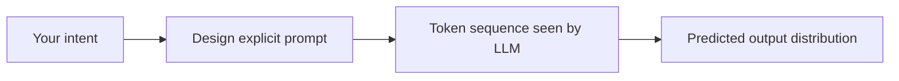
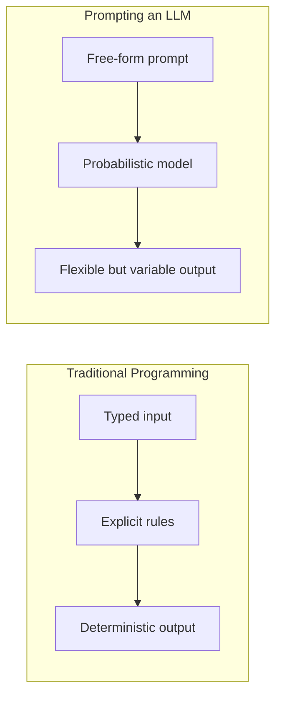
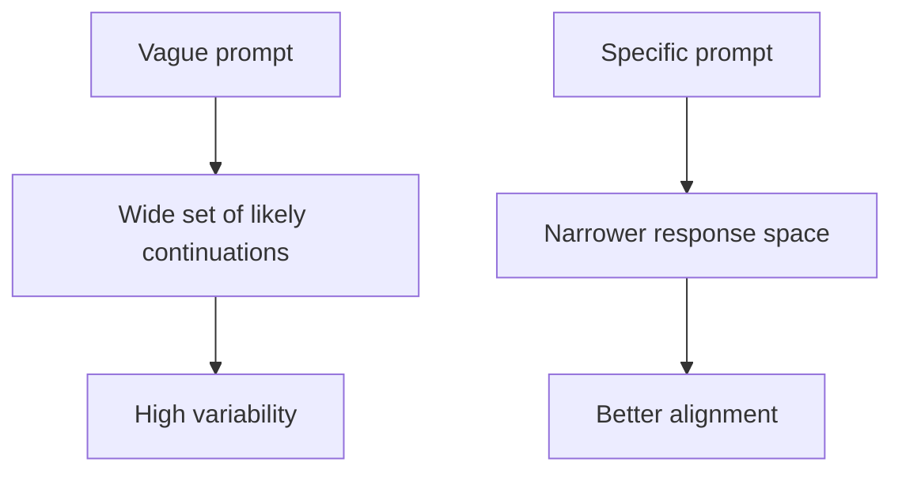
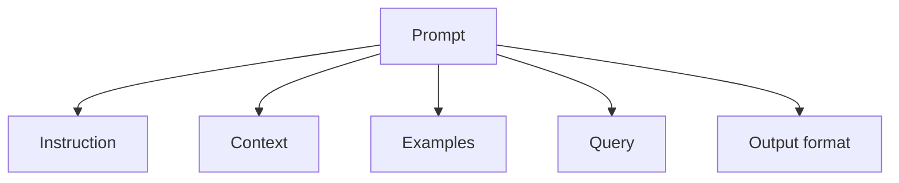
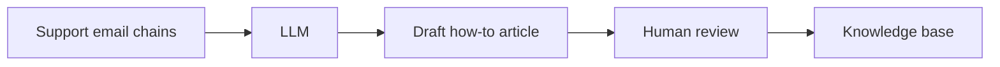
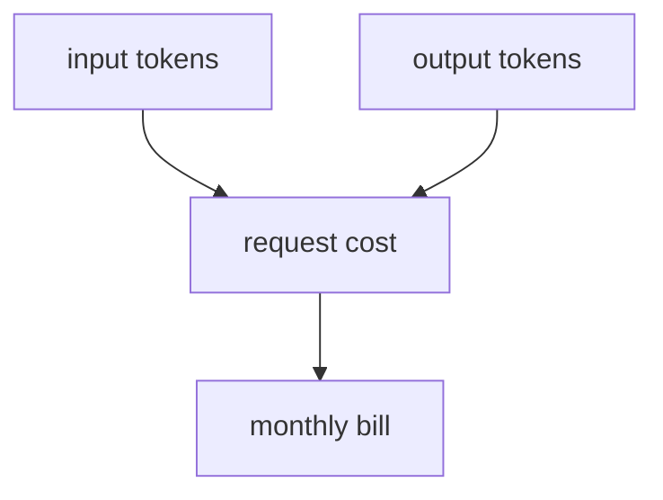
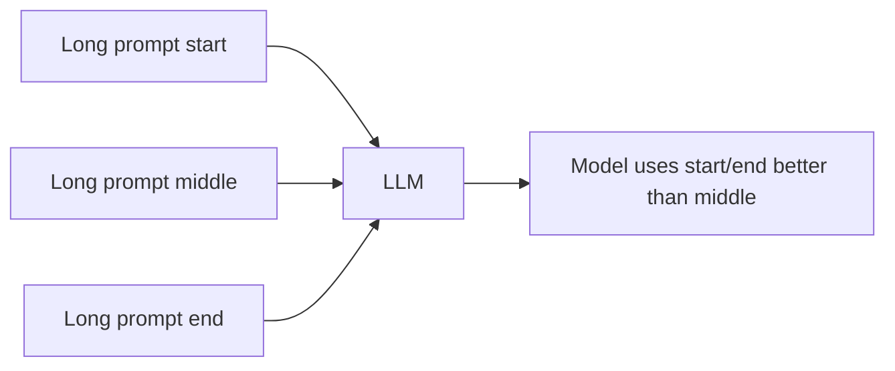
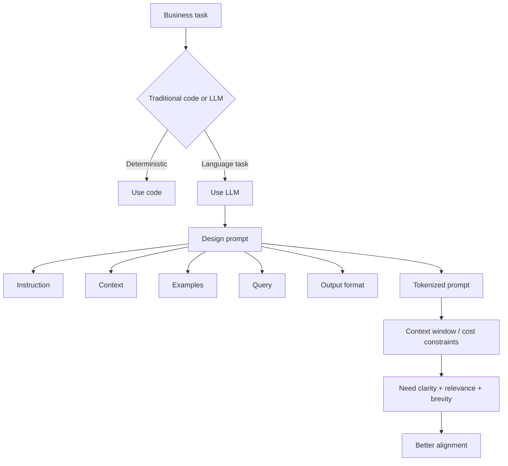

## Part II: Prompt Engineering

### Problem statement

Part II menjawab masalah yang muncul setelah kita bisa memanggil model: output kadang ngawur, konsistensi hilang, dan model merespons seperti orang asing. Di bagian ini, tugasnya adalah membuat AI bekerja dengan cara yang lebih bisa dikendalikan: lewat instruksi, contoh, format, dan struktur prompt.

Fontnya bukan lagi teks acak, tapi antarmuka yang bisa dikoreksi, diuji, dan dipelihara.

## Chapter 4: Fundamentals of Prompt Engineering

Bagian ini salah satu yang krusial. Setelah Part I membangun jalur integrasi dan Part II mulai membangun kontrol sistem, Part IV langsung menegaskan bahwa prompt engineering adalah lapisan kontrol pertama yang harus dikuasai.

### 1. Prompt adalah alat kontrol, bukan mantra ajaib

Dua kalimat pembuka yang paling penting:

> “LLMs are not magic. They simply predict a sequence of tokens based on your prompt.”

> “Prompt engineering is all about trying to steer an LLM toward the right predictions.”

Itu intinya. Prompt bukan sekadar cara ngomong ke AI. Prompt adalah mekanisme untuk mengarahkan distribusi kemungkinan output model.

Dari sini kita harus berpindah mindset:

* dari “AI harusnya ngerti maksud gue”
* ke “gue harus mengekspresikan maksud gue dalam bentuk token yang model lihat.”

### 2. Model tidak mengerti; model hanya melihat token

Kutipan penting:

> “At the end of the day, an LLM does not understand you. It doesn’t know what you mean. It knows only what you type.”

Ini adalah koreksi mental model yang paling sehat. Banyak kekecewaan muncul karena orang menganggap model punya maksud tersembunyi. Padahal tidak.

Prompt engineering adalah usaha menjembatani dua domain:

* niat manusia
* apa yang model benar-benar lihat



### 3. Software deterministic vs prompt probabilistic

Perbedaan mendasar antara function biasa dan prompt:



Function tradisional sempit dan tegas. LLM lebih fleksibel tapi juga lebih variabel.

Bukan berarti salah pakai LLM. Tapi ini mengajarkan kita memilih tool yang cocok untuk task: deterministic task untuk code, fuzzy language task untuk LLM.

### 4. Prompt bagus bukan panjang, tapi jelas

Prompt yang terlalu vague memberi model ruang interpretasi terlalu lebar. Prompt yang terlalu panjang bisa menambah noise, biaya, dan konteks yang tidak fokus.

Inti prompt engineering adalah memperkecil ruang kemungkinan output ke arah yang kita inginkan.



Jadi panjang prompt bukan tujuan. Tujuannya adalah kejelasan, detail yang relevan, dan keseimbangan.

### 5. Kerangka lima elemen prompt

Salah satu framework paling berguna di bab ini adalah melihat prompt sebagai komposisi:

- Instruction
- Context
- Examples
- Query
- Output format



Ini bukan cuma teori. Ini membuat prompt bisa didiagnosis. Kalau output jelek, kita bisa cek: apakah instruksinya kabur? context-nya kurang? contoh tidak relevan? query ambigu? format belum jelas?

### 6. Prompt engineering dan knowledge creation

Bagian ini juga menunjukkan bahwa LLM bisa dipakai bukan hanya untuk menjawab, tapi juga untuk membersihkan knowledge. Contoh: menulis ulang email support jadi artikel how-to.



Ini menunjukkan bahwa prompt engineering juga masuk ke workflow internal, bukan hanya ke UI akhir.

### 7. Context window dan prompt capacity

Prompt tidak hidup di udara. Ia terbatas oleh context window dan token.

```
flowchart LR
    A[All available knowledge] --> B{Dump all into prompt?}
    B -- Yes --> C[Hit limits / high cost / slower / less reliable]
    B -- No --> D[Curate relevant context]
    D --> E[Smaller, clearer, cheaper prompt]
```

Karena itu prompt engineering juga harus memikirkan pemilihan informasi, bukan sekadar menambahkan informasi.

### 8. Tokenization = budget

Bagian ini menjelaskan bahwa kata bukan selalu token. Prompt adalah sejumlah token; token adalah biaya dan kapasitas.

Prompt engineering menjadi bagian biaya sistem:



Input panjang dan output verbose sama-sama menaikkan biaya. Ini membuat prompt bukan hanya masalah bahasa, tapi juga masalah ekonomis.

### 9. Lost-in-the-middle effect

Ada warning penting: informasi di tengah prompt bisa kurang dipakai dibanding informasi di depan atau belakang.



Jadi hanya karena prompt muat dalam window tidak berarti prompt itu optimal.

### 10. Model choice tetap relevan

Prompt engineering bukan pengganti model choice. Bab ini tetap menekankan bahwa kualitas hasil juga tergantung pada model, training data, dan konfigurasi.

Uji prompt di beberapa model adalah praktik yang sehat.

### 11. Prompt adalah artefak desain sistem

Kalau disederhanakan, bab ini sedang mengatakan:

**prompt adalah artefak desain yang menghubungkan kebutuhan bisnis dan mesin probabilistik.**

Bukan seni merayu, bukan mantra rahasia. Ini proses engineering.

### 12. Diagram besar Chapter 4



### 13. Quotes beban berat

Beberapa kutipan paling penting:

> “Prompt engineering is all about trying to steer an LLM toward the right predictions.”

> “It doesn’t know what you mean. It knows only what you type.”

> “The more open-ended the prompt ... the more the LLM will ‘guess’ what information you want.”

> “Detailed, clear, and concise instructions are the most important considerations...”

> “Instead of dumping everything into the prompt, we have to deliberately curate and shape the input...”

> “All the words you send are converted to tokens, which costs both time and money.”

### 14. Sintesis besar

Chapter 4 mengajarkan bahwa prompt engineering adalah disiplin desain input untuk sistem probabilistik. Prompt yang baik menjelaskan tugas, struktur konteks, contoh, query, dan format output. Ia juga harus mempertimbangkan batas token, context window, biaya, dan relevansi.

### Insight

1. Prompt engineering bukan soal finding magic words; ini soal mengontrol probabilistic output.
2. Lima elemen prompt memberi framework diagnosis yang lebih tajam.
3. Tokenisasi memberi prompt dimensi ekonomi.
4. Lost-in-the-middle effect memperlihatkan bahwa ”cukup muat” belum berarti ”cukup baik.”
5. Prompt engineering adalah lapisan kontrol pertama dan termurah yang punya porsi besar dalam sistem AI.

## Chapter 5: Prompt Engineering Techniques

Chapter 5 mengangkat prompt engineering dari fondasi mental ke toolbox teknik. Bab ini menegaskan sejak awal bahwa ini masih area riset terbuka, jadi bab ini bukan daftar hukum tetap, melainkan kumpulan pattern kerja yang harus diuji di setiap model dan use case.

### 1. Instruction prompting

Ini bentuk paling dasar, tapi tetap krusial. Kalimat inti bab ini adalah:

> “LLMs are only as good as the instructions we give them.”

Prompt yang jelas saja sudah bisa membuat model melakukan tugas berbeda: data extraction, PII redaction, dan synthetic data generation. Untuk extraction, prompt terbaik kadang bukan hanya “ambil field ini,” tetapi juga menambahkan rule seperti "jika tidak ada, tulis null" dan "jangan infer." Untuk redaction, LLM tidak menggantikan regex, tetapi bisa melengkapi semantik edge case. Untuk synthetic data, penting menjelaskan kontrak output: jumlah baris, header, kolom, dan format.

### 2. Persona prompting

Persona bukan sekadar tone. Ini teknik untuk memberi model identitas fiksi yang mengunci framing dan asumsi konteks.

Contoh yang kuat:

- “You are a software developer”
- “You are a Google help desk representative”

Kedua persona bisa menanggapi pertanyaan yang sama secara berbeda karena mereka mengubah konteks, depth, dan sudut pandang. Persona berfungsi sebagai compression mechanism: beberapa constraint implisit dibungkus dalam satu role. Kelebihannya adalah prompt bisa lebih pendek dan konsisten; risikonya adalah jika role terlalu umum, model bisa menebak detail yang tidak diinginkan.

### 3. Zero-shot, one-shot, few-shot

Ini inti in-context learning. Perbedaan dasarnya:

- zero-shot = instruksi saja,
- one-shot = instruksi + satu contoh,
- few-shot = instruksi + beberapa contoh.

Banyak task domain-specific tidak perlu fine-tune. Dengan contoh-contoh yang tepat, model bisa mulai mempelajari pola internal tanpa pelatihan ulang. Trade-offnya jelas: zero-shot murah tapi rawan variasi; one-shot lebih terarah tetapi bisa overfit ke pola sempit; few-shot lebih stabil tetapi mengonsumsi token dan context window.

### 4. Delimiters

Delimiters membantu struktur prompt yang jelas. Bagian seperti `<instructions>`, `<examples>`, `<context>`, dan `<query>` membuat model lebih mudah membedakan peran setiap bagian. Ini sebenarnya information architecture untuk prompt.

### 5. Chain-of-thought

CoT mendorong model untuk tidak langsung melompat ke jawaban ketika task butuh banyak langkah. Dengan meminta reasoning step-by-step, model bisa menghasilkan jalur internal yang kemudian membantu jawaban akhirnya.

Tapi trade-off-nya nyata: response jadi lebih panjang, biaya naik, latency naik, dan ada risiko leaking reasoning yang tidak cocok untuk UX production. CoT cocok untuk task reasoning multi-step, bukan untuk semua prompt.

### 6. Prompt chaining

Prompt chaining memecah masalah kompleks menjadi pipeline prompt kecil, misalnya:

1. extract key facts,
2. classify / reason,
3. format / finalize.

Ini memberi scoped subtasks, explicit I/O contracts, debugging lebih mudah, reuse komponen, dan token load yang biasanya lebih rendah. Prompt chaining adalah bentuk komposisi prompting yang paling dekat dengan software engineering.

### 7. Best practices

Bagian penutupnya berisi beberapa prinsip developer:

- gunakan instruksi positif, bukan larangan negatif,
- treat prompts like code: versioning, testing, iterasi,
- collaboration with the model boleh dilakukan, tapi hasil tetap harus diuji,
- experiment dengan variasi prompt dan gunakan evaluasi A/B, review manual, cross-model, dan regression baseline.

### Sintesis Chapter 5

Chapter 5 memberitahu kita bahwa prompt engineering yang matang bukan mencari satu prompt sakti, tapi menyusun kombinasi teknik yang tepat untuk task, model, dan trade-off. Ia memperkenalkan prompting sebagai pattern language: instruction prompting, persona, in-context examples, delimiters, reasoning aid, dan chaining. Satu hal penting adalah bahwa teknik-teknik ini saling melengkapi, bukan saling menggantikan.

## Chapter 6: Prompt Engineering in Code

Chapter 6 adalah titik di mana prompt berhenti jadi eksperimen manual dan mulai diperlakukan sebagai bagian nyata dari sistem software. Pembukaannya sudah jelas:

> “Writing a great prompt is only half the battle.”

> “The moment you drop that prompt into real code, where latency matters, tokens cost money, and users never read the docs, you enter a different arena.”

Itu inti bab ini. Selama ini kita ngomong prompt seolah-olah hanya hidup di playground atau chat box. Di production, prompt hidup di dunia yang jauh lebih keras: latency, token cost, state, user input aneh, downstream code butuh format stabil, dan maintenance jangka panjang.

### 1. Memilih library sebagai keputusan arsitektural

Bab ini membuka dengan pilihan integrasi yang jelas: direct REST API, low-level SDK, lightweight wrapper, atau high-level framework. Bukan sekadar “pakai X”, tetapi mengajak kita mikir:

* apakah bottleneck utama kita kontrol dan debuggability?
* apakah kita butuh delivery cepat dan shared conventions?
* apakah kita siap menukar fleksibilitas dengan abstraksi?

Kutipan kuncinya:

> “Higher abstraction buys speed of delivery and shared conventions. Lower abstraction buys performance, debuggability, and long-term freedom.”

Ini bukan filosofi kosong. Ini mengubah library choice jadi keputusan situasional yang boleh berubah seiring tim dan kebutuhan.

### 2. Hosted API = gampang, tapi security tetap harus disiplin

Selanjutnya bab ini masuk ke hosted API. Di sini kita masuk ke software engineering reality: API key, environment variables, secret hygiene, billing, dan config management.

Warning-nya sederhana tapi penting:

> “Keep your API keys private!”

Banyak demo AI gagal di produksi karena kebocoran credential, commit key, atau logs yang menampung secret. Bab ini mengingatkan bahwa AI integration tetap tunduk pada prinsip keamanan ops biasa.

### 3. Output configuration: sekarang kita pegang tombol model

Di sinilah prompt mulai kehilangan ilusi bahwa semua kontrol ada di prompt. Kualitas output juga ditentukan oleh knob konfigurasi.

Dua keluarga besar yang dibahas:

* output length (`max tokens`, `num_predict`, `stop sequences`)
* sampling controls (`temperature`, `top_p`, `top_k`)

#### 3a. Output length

Kalau task-nya sempit—misalnya classification—lo tidak butuh paragraf. Lo butuh label. Maka `num_predict: 1` dan stop sequences bukan optimasi kecil; itu pola pikir production yang memaksa model tidak babbling.

#### 3b. Sampling controls

Temperature rendah berarti jalur output lebih stabil. Temperature tinggi berarti output lebih kreatif. Top P dan Top K menambah batas atas kandidat token.

Yang penting: `temperature=0` tidak berarti deterministik absolut. Ini hanya membuat output lebih predictable, bukan menghilangkan semua variasi.

### 4. Prompt templates: dari string liar ke artefak yang bisa dipelihara

Bab ini kuat ketika memperkenalkan prompt templates. Prompt bukan lagi string concat ad-hoc di code. Ia harus dipisah menjadi template yang berisi bagian tetap dan slot dinamis.

Jinja dipakai sebagai contoh yang pas karena ia:

* oriented ke plain text,
* mendukung placeholder,
* bisa loop dan condition,
* netral untuk prompt.

Template memberi reusability, maintainability, safer interpolation, dan tempat untuk menaruh guardrail default seperti fallback response.

### 5. Memisahkan prompt dari code

Episode ini melanjutkan ke rekomendasi penting: simpan template di file eksternal. Itu membuat prompt menjadi aset yang bisa dibandingkan, direview, dan diubah tanpa merombak logic bisnis.

Kalau prompt bercampur dengan code, repo cepat jadi berantakan. Kalau prompt disimpan terpisah, kode jadi bersih, prompt review jadi mungkin, dan non-dev bisa kontribusi lebih mudah.

### 6. Dynamic templates and context assembly

Bab ini juga menunjukkan bahwa template bisa dinamis: loop artikel, delimiters per sumber, dan assembly context dari banyak teks.

Ini adalah jembatan ke RAG. Prompt bukan lagi satu string saja; ia adalah hasil render dari beberapa sumber data yang diambil, dibatasi, dan dipisah rapi.

### 7. Messages dan roles: prompt berubah jadi percakapan terstruktur

Bagian berikutnya menurut gue besar: LLM chat-style bukan lagi satu blob teks; ia adalah ordered list of messages dengan roles:

* system
* user
* assistant
* tool

System message dipandang sebagai kernel prompt: global instructions, persona, policy, guardrail. User message adalah request yang berubah-ubah. Assistant message adalah history. Tool message adalah hasil eksternal.

Ini adalah transisi mental model: prompt = not just text, but conversation protocol.

### 8. Conversation history: memori itu ilusi aplikasi

Di sini ada koreksi penting: LLM itu stateless. Aplikasi yang mengirim ulang history menciptakan ilusi memory.

Bab ini memberi pattern class `ConversationHistory` untuk mengelola system message, messages list, dan rendering request. Ini mengajarkan bahwa yang “inget” bukan model, tapi aplikasi.

### 9. Trimming history: memori selalu bertarung dengan token budget

Seiring percakapan bertambah panjang, token budget cepat habis. Solusi sederhana yang dijelaskan adalah remove oldest user/assistant pair ketika limit terlampaui.

Ini menunjukkan prinsip penting:

* memori tidak gratis,
* setiap turn yang disimpan ada biaya token,
* relevansi harus dibayar.

### 10. Summarizing history: kompres konteks sebelum dibuang

Bagian paling menarik adalah penggunaan LLM untuk membantu mengelola dirinya sendiri. Daripada membuang seluruh history, kita bisa membuat ringkasan dan menggantikan history lama dengan summary singkat.

Ini bukan hanya fitur internal. Ini pattern orchestration:

* prompt utama untuk chat,
* helper prompt untuk summarization,
* maintenance prompt untuk memory compression.

Dan itu sudah menempatkan prompt engineering sebagai bagian arsitektur sistem.

### Sintesis Chapter 6

Chapter 6 mengangkat prompt dari level “isi request” ke level “infrastruktur perilaku” dalam aplikasi. Di sini kita belajar:

* pilih abstraction layer yang cocok,
* atur output dengan config knobs,
* susun prompt dengan templates,
* pisahkan prompt dari code,
* rangkai context dinamis,
* gunakan roles untuk chat,
* kelola history aplikasi,
* trim atau summarize agar token budget tetap masuk akal.

Di production, prompt bukan lagi sekadar teks untuk model. Dia adalah kontrak, state, resource, dan artefak yang harus dikelola seperti komponen software lainnya.

