## Part III: Vector Databases and RAG

### Problem statement

Di Part III, masalahnya adalah ketika prompt engineering sudah tidak cukup lagi. Model bisa diajak ngobrol, tapi dia tetap buta terhadap data terbaru, dokumen internal, dan konteks yang relevan karena konteks prompt terbatas. Maka kita butuh sistem yang bisa memilih dan menyajikan konteks dengan cerdas.

Jadi bukan lagi soal mengarang prompt yang lebih panjang. Ini soal bagaimana membangun pipeline context, retrieval, dan grounding yang membuat model bisa menjawab dari sumber yang benar.

Bagian ini adalah transisi arsitektural terbesar sejauh buku. Sampai Part II, startup masih menyelesaikan masalahnya dengan cara yang bisa disederhanakan jadi: "naikkan kualitas prompt dan tambahkan context ke prompt." Itu efektif sampai titik tertentu. Di Part III, buku bilang: ada batas struktural dari prompt engineering murni.

Dua kutipan pembuka yang paling penting buat gue adalah:

> “They had pushed prompt engineering as far as it could take them.”

> “The next step was context engineering.”

Itu artinya bukan hanya soal wording prompt lagi. Masalahnya sudah bergeser ke: bagaimana context dipilih, disimpan, dan diambil.

## 1. Startup sudah berhasil, tapi itu yang membuka bottleneck berikutnya

Buku sengaja nggak menggambarkan solusi awal sebagai kegagalan total. Startup itu sudah menangani setengah request support mereka dan bahkan cukup berhasil melawan troll sosial media. Yang menarik adalah, keberhasilan awal itu justru memunculkan bottleneck baru:

* kualitas recommendation,
* kecepatan support agent,
* usage cost,
* context size.

Itu menunjukkan pola engineering yang realistis: solusi awal yang sukses sering kali bukan solusi akhir.

## 2. Keyword matching tidak cukup untuk recommendation

Masalah pertama adalah recommendation. Keyword-based search mungkin bisa cocokkan kata, sinonim, atau judul produk. Tapi ketika relevansi itu bersifat semantik—misalnya "work-from-home microphone" versus "USB condenser audio interface starter kit"—keyword matching jatuh.

Inti dari transisi ini adalah: recommendation modern bukan cuma cocokkan kata, tapi cocokkan makna laten.

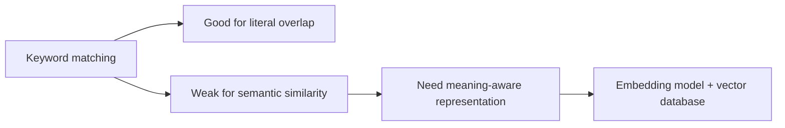

Itu kenapa vector DB muncul bukan dari hype, tapi dari kebutuhan nyata untuk relevansi semantik.

## 3. Support agent mentok di konteks, bukan di prompt

Masalah kedua adalah support agent. Di awal, model bisa dipakai. Tapi ketika traffic naik dan artikel dukungan bertambah, prompt mereka mulai mengandung terlalu banyak context. Sekali lagi diagnosisnya jelas:

> “The problem boiled down to the context size they were cramming into every prompt.”

Itu artinya masalahnya bukan lagi "gimana caranya kasih knowledge ke model". Masalahnya sekarang adalah:

* bagaimana kasih hanya knowledge yang relevan,
* secukupnya,
* dan tepat sasaran.

Lagi-lagi, ini bukan masalah wording. Ini masalah seleksi dan retrieval.

## 4. Vector database sebagai jawaban untuk meaning-aware retrieval

Di titik ini, vector database muncul sebagai solusi. Dia menyimpan representasi numerik dari item seperti dokumen, produk, gambar, atau audio. Dengan embedding, kita bisa cari kedekatan semantik, bukan hanya kecocokan kata.

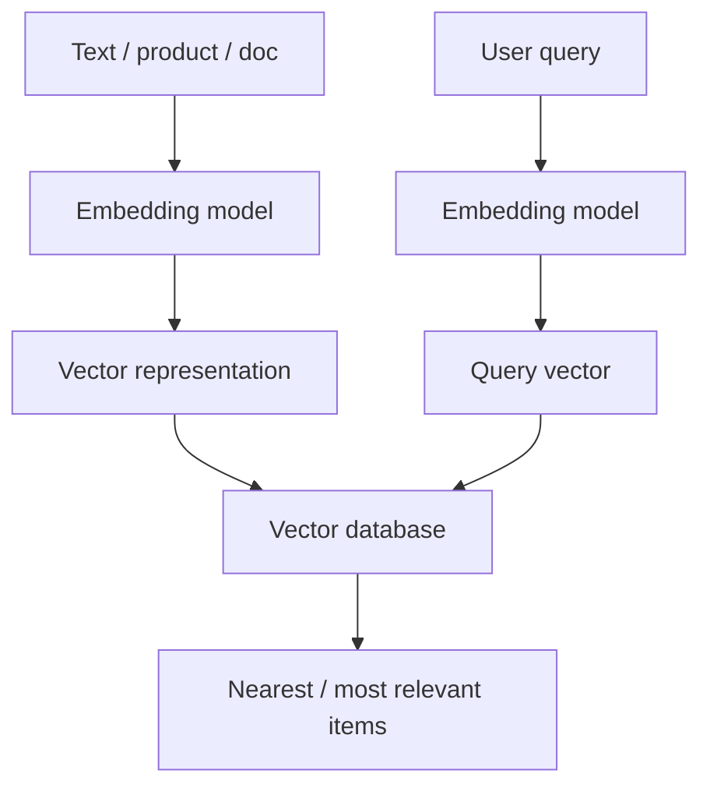

Point pentingnya: vector DB bukan pengganti LLM. Ia adalah mesin pencari relevansi semantik yang hasilnya bisa dipakai untuk recommendation atau ditambahkan ke prompt.

## 5. RAG lahir dari keharusan teknis dan ekonomis

Di pembuka Part III, kata "RAG" tidak muncul sebagai buzzword kosong. Ia muncul dari diagnosis praktis:

* prompt terlalu besar,
* banyak context tidak relevan,
* biaya naik,
* latency naik,
* context window mentok.

Solusinya sederhana namun kuat:

1. simpan knowledge dalam format yang bisa dicari,
2. cari potongan yang relevan saat query datang,
3. hanya potongan yang relevan yang dikirim ke prompt,
4. LLM menjawab dengan grounding dari hasil retrieval.

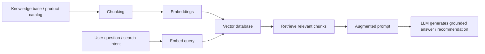

Ini adalah arsitektur yang dibawa Part III: model + retriever + knowledge store.

## 6. Kenapa ini jadi lompatan besar

Part III bukan cuma bab tentang vector database. Ini bab tentang perubahan mindset:

* dari "bagaimana ngomong ke model" ke "bagaimana membangun mesin pencari konteks untuk model",
* dari "tambahin semua dokumen ke prompt" ke "ambil hanya dokumen yang relevan",
* dari "LLM-centric" ke "system-centric." 

Itu yang membuat opener Part III terasa begitu penting.

## 7. Kutipan kunci pembuka Part III

Beberapa kutipan paling beban berat:

> “Their current keyword-based recommendations weren’t enough.”

> “The problem boiled down to the context size they were cramming into every prompt.”

> “They had pushed prompt engineering as far as it could take them.”

> “The next step was context engineering.”

> “Only the retrieved text would be sent along with the prompt.”

> “The approach had a name: retrieval-augmented generation (RAG).”

## Sintesis Part III opener

Intinya: setelah startup berhasil membuat LLM cukup berguna dengan prompt engineering, mereka menabrak dua tembok baru—rekomendasi keyword yang gagal menangkap makna dan support prompt yang penuh artikel tidak relevan. Kedua masalah itu ternyata punya akar yang sama: kebutuhan untuk memilih konteks yang relevan secara semantik. Di sini RAG masuk sebagai evolusi berikutnya: bukan memasukkan semua knowledge ke prompt, tapi mengambil hanya potongan yang relevan dan menggabungkannya ke generation.

Kalau disingkat

**Part III dimulai ketika prompt tidak lagi cukup, dan sistem harus belajar memilih context, bukan hanya menerima context.**

## Chapter 7: Vector Databases in Practice

Chapter 7 penting karena di sini buku mulai memperluas definisi “AI model.” Sampai sekarang kita banyak bicara soal LLM. Di chapter ini yang ditekankan adalah: tunggu dulu, ada jenis model lain yang diam-diam jadi fondasi banyak sistem AI modern, yaitu embedding models.

Kalimat pembukanya kuat:

> “Embedding models are the quiet workhorses behind many of the ‘How did it know that?’ experiences in modern software.”

Itu framing yang pas. LLM memang yang glamornya kelihatan di depan. Tapi yang sering bikin pengalaman terasa pintar adalah model yang tidak kelihatan: model yang mengubah teks, gambar, atau audio jadi representasi numerik berdasarkan makna.

### 1. Helping machines understand our world

Gue ingat bukaan dengan contoh kata "bank":

> “I’m going to the bank to deposit some money.”

versus

> “You’ll catch more fish in this river if you walk down to the bank.”

Ini jelas menunjukkan akar masalah NLP dan retrieval: kata yang sama bisa punya arti berbeda tergantung konteks. Manusia langsung ngerti. Mesin literal, tidak. Embedding model mencoba menangkap arti ini dengan representasi yang memasukkan konteks.

### 2. Apa sebenarnya embedding itu?

Definisinya sederhana:

> “Embedding models are specialized AI models ... trained to transform data ... into a compressed, machine-friendly encoding called a vector embedding.”

Beberapa poin penting:

* ini bukan LLM generatif;
* tugas utamanya adalah encoding, bukan generating;
* inputnya bisa text, image, audio, atau multimodal;
* outputnya adalah array angka.

Tujuan utamanya bukan sekadar encode. Tujuannya adalah membuat similarity meaningful.

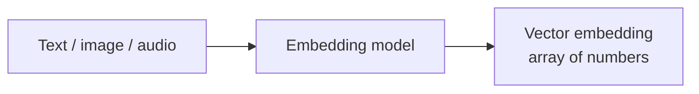

### 3. Dari string ke titik di ruang makna

Support query seperti “I’m having password issues. Can you help me log in?” diubah jadi vektor. Di dunia retrieval, setiap dokumen atau query menjadi titik di ruang berdimensi tinggi. Dekat berarti makna mirip, jauh berarti tidak.

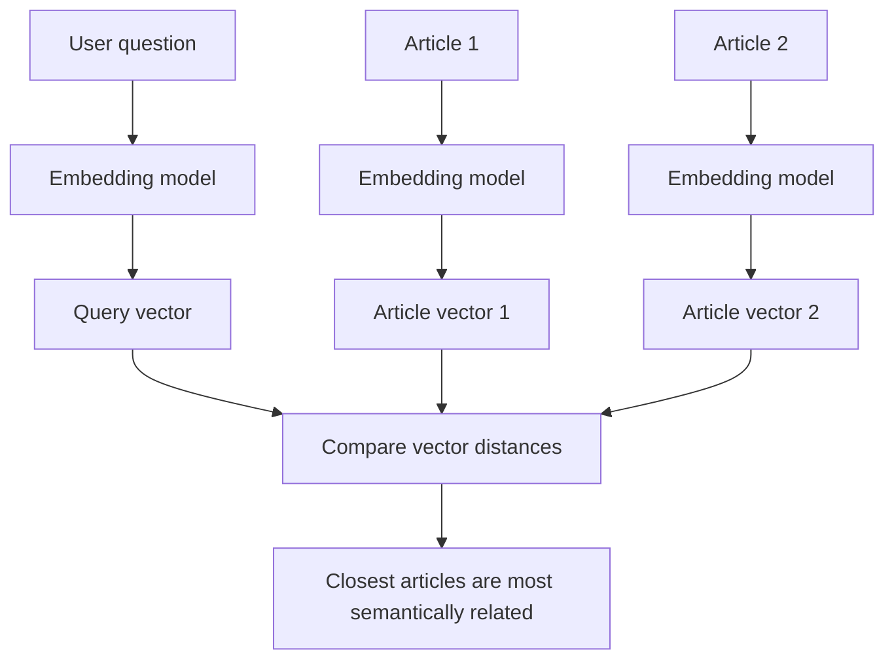

Ini adalah peralihan konsep utama: bukan lagi string literal, tapi titik-titik dalam ruang makna.

### 4. Semantic search versus lexical search

Di chapter ini yang gue tangkap adalah vector search bukan pengganti total keyword search. Keyword search kuat untuk exact words atau filter, tapi lemah untuk makna yang sama dikemas dengan kata berbeda.

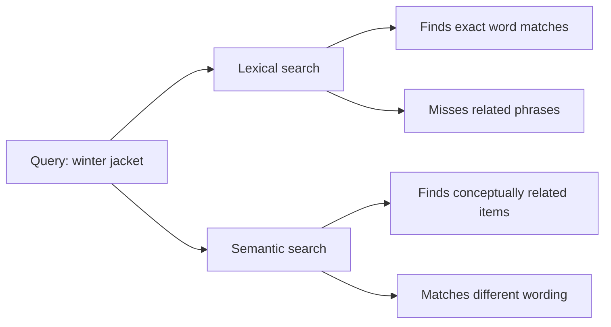

Ini adalah perbedaan paradigma retrieval yang paling penting di chapter ini.

### 5. Chroma + SBERT sebagai practical combo

Buku ini memilih Chroma sebagai vector database dan SBERT sebagai embedding model family. Pilihan ini masuk akal untuk praktik:

* Chroma ringan dan mudah dicoba,
* SBERT populer dan cukup kuat,
* integrasinya relatif straight-forward.

Gue menjelaskan bahwa yang penting bukan syntax, tapi konsistensi ruang embedding. Dokumen dan query harus diproyeksikan ke ruang representasi yang sama.

### 6. Similarity score dan reranking

Chapter ini juga menunjukkan bahwa retrieval tetap berbasis score. Semakin tinggi nilai similarity, semakin mirip item itu. Tapi hasil awal bukan final. Biasanya sistem akan:

* ambil top-k candidate dari vector DB,
* lalu rerank dengan business rules,
* lalu gunakan metadata dan filter.

Jadi vector retrieval memberi candidate set yang bermakna. Aplikasi masih harus menambahkan domain logic.

### 7. Metadata tetap penting

Walau fokusnya semantic, chapter ini tetap menekankan metadata. Vector DB tidak cuma menyimpan vektor. Ia juga menyimpan metadata seperti ID, category, price, dan atribut lain.

Itu penting karena retrieval terbaik sering kali adalah hybrid:

* semantic similarity untuk meaning,
* structured metadata untuk constraints.

### 8. Inti Chapter 7

Chapter 7 memberi kita cara baru melihat data: bukan sebagai string literal, tapi sebagai titik di ruang makna. Embedding model adalah fondasi representasi; vector database adalah mesin pencari relevansi; similarity search adalah cara menemukan konteks yang tepat.

Kalau disimpulkan:

**Chapter 7 mengubah retrieval dari pencocokan kata menjadi pencocokan makna.**

## Chapter 8: Designing a Retrieval-Augmented Generation System

Chapter 8 adalah saat semua potongan mulai ketemu jadi sistem utuh. Sebelum ini kita sudah punya LLM, prompt engineering, template, chat history, vector database, dan embeddings. Sekarang buku menjelaskan bagaimana komponen-komponen itu disusun menjadi pipeline RAG yang benar-benar berguna.

Pembukaan bab ini penting:

> “LLMs arrive with impressive capabilities. But they’re also blank slates when it comes to your own data.”

Itu mengoreksi ekspektasi: LLM bisa canggih, tapi untuk data privat seperti wiki internal, support ticket, email, README terbaru, atau database record, model itu buta tanpa mekanisme akses.

Di sini ada definisi yang menjadi jantung bab:

> “Retrieval-augmented generation (RAG) is the architectural pattern that makes this practical.”

Jadi RAG bukan fitur kecil atau trik prompt. Dia diposisikan sebagai pattern arsitektural: retrieve → augment → generate.

### 1. What Is Retrieval-Augmented Generation?

Bab ini membuka dengan dua mode kerja:

* jawab dari training knowledge,
* jawab dari retrieved context.

Contoh yang paling kuat adalah perbedaan antara "Who are the Beatles?" dan "release bourbon 2025". Yang pertama bisa dijawab dari training. Yang kedua butuh retrieval.

Di sini retrieval bukan sekadar tambahan informasi. Retrieval adalah mekanisme anti-hallucination dan grounding.

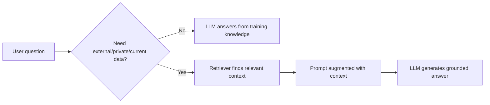

### 2. RAG vs. tool use

Bab ini juga memberi batas konsep yang sehat. RAG difokuskan sebagai pola retrieve-then-generate, sementara tool use bisa menjadi salah satu cara retrieval dilakukan. Untuk pembaca, lebih dulu fahami struktur dasar RAG: ada langkah retrieval yang menyuplai context ke generation.

### 3. Knowledge base sebagai external memory

Kalimat pentingnya:

> “A knowledge base acts as an external memory store for LLMs.”

Artinya knowledge base bukan sekadar dokumen. Dia berfungsi sebagai memori jangka panjang sistem, sumber kebenaran, dan tempat LLM mengintip ketika perlu data yang tidak ada di training.

Ingat juga kata kuncinya: **only**. Bukan semua dokumen, tapi hanya context yang dibutuhkan.

### 4. Dua pipeline RAG: ingestion dan inference

Ini adalah inti struktural bab:

* ingestion pipeline: raw data → chunking → embedding → indexing
* inference pipeline: query → retrieve → augment prompt → generate

Jika digambar:

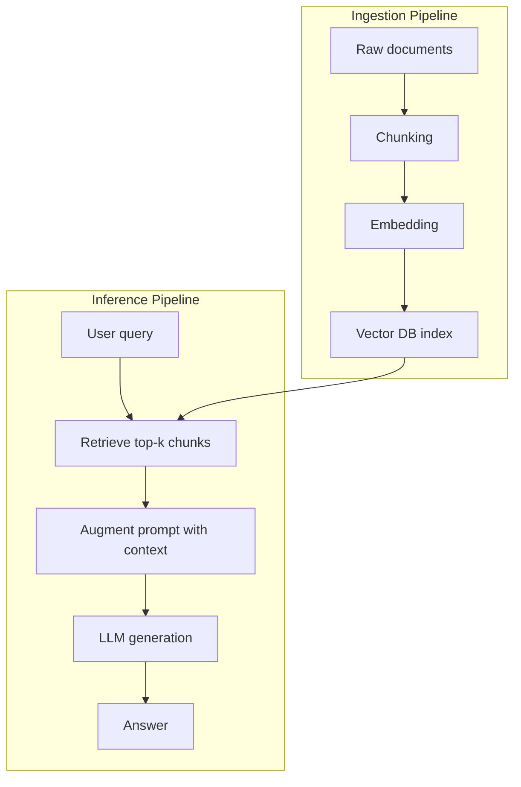

Pemisahan ini penting karena problem dan optimisasi di setiap tahap berbeda.

### 5. Chunking sebagai kunci kualitas retrieval

Chapter ini menekankan bahwa chunking jauh lebih penting dari kelihatannya. Chunking menentukan apakah retrieval menemukan makna yang utuh atau hanya potongan noise. Gue memperkenalkan `RecursiveCharacterTextSplitter` sebagai upgrade dari pemotongan karakter kasar.

### 6. Menyambungkan retrieval ke LLM

Setelah retrieval tersedia, gue membuat prompt templates yang menyisipkan `<context>` dan `<document>`. Alur RAG sederhana jadi sangat jelas:

1. retrieve chunks
2. masukkan ke prompt
3. generate answer

Diagramnya:

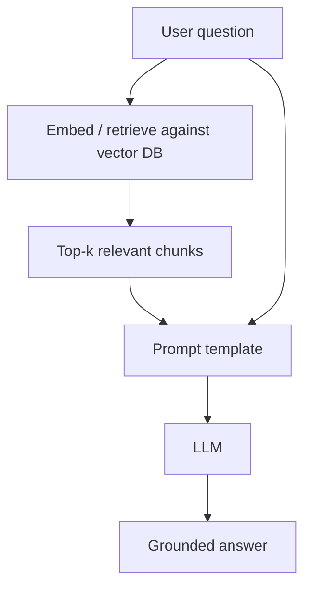

Ini menunjukkan bahwa vector DB dan LLM tidak berdiri sendiri. RAG adalah cara menghubungkannya.

### 7. Citations sebagai trust layer

Gue juga menambahkan aspek trust: jawaban yang grounded sebaiknya tampilkan sumber. Citation bukan sekadar nice-to-have. Dia adalah trust layer yang memungkinkan user memverifikasi jawaban.

### 8. Advanced RAG topics

Chapter ini tidak berhenti di naive pipeline. Bab ini juga membuka arah produksi:

* query rewriting
* reranking / reordering
* hybrid retrieval
* LLM evaluator
* parent-child retrieval
* multi-vector retrieval
* cache-augmented generation
* API-augmented RAG
* knowledge-graph RAG

Suatu sistem RAG yang matang bukan hanya lebih banyak komponen, tapi lebih banyak kontrol atas relevansi, trust, dan cost.

### 9. Sintesis Chapter 8

Chapter 8 menjelaskan bagaimana semantic retrieval dan prompt engineering disatukan menjadi sistem RAG end-to-end. Sistem ini punya dua pipeline: ingestion yang menyiapkan dokumen, dan inference yang mengambil konteks relevan dan memberi model bahan untuk menjawab grounded. Dari sana, gue menunjukkan optimisasi produksi seperti citations, parent-child retrieval, query rewriting, reranking, hybrid retrieval, dan evaluasi.

Kalau dipadatkan:

**Chapter 8 mengubah semantic search menjadi contextual generation.**

## Chapter 8: Kutipan yang bikin gue ngerasain arsitektur RAG

Chapter 8 bukan cuma bab implementasi. Waktu gue baca, gue merasa gue lagi ngomong ke gue bukan tentang `how to use RAG`, tapi tentang `how to think about RAG`.

### 1) “LLMs arrive with impressive capabilities. But they’re also blank slates when it comes to your own data.”

Kalimat ini langsung bikin gue berhenti sejenak. Ya, gue sudah akui LLM itu keren. Tapi yang gue garis bawahi adalah kata kedua: blank slates.

Buat gue, itu bukan sekadar statement. Itu adalah peringatan: model bisa tampil pinter, tapi dia benar-benar buta terhadap semua yang ada di luar training set. Itu berarti semua data privat kita—wiki internal, tiket support, email tim, README terbaru—dari sudut pandang model adalah nol.

Dan kalau kita nggak sadar ini, kita rawan bikin sistem yang cuma mengandalkan prompt buat ‘memaksa’ model grounded. Itu yang biasanya bikin sistem AI terasa rapuh.

### 2) “Retrieval-augmented generation (RAG) is the architectural pattern that makes this practical.”

Bagian ini nge-push gue kalau RAG bukan cuma fitur atau library. Dia adalah pola arsitektur.

Itu membuat gue memandang RAG sebagai sesuatu yang lebih besar dari Chroma, LangChain, atau plugin mana pun. Dia punya komponen, punya alur, punya variasi, dan punya tujuan yang sama:

1. ambil data relevan,
2. gabungkan ke prompt,
3. buat model bisa jawab dengan grounded.

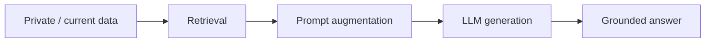

### 3) “All its variations have the same intent: delivering exactly the right pieces of your private data to an LLM the moment that data is needed.”

Ini kalimat yang bikin gue ngeh kenapa Chapter 8 nggak mau jadi bab “tambahin dokumen ke prompt”.

Kata kuncinya adalah `pieces` dan `the moment that data is needed`.

Artinya RAG bukan soal menjejalkan semua knowledge base ke prompt. Itu soal mengambil potongan yang benar—dan hanya ketika dibutuhkan. Itu adalah konsep just-in-time context.

Kalau salah paham di sini, sistemmu gampang jadi prompt dumpster fire.

### 4) “A knowledge base acts as an external memory store for LLMs.”

Nah, ini favorite quote gue di chapter ini.

Begitu gue baca, gue langsung bisa lihat arsitektur RAG dengan analogi memori:

* LLM = engine reasoning,
* KB = external memory,
* retriever = recall mechanism,
* prompt = active working memory.

Itu bikin semua keputusan desain jadi lebih masuk akal. Ini juga membuat gue paham kenapa update knowledge base nggak harus berarti retrain model.

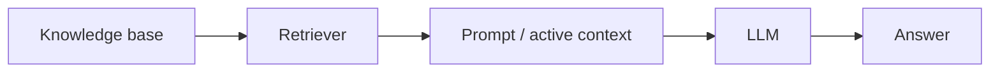

### 5) “The goal is to generate a prompt that contains the customer’s question and only the information the LLM needs as context.”

Gue suka ini karena dia benar-benar menahan kita dari godaan `more is better`.

Di dunia RAG, prompt bukan kotak sampah. Dia harus berisi:

* question,
* only the relevant context.

Itu artinya konteks yang dimasukkan harus dipilih dengan sengaja. Bukan ditumpahkan.

### 6) “RAG isn’t just about adding documents to a prompt; it’s about shaping the context so the model sees only what matters, in the clearest possible form.”

Kalimat ini bagi gue adalah pergeseran dari “retrieve” ke “context engineering”.

Jadi RAG bukan hanya retrieval + append. Dia adalah proses:

* memilih,
* mengurutkan,
* memangkas,
* mengkompres,
* memformat.

Kalimat ini membuatku sadar bahwa pekerjaan RAG juga soal presentasi konteks.

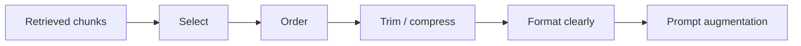

### 7) “Good context engineering lowers cost, reduces hallucinations, and measurably improves answer quality.”

Kalimat ini bikin gue ngeh bahwa context engineering bukan gimmick. Ini tangible.

Kalau konteksnya baik, maka:

* cost turun,
* hallucination turun,
* output lebih berkualitas.

Jadi ini bukan sekadar estetika. Ini performance metric.

### 8) “The pipeline in RAG is simply the end-to-end flow that takes your raw data and turns it into an LLM-powered answer.”

Ini adalah penutup penting buat semua ide sebelumnya.

RAG bukan sekadar retrieval atau prompt. Dia sebuah pipeline transformasi:

* raw data → chunking → embedding → indexing → retrieval → augmentation → generation.

Kalimat ini membuat semua stage terlihat dalam satu alur.

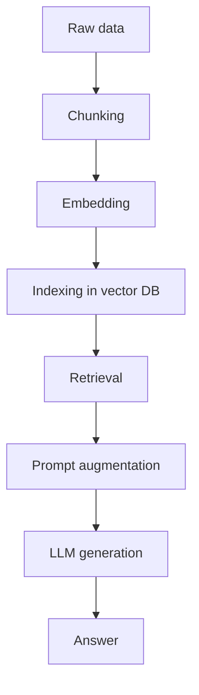

### 9) “Choosing a good text-chunking strategy is key to building a reliable RAG solution.”

Ini salah satu kutipan yang paling practical buat gue.

Chunking itu ternyata bukan preprocessing kecil-kecilan. Chunk adalah unit retrieval. Jadi kualitas retrieval sering mati-hidup di chunking.

Ini membuat gue paham kenapa ingestion system harus dipikirkan matang, bukan sekadar query-time.

### 10) “Users don’t, and shouldn’t, trust a response just because it sounds confident. They trust evidence.”

Kalimat ini yang bikin semua citations terasa wajib.

Bukan karena model harus terdengar lebih ilmiah. Tapi karena user sebenarnya butuh provenance. Confidence saja tidak cukup.

### 11) “Naive RAG ... is simple, it works, and it’s perfect for getting started. But as your needs grow, you might hit its limits.”

Ini adalah pernyataan paling jujur di chapter.

Gue suka karena dia bilang: mulai dari yang sederhana. Baru tambahkan kompleksitas saat kebutuhan memang memaksa.

### 12) “Every RAG variant ... simply tweaks one or more of these pipeline stages...”

Ini membuat semua variasi RAG terasa lebih bisa dicerna.

Kalau kamu sudah paham pipeline dasar, varian-varian itu cuma modifikasi stage tertentu, bukan monster baru.

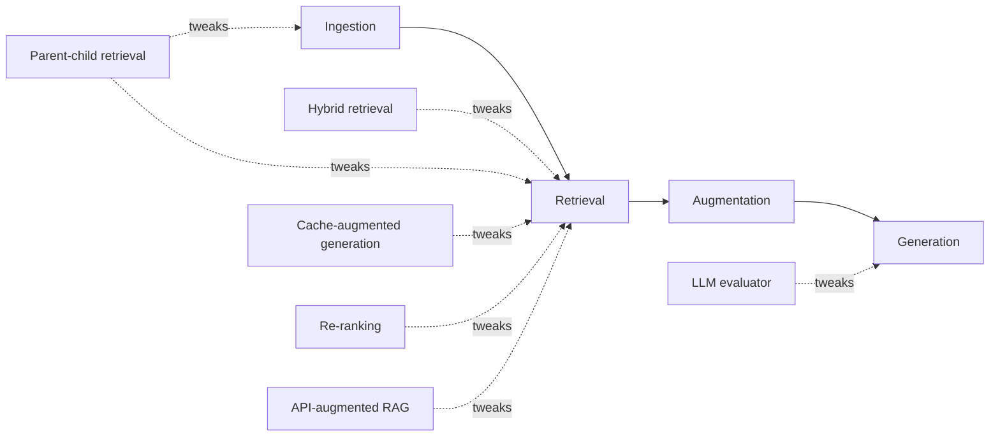

### 13) “In practice, ‘productionizing’ a RAG solution is about tightening every component in the pipeline so answers are relevant, trustworthy, and production grade.”

Ini adalah kutipan paling systems-engineering.

Buat gue, ini artinya production RAG bukan soal satu magic model. Ini soal memperketat semua stage: chunking, metadata, retrieval, ranking, prompt shaping, guardrails, citations, dan evaluasi.

---

## Sintesis kutipan Chapter 8

Kalau semua kutipan ini digabung, yang gue tangkap adalah:

**LLM itu kuat, tetapi kosong terhadap data privat. Jadi supaya dia berguna di dunia nyata, kita butuh pola arsitektur yang mengambil konteks yang tepat dari memory eksternal, menyajikannya dengan jelas, lalu memakainya untuk menjawab grounded. RAG bukan sekadar teknik; dia adalah seni mengubah data mentah jadi konteks tepat, dan konteks tepat jadi jawaban yang bisa dipercaya.**

## Kenapa author penting untuk dibahas

Dari profil ketiga author, hal ini terasa lebih masuk akal sebagai produk praktis. Mereka saling melengkapi:

- Jacob Orshalick membawa pengalaman problem solving enterprise dan konsultasi. Dia bukan sekadar builder; dia juga orang yang sering masuk ke sistem bermasalah dan menata ulangnya supaya kembali berjalan.
- Jerry M. Reghunadh membawa gaya berpikir sistematis dan kemampuan memecah kompleksitas. Ada warna QA/automation di sana: verifikasi asumsi, failure mode, dan pemikiran yang repeatable.
- Danny Thompson membawa energi edukatif dan storytelling. Dia mampu menjaga materi tetap jelas, actionable, dan tidak intimidating untuk developer yang baru masuk.

Jadi kalau ini terasa seperti "AI buat developer yang membangun", itu bukan kebetulan. Itu selaras dengan latar belakang ketiganya: implementasi, produk, edukasi, dan leadership teknis.

### Siapa yang paling memengaruhi tone?

Kalau gue tebak dari profil dan intro, kemungkinan besar:

- Jacob memberi fondasi practical framing dan pengalaman real-world.
- Jerry memberi struktur decomposition dan cara pikir yang membuat topik rumit jadi kelihatan manageable.
- Danny memberi tone ramah, komunikatif, dan mudah didekati.

Kalau digabung, ketiganya menghasilkan nada yang cukup pragmatis tanpa terjebak ke hype, cukup terstruktur tanpa berlebihan, dan cukup approachable tanpa jadi dangkal.

### Insight penting dari analisis author

1. Profil author bisa jadi petunjuk bias pedagogi. Kalau ketiganya mostly praktisi software dan edukator, besar kemungkinan ini dirancang sebagai roadmap implementasi, bukan kajian model teoritis.
2. Bukan semua author teknis punya otoritas yang sama. Satu bisa kuat di konsultasi, satunya di struktur berpikir, satunya di komunikasi.
3. Untuk materi seperti ini, kombinasi builder + decomposer + educator adalah kombinasi yang tepat.
4. Maka cara baca yang paling sehat adalah: jangan berharap teori AI mendalam, tapi harap peta pembelajaran praktis yang bisa dipakai buat mulai bangun.

Kalau lo lagi menilai kredibilitas, jawaban yang paling pas adalah: ya, mereka credible untuk konteks ini, selama targetnya memang developer praktis dan bukan peneliti ML lanjutan.

