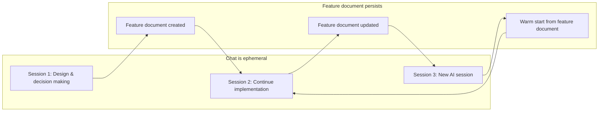

## Gagasan

Ini menunjukan bahwa konsepnya bisa jalan di workflow yang benar-benar ada.

## Mengapa Ini Penting

Jadi artikel ini bukan cuma inspirasi, tapi juga contoh implementasi yang jelas.

## Bagaimana Ini Terlihat di Artikel

Di bagian "What This Looks Like in Practice", penulis menampilkan kasus nyata dari fitur Notification Service v1.

- Dokumentasi fitur dibuat sebagai working record, bukan dokumentasi formal.
- Isinya berisi keputusan utama, alasan, alternatif yang ditolak, open questions, dan status implementasi.
- Dokumen ini cukup ringkas: sekitar 50 baris, bukan ratusan halaman.
- Saat sesi baru dimulai, AI dapat membaca dokumen ini dan memiliki warm start tanpa mengulang kembali keseluruhan sejarah percakapan.

## Kenapa Contoh Ini Penting

Contoh ini menggarisbawahi dua hal:
1. Context anchoring bekerja di dunia nyata, bukan hanya sebagai ide teoretis.
2. Implementasinya praktis: lebih mirip catatan kerja singkat daripada dokumen berat.

## Real Case: Notification Service v1

Artikel menampilkan workflow nyata untuk fitur Notification Service v1. Intinya:

- Sesi awal: keputusan desain dibuat bersama AI dan dicatat dalam fitur dokumen live.
- Dokumen tersebut menyimpan apa yang disepakati (`BullMQ direct`, `Email-only v1`, `SendGrid`), apa yang ditolak (`RetryQueue`), dan constraint penting (`tenantId`, `existing auth middleware`).
- Sesi lanjutan: dokumen dibaca ulang, sehingga AI tidak perlu menelusuri kembali seluruh history chat atau menebak keputusan sebelumnya.
- Setiap sesi baru bisa memulai dari dokumen tersebut sebagai warm start, sementara detail implementasi tetap di kode.

## Visualisasi Real Case

Diagram ini menunjukkan perbedaan antara obrolan yang hanya berlangsung dalam satu sesi dan dokumen fitur yang tetap tersedia sebagai state external antar sesi.

## Hubungan ke Zettel Lain

- Mendukung [[zettel.literature.context-anchoring]] — klaim diambil dari Paragraf 25.
- Lihat juga [[zettel.20260420131310]] — tesis utama bahwa chat AI adalah medium berpikir, bukan tempat penyimpanan keputusan.
- Lihat juga [[zettel.20260420131311]] — baseline kolaborasi manusia yang transfer konteks ke dokumen.

## Sumber

- [[zettel.literature.context-anchoring]] — Paragraf 25
