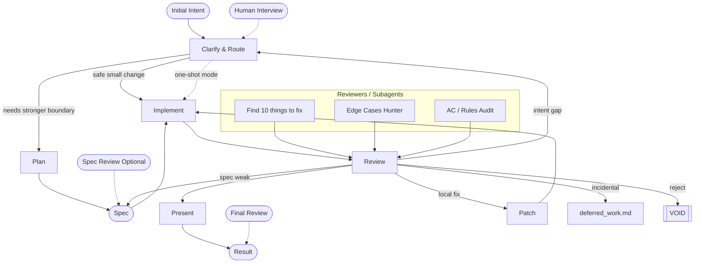

## Pertanyaan yang dibuka

1. Kenapa BMAD menempatkan human attention sebagai bottleneck utama di Quick Dev?
2. Apa bedanya Quick Dev dengan mode "cepat ngoding" biasa?
3. Bagaimana review dirancang agar tidak menghancurkan momentum pengerjaan?

## Klaim utama

BMAD Quick Dev bukan hanya mode untuk mempercepat coding. Ia adalah desain workflow untuk mengurangi checkpoint manusia tanpa membuat model liar.

Prinsip inti: intent in, code changes out, with as few human-in-the-loop turns as possible — without sacrificing quality.

Dalam BMAD, Quick Dev bukan fase pembuka. Ia muncul setelah analysis phase, ketika intent sudah diklarifikasi dan task sudah cukup diprioritaskan untuk diberi ruang otonom.

> Quick Dev memindahkan kontrol manusia ke titik-titik bernilai tinggi: klarifikasi intent, persetujuan spec, dan review akhir.

## Core design BMAD Quick Dev

### 1. Compress intent first

Input apapun bisa datang: kalimat kasar, link issue tracker, output plan mode, chat, atau story number.

Sebelum model dibebaskan, request harus dipadatkan menjadi satu goal yang coherent, kecil, jelas, dan bebas kontradiksi. Jika intent belum stabil, otonomi model hanya akan menghasilkan kesalahan dengan efisien.

Quick Dev tidak menghilangkan kontrol manusia. Ia merelokasikan kontrol ke awal, dan hanya pada momen yang paling bernilai.

### 2. Route to the smallest safe path

Setelah goal jelas, workflow memutuskan jalur teraman.

* Jika perubahan kecil dan blast radius nol atau hampir nol, jalur one-shot bisa digunakan.
* Jika tidak, task melewati jalur penuh dengan planning dan spec yang lebih kuat.

Ini bukan sekadar kecepatan. Ini router risiko: efisiensi berarti memilih jalur paling kecil yang tetap aman.

### 3. Run longer with less supervision

Di jalur penuh, spec yang disetujui menjadi boundary. Model diberi ruang jalan lebih lama sendiri, tapi hanya setelah boundary itu ada.

Otonomi model tidak diberikan mentah-mentah. Ia diberikan setelah intent dibekukan dan scope dibatasi.

### 4. Diagnose failure at the right layer

Jika implementasi salah karena intent salah, memperbaiki kode adalah langkah yang salah.
Jika kode salah karena spec lemah, memperbaiki diff juga salah.

Workflow ini mencari di layer mana kegagalan pertama kali masuk, lalu kembali ke layer itu:

* intent
* spec
* local implementation

Hanya masalah lokal yang dipatch lokal. Sisanya kembali ke sumbernya.

### 5. Bring the human back only when needed

Manusia hadir saat intent interview, saat spec harus disetujui, dan saat review akhir.

Recurring checkpoints yang bernilai rendah dikurangi. Jika workflow bisa lanjut dengan aman, ia akan terus berjalan tanpa interupsi manusia yang konstan.

## Why the review system matters

Review Quick Dev bukan sekadar cari bug. Ia adalah triage untuk koreksi tanpa menghancurkan momentum.

Review sering gagal ketika:

* terlalu banyak temuan sehingga manusia tenggelam dalam noise,
* temuan yang tidak terkait dengan task saat ini mengubah run menjadi cleanup liar.

Quick Dev memperlakukan review sebagai triage:

* temuan yang terkait task saat ini bisa dipatch,
* temuan yang menunjukkan gap spec atau intent kembali ke layer itu,
* temuan incidental didefer ke `deferred_work.md`.

Sistem ini mengoptimalkan signal quality, bukan exhaustive recall.

## Mental model

Quick Dev berada di antara dua ekstrem:

* workflow checkpoint rapat = human attention tinggi, velocity rendah
* prompt-to-code liar = velocity tinggi, quality tidak terkontrol

Posisinya adalah pipeline semi-otonom dengan boundary cerdas. Model mendapat ruang lebih panjang, tapi hanya setelah workflow memastikan batasannya aman.

## Mermaid diagram

## Node-by-node mindset

Untuk analisis lengkap tiap node diagram, lihat [[zettel.20260421174751]].

## Sistem kompresi keputusan

Melihat semua node bersama, Quick Dev adalah sistem kompresi keputusan:

* kabut jadi intent,
* intent jadi plan/spec,
* spec jadi perubahan kode,
* perubahan kode jadi keputusan final.

Tiap node adalah stasiun penyaringan yang memisahkan kesalahan berdasarkan layer. Ini membuat Quick Dev lebih disiplin: bukan hanya cepat, tapi juga lebih jelas dalam menjawab "kalau salah, salahnya di mana?".

## Implikasi BMAD

Quick Dev menunjukkan bahwa mempercepat development bukan hanya soal model latency atau token. Ini soal mengurangi biaya attention manusia.

Ia menolak dua jebakan:

* micromanagement continuous,
* improvisasi liar tanpa boundary.

Sebagai hasilnya, Quick Dev mengoptimalkan waktu pikir manusia dan memberi model ruang yang lebih panjang dalam batas yang aman.

## Lihat juga

* [[zettel.20260421171457]] — BMAD analysis phase menghentikan ketidakjelasan sebelum berubah jadi PRD dan architecture
* [[zettel.20260421171633]] — BMAD brainstorming memperjelas ide sebelum requirement
* [[zettel.20260421173427]] — AI brainstorming terbaik adalah fasilitasi kondisi insight, bukan generator ide
* [[zettel.20260421173600]] — simulasi BMAD brainstorming: dari keresahan tim kecil AI coding tools ke problem definition
* [[zettel.20260421174751]] — Quick Dev diagram: node-by-node diagnosis layer dan alur koreksi
* [[zettel.literature.bmad-quick-dev]] — literature note BMAD Quick Dev
* [[zettel.20260421175034]] — simulasi Quick Dev: reset password via email menunjukkan PATCH, BAD SPEC, dan INTENT GAP
