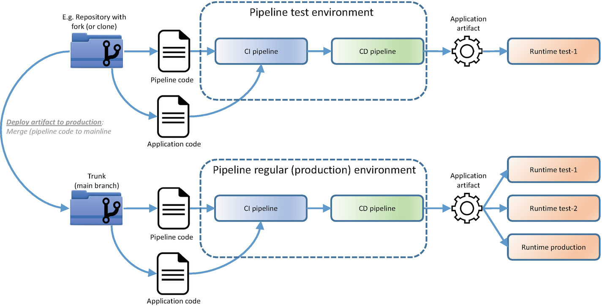
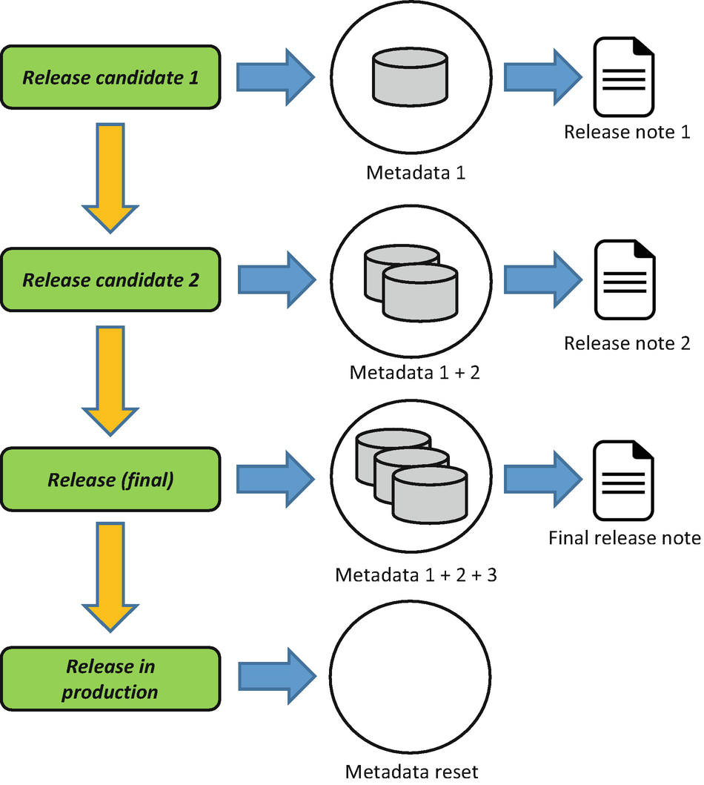
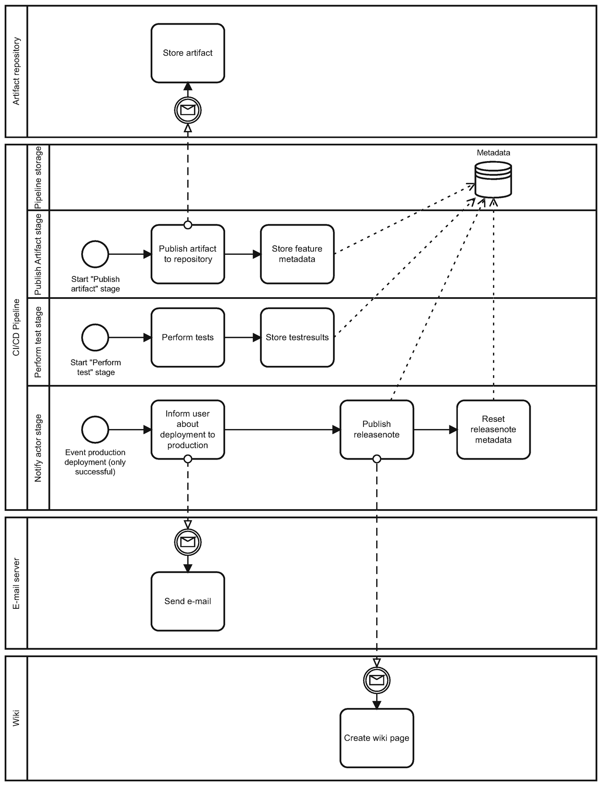
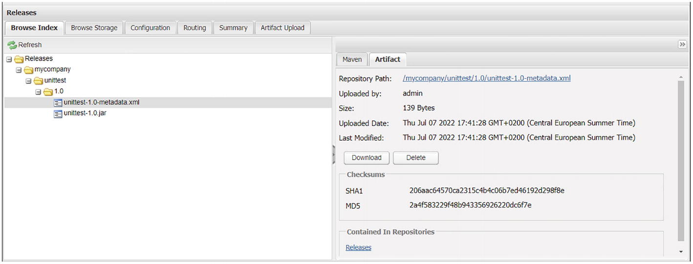
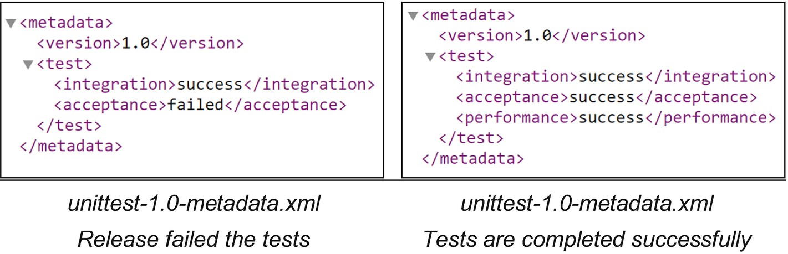

Suatu hari, tim kita akhirnya siap merilis sebuah aplikasi baru ke environment production. Saat momen penting ini tiba, berbagai persiapan pun dimulai. Dimulai dari memasang sertifikat SSL, menata seluruh kredensial dan secret agar aman, hingga memastikan monitoring aplikasi terkonfigurasi dengan benar. Tak semuanya bisa diotomatisasi; sebagian tugas masih memerlukan sentuhan manual. Di sisi lain, pengelolaan aplikasi pun perlu direncanakan dengan rapi. Tim harus tahu persis apa yang harus dilakukan jika aplikasi tiba-tiba gagal atau berperilaku di luar dugaan, dan prosedur untuk menangani perubahan, insiden, maupun masalah operasional harus tersedia agar ketersediaan service tetap aman.

Hal serupa juga berlaku untuk pipeline. Environment tempat pipeline dijalankan harus dipersiapkan dan terus ditingkatkan. Platform pipeline mungkin terhubung ke service eksternal yang perlu diamankan, dan infrastrukturnya—termasuk integrasi dan pipeline itu sendiri—wajib diawasi dengan cermat. Bila pipeline gagal atau tidak berfungsi seperti yang diharapkan, tim perlu segera tanggap untuk memperbaikinya. Barulah setelah semua persiapan tersebut matang, pipeline siap dijalankan. Tidak jarang pekerjaan tambahan diperlukan, jauh lebih banyak daripada yang sering terlihat di permukaan.

## Implementasi Pipeline

Ketika membahas implementasi pipeline, konsepnya sedikit unik. Jika kita membandingkan implementasi pipeline dengan implementasi aplikasi, keduanya sama-sama memerlukan konfigurasi dan penerapan di environment target. Namun, pertanyaannya adalah: apa sebenarnya “environment target” untuk sebuah pipeline? Lalu, bisakah kita benar-benar berbicara tentang “implementasi pipeline” layaknya implementasi aplikasi biasa? Dalam diskusi mengenai “pipeline dari pipeline,” kesimpulannya menyiratkan bahwa menerapkan pipeline ke production tak lebih dari sekadar mendorong kode pipeline ke repositori jarak jauh dan menggabungkannya ke jalur utama. Gambar 7-1 memperlihatkan bagaimana proses ini berlangsung.

Saat melihat Gambar 7-1, kita menemukan bahwa kode pipeline yang baru maupun yang telah diperbarui dapat berada di branch terpisah dalam repositori yang sama dengan aplikasi, atau mungkin di repositori terpisah yang merupakan hasil kloning. Semua itu bergantung pada bagaimana pipeline dikembangkan. Setelah ditulis, kode pipeline tersebut akan ditesting di environment khusus untuk pengtestingan pipeline. Di sana, pipeline otomatis membangun dan menjalankan aplikasi di environment testing pertama, yang disebut “testing Jalankan-1.” Begitu proses penggabungan kode pipeline ke jalur utama selesai, pipeline resmi dianggap “diimplementasikan” dan siap digunakan di seluruh environment tujuan (testing Jalankan-1, testing Jalankan-2, maupun Produksi Jalankan).

## Dampak Organisasi

Sebuah pipeline yang dirancang dengan cermat mengikuti beragam persyaratan dan pedoman organisasi. Sebelum siap digunakan oleh tim DevOps, pipeline itu harus melewati serangkaian testing ketat: mulai dari memastikan perilaku fungsional yang sesuai spesifikasi, mengtesting performa agar memenuhi standar tertentu, menerapkan langkah-langkah keamanan, hingga memeriksa compliance terhadap kebijakan internal. Begitu semua aspek terverifikasi, barulah seluruh anggota tim yakin pipeline tersebut dapat diandalkan. Apabila diperlukan, mereka pun menyiapkan dokumentasi tentang cara penggunaan, penyesuaian teknis, dan pemeliharaan. Semua itu tidak wajib, namun sering kali memudahkan seluruh tim untuk memulai. Pada akhirnya, tim akan bermusyawarah, menilai kesiapan pipeline, dan memberi lampu hijau saat semuanya dianggap layak.

Setiap kali pipeline diperbarui, tim perlu mengenali batasannya dan mendokumentasikan masalah yang telah diketahui. Jika terdapat persyaratan yang belum terwujud, catat tindakan mitigasinya, seperti pemeriksaan manual, agar potensi risiko tetap terkendali. Tim dan pemangku kepentingan dari sisi bisnis kemudian bersama-sama mengevaluasi berbagai celah yang mungkin muncul, lalu merancang perbaikan-perbaikan berikutnya. Semua masukan tersebut disatukan dalam backlog dan diprioritaskan sesuai kebutuhan. Bisnis umumnya akan berfokus pada strategi rilis dan kebijakan organisasi: apakah setiap fitur baru harus langsung diterapkan ke produksi dalam waktu 15 menit, atau cukup menunggu hingga terkumpul dan dirilis seminggu sekali? Keputusan seperti ini akan memengaruhi alur kerja tim, bahkan mungkin menuntut perubahan desain pipeline. Di sinilah struktur pengawasan berperan, memastikan evaluasi yang berkelanjutan. Tim pun perlu meluangkan waktu untuk meninjau dan terus menyempurnakan pipeline, sama seperti mereka melakukan perbaikan berkelanjutan pada pengembangan aplikasi.

Apabila pipeline belum ditetapkan sistem notifikasinya, penting untuk menentukan siapa saja yang berhak mendapatkan informasi serta jenis pembaruan apa yang perlu diberitahukan. Saat tahap pengembangan, mungkin seluruh anggota tim mendapat email serupa setiap kali pipeline berjalan atau ketika dibutuhkan persetujuan penerapan. Namun, menjelang penerapan ke produksi, konfigurasi penerima notifikasi perlu disesuaikan agar setiap orang hanya menerima informasi yang benar-benar relevan. Tujuannya adalah mencegah informasi berlebihan dan sekaligus memaksimalkan efektivitas pipeline. Selain itu, dashboard dapat dimanfaatkan untuk menampilkan data penting secara visual, sehingga tim bisa memantau kondisi pipeline secara real-time dan segera mengambil tindakan bila terjadi masalah.

### Disiplin Tim

Ada kalanya tim sangat antusias mengadopsi otomatisasi dan pipeline. Mereka telah merencanakan segalanya dengan matang, mempelajari berbagai tools, dan berharap proses pengembangan menjadi lebih lancar. Namun, seiring berjalannya waktu, tim mulai menyadari bahwa ada beberapa hal yang kerap terabaikan, dan disiplin kerja diperlukan untuk mengatasinya. Berikut adalah beberapa masalah yang terus-menerus muncul:

- Breaking Builds: Salah satu prinsip integrasi berkelanjutan menyatakan bahwa build yang rusak harus segera diperbaiki. Idealnya, setiap developer langsung menghentikan pekerjaan lain dan fokus memperbaiki pipeline. Namun pada praktiknya, developer sering kali menunda. Jika tidak menimbulkan keterlambatan rilis, mereka menganggapnya biasa saja. Padahal, membiarkan pipeline rusak berlarut-larut—satu hingga dua hari—bukanlah kebiasaan yang baik. Udah gitu, kerusakan pipeline tidak selalu disebabkan oleh kode yang salah. Lingkungan eksternal pun bisa berubah: sistem eksternal down, SSL kedaluwarsa, bahkan platform ALM/integrasi mengalami gangguan. Jika diabaikan, penanganannya semakin hari semakin sulit.

- Disabled Quality Gates: Idealnya, jika analisis kode mendeteksi vulnerabelity serius, pipeline harus “gagal” agar tim segera menyelesaikan masalah tersebut. Akan tetapi, ada situasi di mana quality gates dimatikan—entah secara tidak sengaja atau disengaja—sehingga vulnerabelity dibiarkan. Sering kali hal ini terjadi karena tim tidak ingin mengatasi temuan analisis kode yang menumpuk.

-  Menindak lajuti code yang busuk dan cacat: Sebagian tim rajin membersihkan vulnerabelity penting yang terdeteksi. Mereka memprioritaskan quality gates, sehingga pipeline hanya “hijau” bila kualitas kodenya benar-benar aman. Namun, ada juga yang justru mengabaikan temuan analisis kode hingga menonaktifkan quality gates. Akibatnya, utang teknis menumpuk dan makin sulit dilunasi di kemudian hari.

- Unit Testing Coverage: Prinsip yang sama berlaku untuk unit testing coverage. Beberapa tim menjadikannya target penting agar senantiasa berada di ambang tertentu. Jika di bawah batas, pipeline akan “gagal.” Namun, ada pula tim yang tidak memprioritaskan hal ini. Dampaknya, coverage testing rendah dan kualitas kode mudah terganggu oleh bug yang tak terdeteksi.

- Automated testing yang ditunda tunda: Tidak jarang backlog untuk automated test terus menumpuk. Ini terjadi jika jumlah orang yang mengerjakan otomatisasi terbatas, misalnya hanya tim QA dengan anggota sedikit. Jalan keluar yang sering terbukti efektif adalah melibatkan seluruh tim—termasuk developer—dalam menulis dan memelihara tes otomatis, sehingga beban kerja pengujian tersebar lebih merata.

Di samping itu, tim yang belum sepenuhnya beradaptasi kadang mencari “jalan pintas”: menghindari pipeline resmi dan menerapkan aplikasi ke produksi dengan cara lain, atau melakukan integrasi berkelanjutan dari cabang pengembangan saja, sementara rilis dilakukan dari branch main secara manual di local. Bahkan, ada kalanya pull request disetujui tanpa code review mendalam ketika ada push dari tim product. Semua ini merupakan bagian dari proses pembelajaran. Namun, demi kebaikan jangka panjang, masalah-masalah tersebut harus diatasi agar pipeline benar-benar bermanfaat bagi kualitas, kecepatan, dan stabilitas pengembangan.

### Platform Integrasi

Ada Tim DevOps yang akan membangun dan menjalankan pipeline di sebuah organisasi. Mereka menyadari bahwa pipeline tidak hanya sekadar menulis skrip dan menekan tombol “jalankan,” tetapi juga mencakup infrastruktur di belakangnya. Tiba-tiba tim dihadapkan pada pertanyaan besar: **di mana dan bagaimana pipeline ini akan berjalan?** Mereka pun mulai berdiskusi dan menimbang berbagai model operasional—mulai dari SaaS, IaaS, hingga mengelola infrastruktur sendiri (self-hosting).

#### Model SaaS
Pertama, tim mempertimbangkan **model SaaS**, di mana mereka menggunakan platform integrasi yang sudah tersedia sebagai layanan. Bayangkan kemudahan yang dirasakan oleh tim DevOps: mereka tinggal fokus pada pembuatan pipeline, sementara penyedia SaaS bertanggung jawab atas pengelolaan infrastruktur dan semua pembaruan software. Solusi seperti Azure DevOps atau CircleCI Cloud masuk dalam kategori ini. Berbagai kekhawatiran teknis seolah-olah hilang, karena penyedia layanan menangani keamanan, kapasitas server, dan pemeliharaan rutin. Tim DevOps pun dapat mencurahkan waktu untuk meningkatkan kualitas pipeline tanpa terjebak masalah infrastruktur.

#### Model IaaS
Namun, tim menemukan alasan untuk tidak langsung menutup opsi lain. Mereka juga menimbang **model IaaS**, di mana infrastruktur disediakan oleh platform cloud—misalnya AWS atau Azure—tetapi pengelolaan platform integrasi seperti Jenkins, SonarQube, dan alat-alat penerapan lainnya tetap berada di tangan tim IT4IT atau tim DevOps sendiri. Di sini, tanggung jawab mereka lebih luas: mulai dari memastikan kluster Kubernetes dalam kondisi prima, meng-upgrade kontainer secara rutin, hingga memeriksa apakah kapasitas server masih mencukupi. 

Cerita pun berlanjut ketika pipeline baru semakin banyak dan beban kerja melonjak. Ternyata, infrastruktur yang disiapkan di awal tak lagi mampu menampung tingginya lalu lintas build dan pengujian. Mau tak mau, tim harus meninjau ulang kebutuhan kapasitas. Mungkin memindahkan sebagian tahap build dan testing ke node atau agen lain adalah solusi yang tepat, sehingga beban kerja lebih merata. Dalam model IaaS ini, fleksibilitas cukup tinggi, tetapi tim juga harus siap mengurus hal-hal teknis lebih dalam.

### Model Self-Hosting
Selanjutnya, organisasi mungkin mengambil langkah paling menantang: **self-hosting**. Mereka memutuskan untuk memegang kendali penuh atas seluruh tumpukan integrasi, termasuk perangkat keras maupun perangkat lunaknya. Tentu ada sederet tanggung jawab ekstra:

1. **Menyediakan infrastruktur** tempat seluruh platform integrasi berjalan.  
2. **Mengatur logging, pemantauan, dan notifikasi** di tingkat infrastruktur. Tim harus menentukan metrik apa yang akan diawasi, misalnya tingkat pemakaian CPU di atas 90 persen atau ruang disk yang menipis di atas 80 persen.  
3. **Memastikan infrastruktur memenuhi standar nonfungsional**, seperti yang diatur dalam ISO 25010. Ini mencakup keamanan, ketersediaan, serta berbagai aspek kualitas lain. Tim juga harus menilai keamanan infrastruktur menggunakan kerangka acuan seperti NIST, terutama untuk infrastruktur yang dianggap kritis.

Pilihan ini membuat tim DevOps lebih leluasa menyesuaikan setiap aspek infrastruktur dengan kebutuhan unik di organisasi. Namun, konsekuensinya, beban kerja mereka dalam hal perawatan dan pemeliharaan ikut melonjak.

### Keamanan Infrastruktur
Dalam cerita ini, keamanan menjadi tema yang selalu mendominasi pikiran tim, apa pun model operasional yang dipilih. Mereka tak mau kecolongan. Berbagai hal diperhatikan:

- **Penguatan server dan manajemen kerentanan:** Server harus dijaga, rutin diperbarui, dan divalidasi keamanannya.  
- **Koneksi yang aman:** Komunikasi antara platform ALM, sistem SCM, alat analisis kode, hingga environment produksi perlu terlindungi, misalnya dengan HTTPS atau mTLS.  
- **Pengaturan hak akses:** Tim memastikan bahwa yang memicu penerapan tidak bisa sekaligus menyetujui penerapan itu tanpa mekanisme kontrol.  
- **Kebijakan cabang:** Pipeline tidak boleh digabungkan ke jalur utama jika sedang gagal. Aturan ini harus dikonfigurasi dengan tepat agar tak ada kode bermasalah yang lolos ke production.  
- **Penggunaan vault:** Token, kunci, dan kredensial disimpan secara aman di vault. Ini membantu mencegah kebocoran data kritis.  
- **Proteksi artefak rilis:** Kode aplikasi, pipeline, pengujian, maupun item kerja yang membentuk artefak rilis produksi harus diamankan agar tidak bisa dihapus sembarangan.  
- **Pemindai kepatuhan pipeline:** Mengawasi apakah pipeline telah sesuai dengan kebijakan organisasi, misalnya terkait audit, keamanan, atau standar internal lainnya.

Pada akhirnya, kisah ini memperlihatkan bahwa membangun dan menjalankan pipeline tidak sekadar soal menulis skrip otomatisasi. Tim DevOps perlu mempertimbangkan di mana pipeline tersebut akan hidup, bagaimana mengelola infrastruktur di belakangnya, serta bagaimana menjaga keamanan dan kepatuhan. **Keputusan dan disiplin** dalam hal infrastruktur, entah SaaS, IaaS, ataupun self-hosting, menjadi fondasi agar pipeline berfungsi andal, aman, dan efisien—persis seperti yang diharapkan oleh seluruh pemangku kepentingan.

### Persiapan environment Target

Jika tim telah mengadopsi pengembangan pipeline yang diperluas (atau canggih), sebagian besar pengembangan dan pengtestingan pipeline dilakukan menggunakan environment pengembangan/testingan pipeline. Jika pipeline siap untuk diimplementasikan dan digunakan, pipeline tersebut dipromosikan sehingga dapat membangun dan menerapkan aplikasi ke berbagai environment target. Ini mungkin meliputi environment testing tambahan dan environment produksi. Konfigurasikan environment target ini agar dapat diakses oleh pipeline dan lakukan penerapan melalui koneksi yang aman.

Aplikasi yang diimplementasikan kemungkinan juga memerlukan kredensial (basis data), sertifikat, atau data statis. Hal ini harus diminta atau dihasilkan dan diterapkan ke environment target sehingga aplikasi dapat menggunakannya. Lebih baik jika ini adalah proses otomatis; gunakan pipeline operasional untuk mengatur hal ini. Bab berikutnyaakan membahas pipeline operasional dengan lebih detail.

Dalam kasus environment testing aplikasi, perlu diatur data testing. Entah menghasilkan data sintetis atau menggunakan salinan dari produksi, tetapi pastikan data tersebut dianonimkan.

#### Playbook

Apa dampak bisnis jika terjadi insiden atau masalah dengan pipeline? Kegagalan pipeline dapat menyebabkan kerusakan. Misalnya, perbaikan mendesak pada aplikasi harus dibuat dan perlu diterapkan. Namun, pipeline tidak berfungsi karena kegagalan infrastruktur dari platform integrasi. Ini dapat merusak kelangsungan proses bisnis jika pipeline tidak tersedia dalam waktu yang lama. Proses ITIL juga berlaku untuk pipeline. Playbook dapat berperan penting dalam proses manajemen insiden dan masalah.

Playbook berisi metode investigasi yang didokumentasikan untuk mendeteksi dan menyelesaikan masalah. Playbook ini berguna untuk menyelidiki insiden atau kegagalan. Playbook juga dapat digunakan untuk pipeline. Penyusunan playbook pipeline dapat dimulai selama pengtestingan pipeline. Kegagalan pipeline umum dan solusinya ditambahkan ke playbook. Tentu saja, playbook tidak pernah lengkap, dan setelah implementasi dan penggunaan pipeline, akan muncul lebih banyak kasus. Kasus-kasus ini juga ditambahkan ke playbook.

### Implementasi Aplikasi

Sulit untuk membicarakan implementasi pipeline tanpa menyebutkan implementasi aplikasi. Implementasi aplikasi, pada dasarnya, adalah tujuan penggunaan pipeline. Menambahkan fitur-fitur tertentu ke dalam pipeline dapat berkontribusi pada pengalaman implementasi aplikasi yang solid. Pertimbangkan untuk menggunakan atau mengimplementasikan fitur-fitur berikut.

#### Runbook

"Sebuah runbook adalah sekumpulan proses dan prosedur yang Anda eksekusi secara berulang untuk mendukung berbagai tugas perusahaan."

Referensi [33]

Mengapa Anda membutuhkan runbook jika Anda menggunakan pipeline otomatis? Itu pertanyaan yang bagus. Sebuah pipeline sudah mengatur pelaksanaan aplikasi, bukan? Tetapi tim masih menggunakan runbook meskipun mereka juga menggunakan pipeline. Ada beberapa alasan mengapa penggunaan runbook masih valid.
Masih ada tugas atau aktivitas satu kali yang tidak termasuk dalam CI/CD. Awal CI adalah saat melakukan commit ke repositori. Akhir CD adalah saat penerapan artefak ke environment produksi. Banyak tugas termasuk dalam proses sebelum dan sesudah CI/CD. Pikirkan tentang meminta langganan Azure, mengonfigurasi peran IAM, dan mengalokasikan anggota tim. Selain itu, pemeliharaan atau migrasi rutin melibatkan aktivitas yang juga tidak termasuk dalam pipeline CI/CD. Terkadang aktivitas-aktivitas ini kompleks dan memerlukan runbook yang detail.

Alasan lain menggunakan runbook adalah implementasi pertama dari sistem lengkap. Anda tidak memiliki CI/CD yang disiapkan sejak hari pertama. Implementasi sistem baru dalam produksi mungkin memerlukan eksekusi beberapa pipeline dalam urutan tertentu; bahkan dalam arsitektur mikro layanan, beberapa pipeline harus berjalan dalam urutan tertentu. Pikirkan tentang menyiapkan komponen infrastruktur dasar yang digunakan oleh semua mikro layanan.

Segala sesuatu dapat diotomatiskan, termasuk runbook. Jika sebuah spreadsheet sederhana tidak cukup, gunakan salah satu dari beberapa alat runbook otomatis. Dan karena Anda sudah mengembangkan pipeline, mengatur pipeline orkestrasi untuk mengimplementasikan runbook juga menjadi pilihan. Namun, pertanyaannya adalah apakah manfaatnya sebanding dengan usaha dan biaya yang dikeluarkan. Itu adalah pertanyaan yang hanya dapat dijawab oleh tim.

### Release Note

Sebuah release note adalah catatan perubahan, yang menggambarkan pembaruan software. Ini juga dapat mencakup bukti bahwa semua fitur baru telah ditesting dan diterima. Jadi, release note terkait dengan artefak dan berisi informasi tentang fitur-fitur yang disampaikan dan (opsional) laporan pengtestingan. Karena buku ini membahas desain CI/CD, pembuatan release note seharusnya tidak dilakukan secara manual tetapi dibuat secara otomatis. Namun, ada satu hal yang perlu dipertimbangkan. Antara dua rilis produksi, kemungkinan ada beberapa kandidat rilis, termasuk fitur-fitur dan perubahan baru. Kandidat rilis terakhir ditandai sebagai "rilis" dan diterapkan ke produksi. Potensial, beberapa catatan rilis dibuat di antara mereka, masing-masing terkait dengan kandidat rilis. Hanya artefak terakhir yang diterapkan ke produksi yang berisi semua fitur baru sejak rilis produksi sebelumnya. Kemungkinan besar catatan rilis terakhir sangat ringkas, hanya menggambarkan perbaikan bug. Hal ini sedikit disayangkan. Catatan rilis dari artefak produksi seharusnya idealnya terdiri dari semua perubahan antara rilis produksi sebelumnya dan rilis produksi saat ini. Selain itu, catatan rilis juga harus berisi semua hasil pengtestingan yang dilakukan pada rilis yang diterapkan ke produksi.

Untuk memecahkan masalah ini, sistem harus melacak semua perubahan antara rilis produksi terbaru dan rilis produksi berikutnya dan mengumpulkan semua metadata perantara untuk membentuk catatan rilis yang teragregasi. Setelah setiap penerapan produksi, status metadata direset, dan proses pengumpulan dimulai kembali. Lihat Gambar 7-2.

Karena catatan rilis berpotensi berisi semua fitur artefak dan hasil pengtestingan yang terkait, pembuatannya biasanya dilakukan setelah semua pengtestingan selesai. Metadata yang terdiri dari semua fitur dihasilkan pada tahap Publish artefak, di mana semua data perubahan dan fitur artefak dikumpulkan. Tahap Perform test menghasilkan semua hasil pengtestingan. Sepertinya masuk akal bahwa pembuatan catatan rilis dilakukan sebagai bagian dari tahap Notify actors.

Pertimbangkan kasus berikut:

> Tim ingin mengotomatisasi pembuatan catatan rilis. Mereka menggunakan sistem pelacak masalah terpisah untuk mendaftar item kerja. Kode disimpan di Git, dan artefak disimpan di repositori artefak.

> Tim diberi informasi tentang setiap penerapan produksi menggunakan email (baik penerapan yang berhasil maupun yang gagal).

> Catatan rilis dipublikasikan di halaman wiki. Tim ingin memiliki catatan rilis teragregasi, yang berisi semua fitur sejak rilis terakhir diterapkan ke produksi, termasuk hasil pengtestingan dari rilis terakhir.

Model BPMN khas dapat terlihat seperti pada Gambar 7-3.

Ketika tahap Publish artefak dieksekusi, artefak disimpan di repositori artefak, setelah itu tugas khusus mengumpulkan semua data yang terkait dengan artefak. Ini berarti pesan komit kode diambil dan item kerja yang terkait dengan artefak rilis diambil (tidak ditampilkan dalam diagram untuk alasan kejelasan). Informasi ini disimpan di database sehingga dapat digunakan nanti.

Pada akhir tahap Perform test, hasil pengtesting akan terbaca. Data hasil pengtestingan dikumpulkan dan juga disimpan dalam database yang sama.

Pada suatu waktu dalam proses CI/CD, artefak tersebut (berhasil) diimplementasikan ke environment produksi. Hasil dari penerapan tersebut diteruskan ke tahap Notify actors, dan tugas Publish release note mengambil metadata dari database, mengumpulkan data tersebut, memformatnya menjadi catatan rilis, dan mempublikasikannya ke halaman wiki. Setelah ini selesai, metadata dalam database direset ke situasi awal yang baru.

#### Promosi Artefak

Hasil dari tahap build, package, dan publish adalah sebuah artefak yang disimpan dalam repositori biner. Artefak ini adalah kandidat rilis, artinya secara potensial dapat diimplementasikan ke produksi. Namun, pertama-tama artefak harus melalui berbagai siklus pengtestingan, sehingga segalanya dapat terjadi sepanjang perjalanan. Selama proses pengtestingan, artefak bergerak mendekati produksi, tetapi hanya artefak yang telah ditesting dengan sukses yang diizinkan untuk diimplementasikan ke produksi. Kandidat rilis yang terhenti di tengah proses pengtestingan harus diberi tanda karena ada potensi risiko bahwa rilis yang salah diimplementasikan ke produksi. Masalahnya adalah semua kandidat rilis, baik yang gagal dalam pengtestingan maupun yang berhasil, disimpan dalam repositori biner yang sama. Harus ada cara untuk membedakan kandidat rilis yang gagal dengan rilis yang berhasil. Untuk memastikan bahwa kandidat rilis yang gagal selama pengtestingan dicegah dari diimplementasikan ke produksi, dapat ditambahkan quality gate; ini adalah pemeriksaan tambahan untuk menentukan bahwa artefak valid. Pemeriksaan ini dapat diimplementasikan dalam tahap Validate exit criteria.

Tapi berdasarkan informasi apa quality gate ini bekerja? Ada beberapa opsi untuk mencegah rilis yang salah diimplementasikan.

- Artefak dipromosikan dari tahap ke tahap. Salah satu jenis implementasi adalah artefak berpindah antara repositori biner yang berbeda. Jadi setelah pengtestingan integrasi, pengtestingan penerimaan, dan pengtestingan kinerja, artefak dipindahkan dari satu repositori ke repositori berikutnya. Repositori terakhir berisi rilis yang siap untuk produksi, jadi itu adalah repositori yang digunakan dalam tahap Deploy artefak ke produksi. Kondisi/quality gate tambahan bahkan tidak diperlukan karena repositori yang tepat sudah digunakan. Kelemahan besar dari solusi ini adalah bahwa multiple repositori diperlukan dan artefak dipindahkan beberapa kali.

- Opsi lainnya adalah mempromosikan artefak secara manual. Fitur ini ditawarkan oleh beberapa platform ALM. Masalah dengan opsi ini adalah bahwa itu adalah tindakan manual. Pengguna harus secara aktif mengubah status artefak dari pra-rilis menjadi rilis, misalnya. Tahap kontrol ganda sudah merupakan tindakan manual, jadi apa gunanya menambah lebih banyak tindakan manual? Jujur saja, promosi artefak manual adalah sesuatu yang harus dihindari.

- Alih-alih menarik artefak yang sama ke repositori biner yang berbeda, ada juga opsi untuk menyimpan semua artefak dalam repositori yang sama dan menyediakan metadata. Setelah tahap-tahap dan tugas-tugas tertentu selesai dan pengtestingan berhasil, metadata artefak diperbarui (menggunakan curl atau Maven, misalnya). Berdasarkan metadata-nya, status artefak menjadi jelas.

Gambar 7-4 menggambarkan artefak kerangka pengtestingan unit dengan metadata tambahan dalam format file XML. File metadata (unittest-1.0-metadata.xml) berisi informasi tambahan tentang status tugas pengtestingan.

Sebelum artefak diunduh dari repositori biner dan diimplementasikan ke produksi, metadata-nya dibaca dan diinterpretasikan (menggunakan tugas quality gate dalam tahap Validate exit criteria). Karena pengtestingan penerimaan dalam metadata di sebelah kiri Gambar 7-5 menunjukkan bahwa pengtestingan penerimaan gagal, pipeline berakhir di sini, dan implementasi ke produksi tidak dilakukan. Pada contoh kedua, di sebelah kanan, metadata menunjukkan bahwa semua pengtestingan berhasil. Quality gate terlewati, dan implementasi dapat dimulai.

Catatan: Ini menjadi masalah yang lebih kecil jika bagian CI dan CD diimplementasikan sebagai satu pipeline fisik. Pipeline tersebut sudah gagal sebelum tahap Validate exit criteria dicapai. Namun, ini menjadi risiko jika implementasinya terdiri dari pipeline-pipeline terpisah. Salah satu contoh di mana ini menjadi masalah adalah dalam kasus strategi pembangunan multiteam, di mana ada satu pipeline CD terpisah, memproses artefak dari beberapa pipeline CI.
