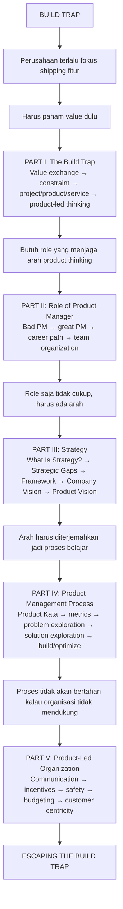

Yang paling nempel dari *Escaping the Build Trap* adalah satu kalimat sederhana: banyak organisasi merasa produktif karena terus shipping fitur, tapi mereka sebenarnya sedang sibuk membangun output, bukan menghasilkan outcome.

### Preface: Build Trap sebagai Masalah Organisasi

Di preface gue merasa titik awalnya penting: build trap tidak bisa disederhanakan jadi “PM kurang jago”. Ini masalah sistem org. Michael Dell jadi pembuka dengan quote: “The point is, you can’t keep doing the same thing and expect it to keep working.”

Melissa Perri cerita kayak gue pernah: bikin requirement tebal, lempar ke developer, lalu ngerasa keren. Tapi kenyataannya, produk itu tidak dipakai. Dari momen itu gue ngerti bahwa aktivitas internal bisa terlihat benar, tapi hasilnya salah. Build trap bukan cuma soal tidak bisa membangun. Build trap bisa terjadi ketika tim sangat mahir membangun, tapi membangun hal yang tidak menghasilkan outcome.

Preface ini menarik karena dia mengubah fokus dari “buku untuk PM” jadi “buku tentang product-led organization.” Istilah pentingnya: skill individu tidak cukup kalau sistem insentif, struktur, dan budaya organisasi masih mendorong perilaku lama. Gue bisa belajar eksperimen dan customer research, tapi kalau bonus, manajemen, dan KPI tetap output-driven, gue bakal kejebak lagi.

Di sini juga istilah “product person” diperlebar. Bukan cuma PM. Ini buat siapa pun yang ikut menentukan produk: PM, engineer, founder, leader. Product bukan hanya departemen; product adalah cara organisasi mengambil keputusan.

### Diagnosis: Build Trap

Di Part I, gue diajak memahami build trap sebagai jebakan organisasi yang mengukur kemajuan dengan pertanyaan seperti “fitur apa yang sudah selesai?” bukannya “masalah customer apa yang berhasil kita selesaikan, dan apa dampaknya ke bisnis?”.

Dari situ gue mulai melihat produk sebagai value exchange system. Customer memberi waktu, perhatian, uang, data, atau kepercayaan. Perusahaan memberi solusi, kemudahan, efisiensi, atau hasil yang lebih baik. Kalau pertukaran itu tidak sehat, fitur sebanyak apa pun tidak menyelamatkan produk.

Di situ gue juga melihat perbedaan antara project, product, dan service. Project punya awal-akhir: fokusnya selesaiin X. Product hidup lebih lama dan berubah berdasarkan masalah, usage, dan strategi. Service merangkum keseluruhan pengalaman customer — support, onboarding, billing, reliability, dan semua interaksi.

### Part I: The Build Trap

Part I terasa seperti dasar yang harus gue pahami dulu: apakah organisasi sedang bertukar value dengan sehat? Dalam bab-bab ini Melissa memetakan sistem value yang membuat produk layak dipakai. Customer memberi waktu, uang, perhatian, data, dan trust. Perusahaan memberi hasil yang lebih baik, proses lebih mudah, dan pengalaman yang lebih lancar. Kalau pertukaran itu timpang, fitur sebanyak apa pun tidak cukup.

Bab-babnya disusun seperti urutan pemikiran:

- The Value Exchange System
- Constraints on the Value Exchange System
- Projects Versus Products Versus Services
- The Product-Led Organization
- What We Know and What We Don’t

Hal yang paling nancep buat gue adalah: bab ini bukan sekadar bilang produk bukan proyek. Bab ini mengajak gue membangun pola pikir. Sebelum ngomong role PM atau strategy, gue harus paham medan permainannya. Kalau mindset organisasi masih “proyek”, ukuran suksesnya cuma selesai. Kalau mindsetnya “produk”, ukuran suksesnya berubah jadi dampak. Kalau mindsetnya “service”, ukuran suksesnya adalah pengalaman end-to-end.

Yang gue suka dari struktur ini adalah dia tidak langsung ngomongin “cara jadi product manager”. Dia mulai dari sistem value. Itu penting: product management tanpa pemahaman value gampang berubah jadi backlog management. Mirip engineering: sebelum optimasi kode, gue harus tahu dulu di mana bottleneck sistemnya.

### Part II: The Role of the Product Manager

Setelah gue paham build trap, buku masuk ke Part II untuk nanya: siapa yang harus bantu organisasi berpikir benar?

Bab-babnya:

- Bad Product Manager Archetypes
- A Great Product Manager
- The Product Manager Career Path
- Organizing Your Teams

Yang gue tangkap adalah: PM bukan cuma tukang tulis requirement atau CEO mini. PM yang sehat bantu tim memahami problem, memvalidasi opportunity, menghubungkan customer need dengan business goal, lalu bantu tim membuat keputusan produk yang lebih baik.

Di situ gue lihat beberapa archetype PM yang jebakannya organisasi output-driven:

- PM yang cuma jadi project manager
- PM yang cuma jadi backlog secretary
- PM yang cuma meneruskan request stakeholder
- PM yang memonopoli keputusan sampai engineering dan design cuma eksekutor

Ini penting: gue ngerasa ini tidak memuja role PM secara buta. PM bisa jadi bagian dari masalah kalau posisinya salah. Role PM masuk setelah build trap dijelaskan karena PM adalah respons terhadap masalah sistemik.

Kalau organisasi masih output-driven, PM bakal dipaksa jadi penjaga backlog. Kalau organisasi outcome-driven, PM bisa jadi penghubung antara customer problem, business strategy, dan delivery team. Jadi kualitas PM tidak bisa dipisahkan dari struktur organisasi; role clarity bergantung pada operating model.

### Part III: Strategy

Part III menurut gue adalah otak dari product thinking.

Bab-babnya:

- What Is Strategy?
- Strategic Gaps
- Creating a Good Strategic Framework
- Company-Level Vision and Strategic Intents
- Product Vision and Portfolio

Ini bagian paling kena kalau lo sering merasa “gue punya banyak fitur, tapi produknya gak kerasa utuh.” Strategy di sini bukan slide cantik atau slogan. Strategy adalah sistem keputusan yang menjawab: kita mau menang di mana, dengan cara apa, untuk customer siapa, dan trade-off apa yang harus kita ambil?

Tanpa strategy, tim gampang ke mode request-driven. Sales minta A, customer besar minta B, CEO minta C, competitor minta D, sampai roadmap jadi campuran tempelan. Dari luar terlihat aktif, tapi dari dalam gak punya arah.

Strategic gap muncul ketika visi besar nggak nyambung ke aktivitas harian. Banyak perusahaan punya visi tinggi seperti “menjadi platform terbaik untuk X”, tapi sprint team sehari-hari cuma ngurus tiket random. Strategy harus jadi jembatan antara visi dan pekerjaan tim.

Product vision harus lebih spesifik daripada company vision. Product vision ngejelasin produk harus jadi apa supaya visi bisnis bisa tercapai. Portfolio penting kalau perusahaan punya banyak produk atau banyak area problem.

Polanya: vision → strategic intent → product vision → product initiatives → experiments/features. Fitur berada di ujung bawah. Fitur adalah konsekuensi, bukan titik awal.

### Part IV: Product Management Process

Part IV berisi bab praktis:

- The Product Kata
- Understanding the Direction and Setting Success Metrics
- Problem Exploration
- Solution Exploration
- Building and Optimizing Your Solution

Bagian ini terasa paling teknis, tapi juga paling penting untuk keluar dari build trap. “Product Kata” gue baca sebagai latihan berulang: pahami tujuan, pahami kondisi sekarang, identifikasi obstacle, eksperimen, belajar, ulangi.

Urutannya menarik karena dia nggak langsung ngajak “brainstorm solusi”. Dia mulai dari direction dan success metrics. Tanpa metrik sukses, kita nggak bisa tahu apakah solusi itu bekerja atau cuma terlihat bagus.

Problem exploration tanya:

- masalah apa yang benar-benar terjadi?
- siapa yang mengalami?
- seberapa sering?
- seberapa mahal dampaknya?
- apakah problem ini worth solving?

Solution exploration baru tanya:

- solusi apa yang mungkin?
- mana yang paling murah untuk divalidasi?
- mana yang paling mungkin menghasilkan outcome?
- bagaimana kita tahu solusi ini bekerja?

Proses yang sehat memisahkan problem space dan solution space. Problem space adalah wilayah memahami realitas: pain, behavior, constraint, context. Solution space adalah wilayah desain: fitur, flow, automation, UI, API, pricing, onboarding.

Kalau lo lompat ke solution space terlalu cepat, lo akan bangun fitur rapi yang mungkin nggak penting. Success metric harus muncul sebelum build karena metric adalah alat navigasi. Product Kata bukan sekali riset lalu build besar; ini siklus belajar kecil.

### Part V: The Product-Led Organization

Part V nutup buku dengan organisasi yang membuat semua konsep sebelumnya bertahan. Bab-babnya:

- Outcome-Focused Communication
- Rewards and Incentives
- Safety and Learning
- Budgeting
- Customer Centricity
- Marquetly: The Product-Led Company
- Afterword: Escaping the Build Trap to Become Product-Led
- Appendix: Six Questions to Determine Whether a Company Is Product-Led

Di sini pertanyaannya adalah: gimana caranya satu perusahaan benar-benar hidup dengan prinsip ini?

Build trap bukan cuma masalah individu. Dia muncul dari sistem insentif. Kalau orang dipuji karena “fitur selesai banyak”, mereka akan tetep ngejar fitur. Kalau budgeting masih project-based, tim bakal ngemas kerjaan jadi project besar. Kalau komunikasi stakeholder selalu pakai output, tim bakal laporin output. Kalau kegagalan eksperimen dihukum, orang bakal pura-pura yakin dan berhenti belajar.

Makanya bab tentang rewards, incentives, safety, learning, budgeting, dan customer centricity ada di akhir. Bukan sekadar tambahan. Ini kondisi lingkungan yang bikin product thinking bisa bertahan.

Product-led organization bukan cuma organisasi yang “punya PM”. Product-led berarti keputusan bisnis dan delivery diarahkan oleh outcome customer dan impact bisnis. Kalau reward masih output-based, orang bakal tetap ngejar output walaupun ngomongnya outcome. Kalau budgeting masih project-based, product team susah ngelakuin discovery berkelanjutan. Kalau gak ada psychological safety, eksperimen bisa berubah jadi sandiwara validasi. Customer centricity bukan “nanya customer mau fitur apa”, tapi memahami masalah dan konteks customer.

### Kenapa ini penting

Untuk konteks SaaS atau produk B2B, pelajaran paling pentingnya bukan memulai dari daftar fitur. Pelajaran itu adalah mulai dari sistem value:

- siapa user utama?
- moment apa yang menyakitkan?
- outcome apa yang mereka butuh?
- perubahan perilaku apa yang jadi tanda produk berguna?
- fitur minimum apa yang bisa membuktikan perubahan itu?

Yang paling ngena bagi gue adalah bahwa product management bukan sekadar seni bikin roadmap. Ini disiplin menghubungkan problem customer, outcome bisnis, strategi, eksperimen, dan delivery supaya tim tidak cuma sibuk membangun, tapi benar-benar menciptakan value.

## Lihat Juga

- [[handbook.product-thinking.from-feature-to-service-design]] — learning path keluar dari build trap dan mulai dari pain point kecil
- [[notes.saas.product-vs-service]] — contoh perbedaan product vs service di SaaS
- [[handbook.product-thinking.service-sense-and-journey-thinking]] — service sense dan journey thinking untuk membuat alur produk lebih mengalir
