## Part I: Getting Started with AI

### Problem statement

Di Part I, masalahnya adalah menemukan titik masuk yang realistis buat developer: bagaimana caranya memakai LLM tanpa harus jadi peneliti ML, bagaimana mengemas model itu dalam aplikasi, dan bagaimana memahami batasan dasarnya sebelum masuk ke tooling yang lebih rumit.

Dalam bahasa gue, ini tentang membangun fondasi yang cukup kuat supaya pendekatan AI terasa masuk akal, bukan sekadar demo hype.

## Chapter 1: Understanding Large Language Models

Di sini gue sedang membangun model mental yang jadi dasar semua engineering AI selanjutnya. Kalau gue cuma menghafal istilah, nanti prompt, RAG, fine-tuning, dan agents bakal terasa seperti trik acak.

### Mental model utama

Kutipan inti yang seharusnya lo pegang:

> “Large language models (LLMs) are very large, deep learning models that are pretrained on vast amounts of data.”

> “The model predicts the word most likely to appear next in the sequence, over and over, until the response generation is complete.”

> “Traditional programming is based on Boolean logic. It’s deterministic.”

> “The results you get with any given input are probabilistic.”

> “The model does not know facts that arose after the cutoff, nor does it know anything about your private data unless you provide that information in the prompt.”

> “It’s always easiest (and the most cost-effective) to start with prompt engineering.”

Kalau digabung, intinya:

**LLM adalah model pretrained besar yang menghasilkan teks token demi token secara probabilistik. Itu membuatnya fleksibel, tapi juga rawan salah, tidak otomatis tahu domain privat lo, dan perlu diarahkan lewat prompt, context, atau fine-tuning.**

### 1. Prompt → LLM → response

Ini diagram paling dasar:

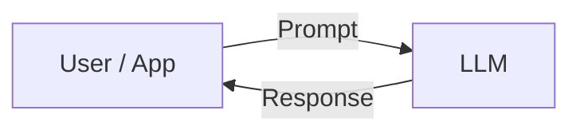

Intuisi dasarnya: lo kirim prompt, model mengolah prompt, model balikin response. Prompt bukan cuma pertanyaan; prompt adalah konteks awal yang menentukan trajectory token.

### 2. Training data → pretrained model

Model jadi kuat karena belajar dari data besar:

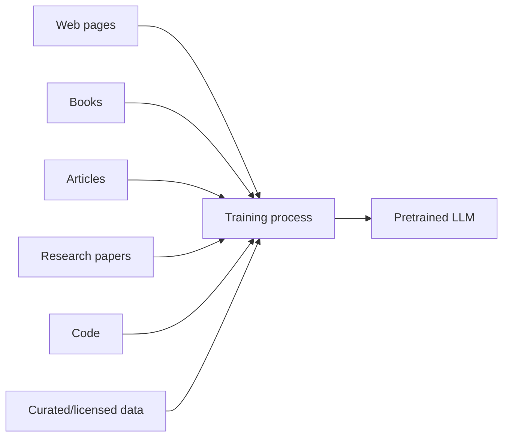

Dari situ muncul dua hal sekaligus:

- kenapa model bisa terdengar pintar,
- kenapa model punya batas yang berasal dari data yang ia lihat.

### 3. Token demi token

Mekanisme dasarnya:

```mermaid
flowchart LR
    C1[Context: Who are the Beatles?] --> P1[Predict next token: The]
    P1 --> C2[Context: Who are the Beatles? The]
    C2 --> P2[Predict next token: Beatles]
    P2 --> C3[Context: Who are the Beatles? The Beatles]
    C3 --> P3[Predict next token: are a]
    P3 --> C4[Context: Who are the Beatles? The Beatles are a]
    C4 --> P4[Predict next token: rock]
    P4 --> C5[Context: Who are the Beatles? The Beatles are a rock]
    C5 --> P5[Predict next token: band]
```

Ini penting karena keluaran dibangun langkah demi langkah. Model tidak menulis paragraf final sekaligus.

### 4. Training vs inference

Bedanya ini penting:

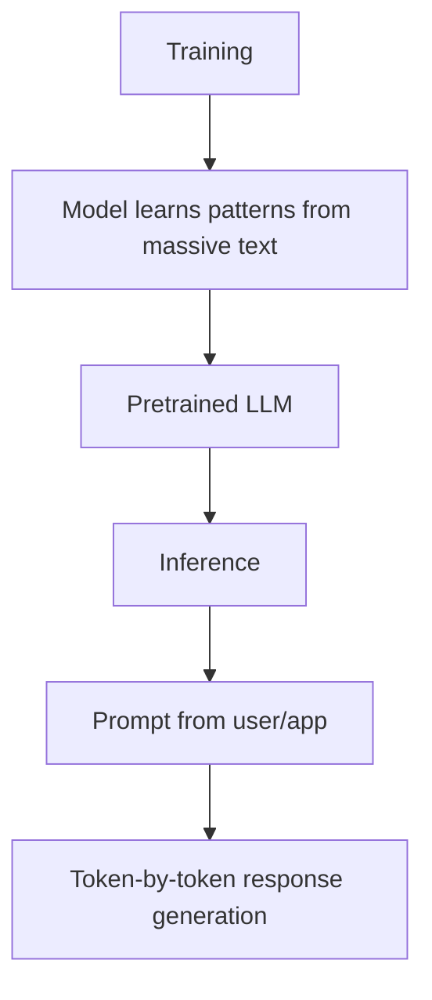

Training adalah saat model belajar pola umum. Inference adalah saat model memakai pola itu untuk input baru.

### 5. Code deterministik vs LLM probabilistik

Perbedaan mental modelnya:

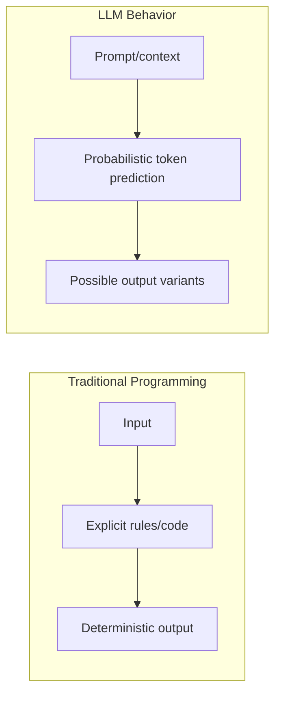

Kalau di code tradisional input sama, output harus sama. Di LLM, input sama, output bisa beda. Itu sifat dasarnya.

### 6. Knowledge limit & grounding

Model punya batas pengetahuan:

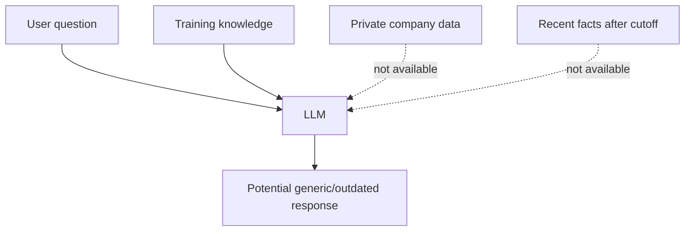

Solusinya adalah grounding:

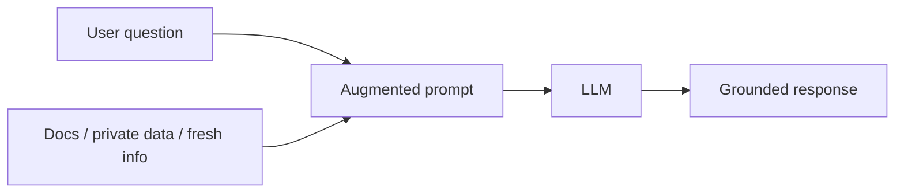

Kalau info domain lo tidak ada di training dan tidak masuk prompt, wajar model gak tahu.

### 7. Hallucination flow

Kalau model tidak punya relevan knowledge, dia masih akan terus prediksi token:

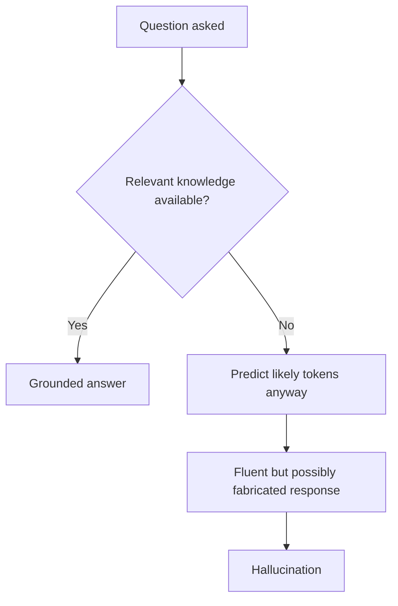

Kefasihan bahasa bukan jaminan kebenaran. Itu jebakan terbesar.

### 8. Multi-step reasoning fragility

Kalau task butuh banyak langkah, satu kesalahan kecil bisa snowball:

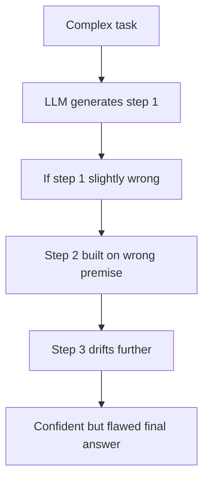

Itu kenapa teknik seperti decomposition, chain of thought, verification, dan tool use penting.

### 9. Hierarki intervensi

Karena LLM punya batas, ada urutan intervensi yang sehat:

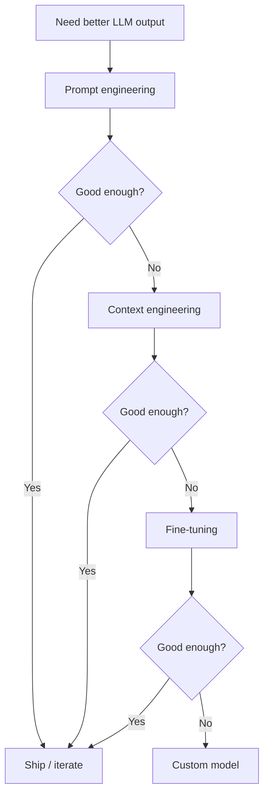

Jadi bukan langsung lompat ke fine-tune. Mulai dari yang murah, baru naik ke yang lebih mahal.

### 10. Dari LLM ke agentic systems

Agent bukan makhluk baru. Agent adalah:

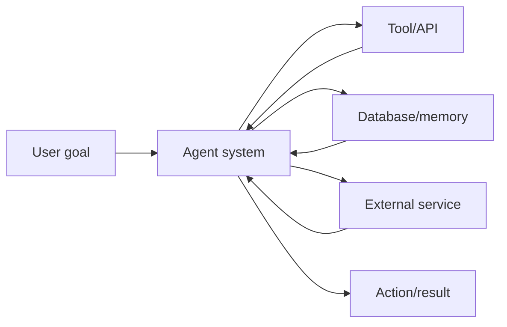

Agent berarti LLM plus konteks, plus tools, plus loop keputusan. Fondasi yang dipakai tetap sama.

### Inti utama

Bagian ini sedang meluruskan intuisi: LLM itu dikuatkan oleh pretraining di data teks masif, menghasilkan respons token demi token secara probabilistik, fleksibel tapi punya batas. Tugas developer adalah memahami trade-off itu dan memilih intervensi yang tepat: prompt, context, fine-tuning, atau custom model.

## Chapter 2: Building Your First LLM-Powered Application

Bagian ini memindahkan kita dari “paham LLM” ke “menyusun skeleton sistem.” Kalau bagian sebelumnya fokus ke model mental, sekarang fokusnya adalah aliran nyata: input user → prompt → service → model → response → user.

### 1. Target sederhana tapi strategis

Akhirnya kita dapat tiga tujuan jelas:

- menangkap input user dan bikin prompt,
- kirim prompt ke LLM lewat API,
- stream response balik ke user.

Itu nampak gampang, tapi ini sudah memuat tiga layer sistem:

- input layer
- inference layer
- delivery layer

Diagram paling dasar dari bagian ini adalah:

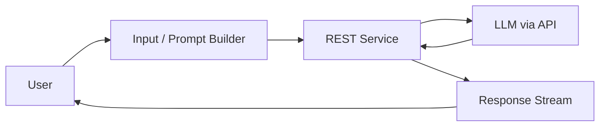

Dari sudut engineering, ini memberi bentuk minimum sistem: model jarang diakses langsung dari UI. Biasanya ada service layer di tengah yang menangani prompt, model selection, dan response delivery.

### 2. Kenapa mulai dari Ollama lokal?

Chapter 2 sengaja memilih local model lewat Ollama sebagai entry point. Itu bukan hanya soal convenience. Ini decision pedagogis:

- supaya lo bisa fokus pada arsitektur request/response,
- bukan langsung terjebak billing, auth, atau vendor cloud,
- supaya lo paham model bisa hidup lokal maupun di cloud.

Visual yang disarankan di sini adalah:

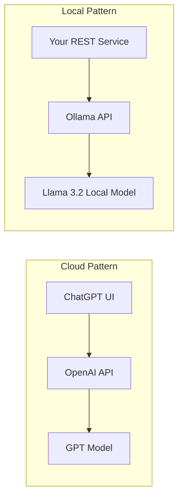

Strukturnya mirip: ada app, ada API layer, ada model di belakang. Yang beda cuma siapa yang meng-host.

### 3. Hardware constraint sebagai trade-off awal

Bagian ini memberi reminder penting: model bukan cuma kode, tapi juga resource. Llama 3.2 3B butuh disk dan RAM tertentu, dan kalau berat bisa turun ke 1B.

Artinya pilihan model adalah soal kemampuan dan lingkungan sekaligus:

- model lebih besar → kemungkinan lebih capable,
- model lebih berat → butuh lebih banyak memory dan compute.

Ini sudah menanamkan kebiasaan sehat: jangan hanya bicara model, tapi bicara juga lingkungan tempat model itu dijalankan.

### 4. Validasi model dulu, baru service

Sebelum bikin server, bagian ini menyuruh lo tes model langsung via Ollama CLI, misalnya dengan “Who are the Beatles?”.

Itu bukan trivia. Ini menekankan pola debugging yang sehat:

1. pastikan model lokal dan Ollama berjalan,
2. baru bangun service di atasnya.

Ini memisahkan dua layer yang sering bikin pemula bingung.

### 5. Service pertama: GET sederhana

Langkah pertama service adalah route GET yang memanggil `ollama.generate`. Inti arsitekturnya adalah:

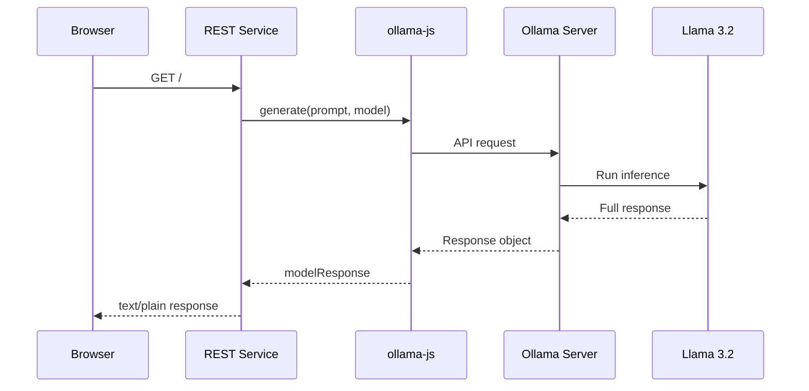

Pesan utamanya: aplikasi lo memanggil model sebagai dependency. Lo tidak perlu tahu internal transformer. Lo cuma perlu tahu bagaimana menginvokasinya dari service.

### 6. GET + text/plain = jalur lurus pertama

Pada awalnya response diset jadi `text/plain` dan prompt hardcoded. Ini sengaja untuk meminimalkan complexity: jalur lurus dulu, belum perlu fleksibel, belum perlu UI kompleks.

Kalau jalur lurus belum hidup, menambah fleksibilitas cuma menambah area error.

### 7. Streaming sebagai UX dan delivery pattern

Di sini Chapter 2 mulai menunjukkan bahwa sifat token-by-token model bisa jadi kekuatan UX.

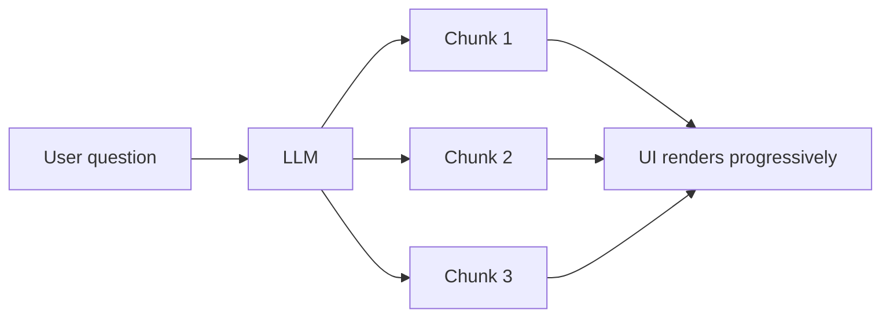

Streaming bukan sekadar efek visual. Ini cara mengubah keterbatasan output bertahap menjadi persepsi sistem yang hidup.

### 8. `stream: true` mengubah pola interaksi

Dengan `stream: true`, `generate` tidak lagi memberi satu response final. Ia menjadi iterator.

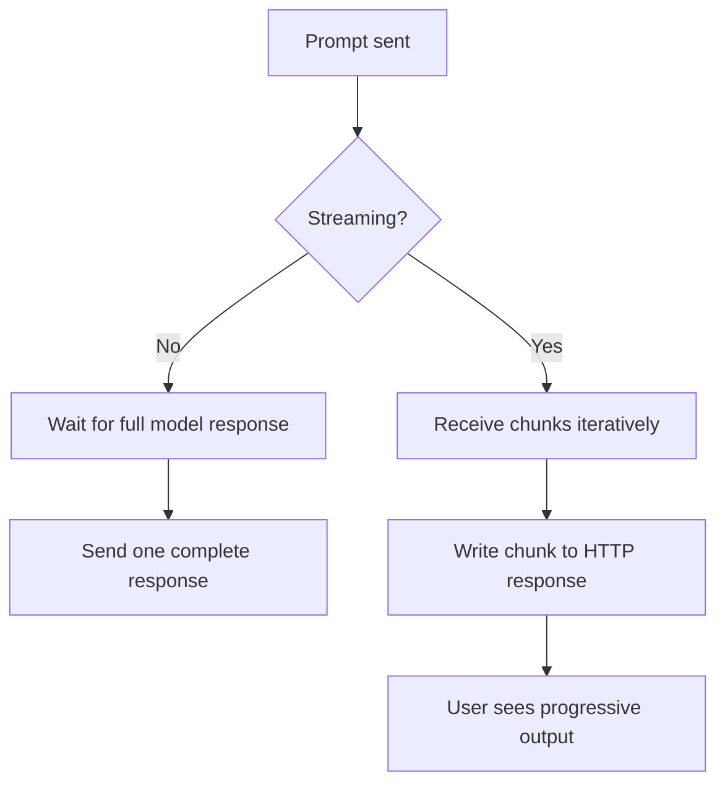

Ini pindah dari pola batch ke incremental delivery. Dan itu penting untuk chat UI, long-running call, dan feedback real-time.

### 9. Dari GET ke POST

Setelah plumbing awal hidup, bagian ini naik level ke POST dengan JSON body:

```json
{
  "question": "Can you tell me about the Beatles in 500 words or less?"
}
```

Ini menandai transisi dari eksperimen ke service yang bisa reusable. Input kini dinamis, prompt dibangun dari payload, dan service mulai terasa seperti web API biasa.

### 10. Real-world detail: CORS dan browser boundary

Middleware seperti `cors()` dan `express.json()` menunjukkan satu hal kecil tapi penting: AI app tetap tunduk pada aturan web platform biasa. Begitu UI mulai memanggil service dari browser, masalah CORS, parsing JSON, dan network boundary muncul.

Itu menguatkan pesan utama: AI engineering banyak bersinggungan dengan software engineering umum.

### 11. End-to-end streaming architecture

Diagram paling pentingnya adalah arsitektur ujung-ke-ujung:

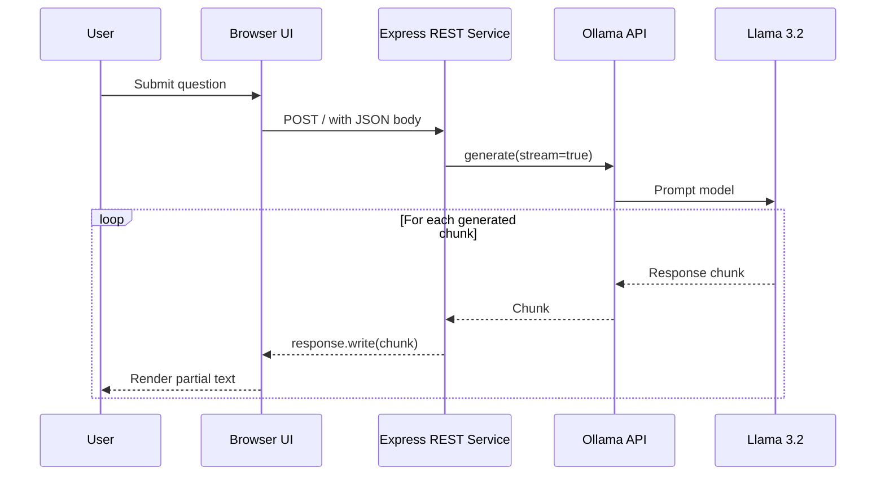

Ini menunjukkan tiga ide sekaligus:

- UI tidak bicara langsung ke model,
- service layer jadi jembatan,
- streaming mengalir ujung-ke-ujung.

### Insight besar

Bagian ini sebenarnya mengajarkan empat hal besar di bawah permukaan:

1. model diperlakukan sebagai dependency, bukan sihir,
2. service layer itu penting,
3. streaming adalah respons terhadap sifat natural LLM,
4. AI app tetap software engineering biasa.

### Kutipan penopang

Beberapa kutipan yang paling penting:

> “This chapter will serve as your ‘Hello, World!’ to calling an LLM API from code and getting a response.”

> “You will do the same, but using a locally running Llama instance.”

> “The cool typing effect you see in the responses from ChatGPT makes it feel responsive.”

> “OpenAI ingeniously transformed a drawback of LLMs, their text-generation speed, into a captivating UI effect.”

> “The fetch function allows you to call your server and read its response as a ReadableStream.”

### Sintesis besar

Chapter 2 mengajari lo membangun jalur paling dasar AI app: menerima input user, membuat prompt, mengirim ke model lewat backend service, dan mengembalikan respons lewat streaming. Model ditempatkan sebagai dependency dalam arsitektur web biasa, bukan sebagai teknologi yang berdiri sendiri.

## Chapter 3: Python on-ramp for AI development

Bagian ini bukan soal debat bahasa. Ini soal ekosistem. Setelah lo paham pattern AI app di JavaScript, sekarang lo diajak pindah ke bahasa yang lebih kuat di dunia AI: Python.

### 1. Mengapa pindah ke Python?

Motivasinya jelas:

> “JavaScript can take you pretty far... But Python has the libraries and tools to do the heavy lifting.”

Ini bukan merendahkan JavaScript. Ini menyampaikan realitas: dalam AI, bahasa sering dimenangkan oleh ekosistem — library, tooling, komunitas, dan infrastruktur riset.

Logika perpindahan yang disampaikan di sini adalah:

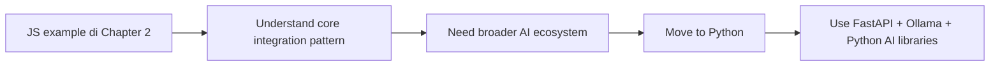

Peralihan ini bukan loncatan acak. Konsep sistem sama, yang berubah adalah stack yang lebih relevan untuk sisa perjalanan.

### 2. Mencegah mental block Python

Bagian ini langsung menenangkan pembaca:

> “Don’t worry! If you are not a Python developer, we will ease you into it.”

Artinya: ini bukan kursus Python lengkap. Ini lebih ke survival kit Python untuk AI developer. Mereka tahu pembaca mungkin datang dari Java, JavaScript, atau backend lain.

Jadi ada dua tujuan sekaligus:

1. porting contoh AI app ke Python,
2. mengenalkan idiom Python secukupnya agar lo bisa lanjut ke bab berikut.

### 3. Mengulang contoh yang sama

Metode pengajarannya sangat bagus: contoh yang sama dari Chapter 2 diulang dalam Python. Itu membuat satu-satunya variabel yang berubah adalah bahasa dan framework.

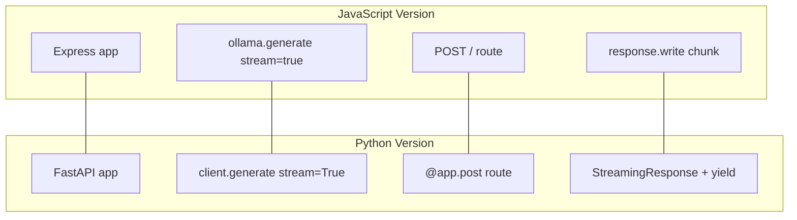

Ini mengajarkan bahwa pattern AI app bersifat lintas bahasa; yang berubah hanyalah idiom implementasi.

### 4. FastAPI sebagai pilihan yang cocok

Tool Python yang dipilih adalah FastAPI dan Ollama SDK. Pilihan ini masuk akal karena FastAPI:

- cepat bikin API,
- jelas dengan type hints,
- punya validasi input otomatis,
- cocok untuk service AI sederhana.

Arsitekturnya tetap sama seperti sebelumnya, hanya stack-nya bergeser.

### 5. Pydantic sebagai boundary typed yang penting

Salah satu momen paling krusial adalah pengenalan `ChatRequest(BaseModel)`.

Itu terlihat sederhana, tapi nilainya besar. Dengan Pydantic, lo mulai mendefinisikan bentuk kontrak data pada boundary service. FastAPI lalu memvalidasi JSON otomatis.

Di AI app, ini penting karena membantu menjaga boundary data tetap disiplin saat sistem berkembang.

### 6. Decorator route Pythonic

Kalau di Express lo pakai `app.post('/', handler)`, di FastAPI lo pakai `@app.post('/')`.

Secara konsep sama. Secara gaya, Python jadi lebih deklaratif. Ini membantu pembaca melihat satu ide arsitektural yang sama muncul dalam budaya bahasa berbeda.

### 7. `yield` dan streaming Python

Bagian ini menonjolkan generator `yield` sebagai cara Python untuk streaming response.

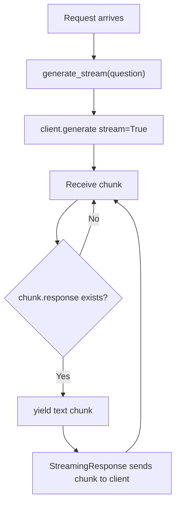

Ini menunjukkan bahwa Python punya idiom yang sangat natural untuk kasus AI streaming: output bertahap dari model bisa langsung diteruskan sebagai generator.

### 8. Indentation warning bukan cuma syntax

Peringatan soal indentasi Python bukan trivia. Ini soal cara membaca code. Di Python, whitespace adalah bagian struktur.

Ini membantu pembaca non-Python menghindari frustrasi awal.

### 9. Chapter 3 sebagai boarding pass

Akhirnya, Chapter 3 memberi sinyal bahwa pembaca sekarang siap ikut sisa perjalanan.

> “You used key Python libraries that will be used throughout the book: FastAPI and the Ollama SDK.”

Ini bukan destinasi akhir. Ini boarding pass yang memastikan pembaca dapat melanjutkan ke Part II dengan lebih lancar.

### 10. Hubungan antar bagian

Jika kita tarik progresinya:

```mermaid
flowchart LR
    A[Chapter 1: Apa itu LLM?] --> B[Chapter 2: Call LLM dari JS]
    B --> C[Chapter 3: Port example ke Python]
    C --> D[Part II: Prompt engineering di atas fondasi ini]
```

Jadi Chapter 3 bukan cuma transisi bahasa. Ini menutup Part I dengan memastikan pembaca punya kendaraan Python untuk kelanjutan AI engineering.

### Kutipan penopang

Beberapa kutipan paling penting:

> “Python has the libraries and tools to do the heavy lifting.”

> “It is simply the language of choice for AI development.”

> “We’ll start by re-creating the example from Chapter 2 in Python.”

> “FastAPI will validate the JSON in any request... ”

> “The yield keyword in Python transforms a regular function into a generator function.”

### Sintesis besar

Chapter 3 adalah bab yang mengubah pembaca dari “orang yang pernah coba AI app di JS” menjadi “orang yang siap mengikuti stack AI Python.”

### Insight

1. Bab ini bukan promosi Python; ini pembelajaran ekosistem.
2. Repeating the same example menurunkan cognitive load.
3. Pydantic + FastAPI + generator membentuk idiom Python modern yang cocok buat AI service.
4. Ini adalah bab enabler; dia memastikan sisa perjalanan bisa dilanjut tanpa kegagapan tool/bahasa.
5. Yang berubah di sini adalah kendaraan, bukan arah.

