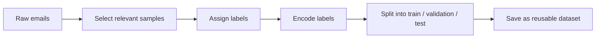
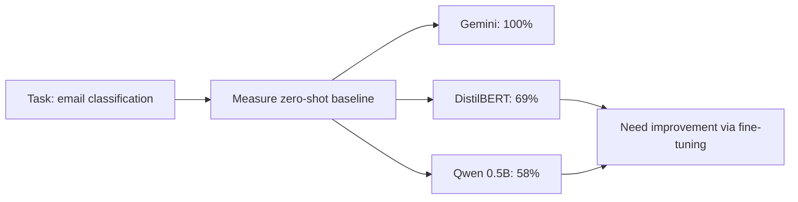
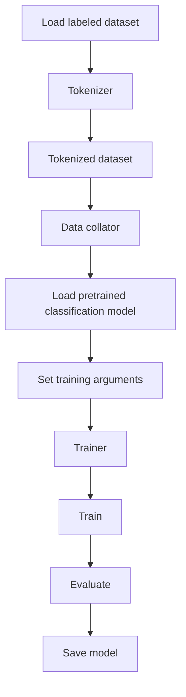
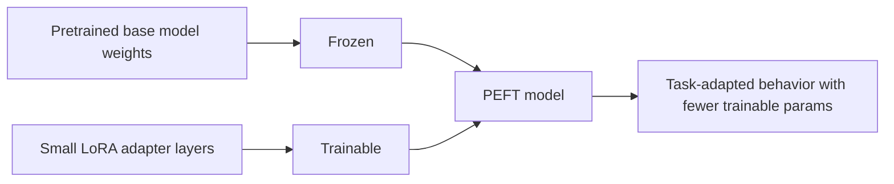
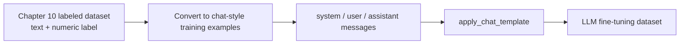

## Part IV: Adapting Models to Real-World Tasks

### Problem statement

Part IV berdiri di titik ketika task sudah terlalu spesifik buat pendekatan generik. Prompt sudah dioptimalkan, retrieval sudah jalan, tapi model masih sering salah di taxonomy internal, format output, dan gaya domain. Intinya: tugasnya adalah memutuskan kapan kita memerlukan perubahan pada model itu sendiri.

Bagian ini bukannya langsung suruh fine-tune. Dia malah buka dengan sakit yang jelas: inbox perusahaan yang kebanjiran email campur aduk. Di situ gue ngerasa gue lagi mendorong kita untuk mengenali peralihan fokus, dari "bikin model ngerti dokumen" ke "bikin model ngerti niat pesan".

Yang bikin bagian pembuka ini nendang adalah satu kutipan ini:

> “Although the agent could handle the content of some emails, the bigger problem was not answering them. It was understanding what they were.”

Kalimat itu memisahkan dua mesin yang sering kita samakan: jawaban generatif versus klasifikasi intent. Untuk inbox, jawaban cuma setengah dari masalah. Sebelum model boleh dijadikan pahlawan auto-reply, dia harus mampu jadi petugas triase. Sales inquiry, press request, support ticket, spam—semua itu butuh label dan routing dulu. Kalau salah taruh, urusannya jadi tidak hanya salah jawab, tapi salah proses.

Gue suka cara buku ini nggak menjadikan RAG sebagai jawaban universal. Ia membangun pola yang konsisten: prompt engineering sukses, lalu RAG sukses, lalu muncul bottleneck baru. Setelah RAG mengurus knowledge retrieval, tiba saatnya berkata, "ini masalahnya bukan lagi kurang konteks, ini masalahnya kurang insting task-spesifik."

Dari pembuka Part IV, yang terasa jelas adalah batas RAG. RAG kuat untuk memberi model akses ke fakta produk atau dokumen dukungan. Tapi tugas inbox ini lebih ke: apakah model bisa membedakan pola pitch sales versus support, atau mengenali urgency versus general inquiry. Itu bukan sekadar kata yang relevan, itu adalah taxonomy internal dan kebiasaan operasional yang perlu dipelajari.

Pertanyaan krusialnya bukan "bisa promptnya diatur lagi?" Melainkan "apakah model bisa diajari perbedaan halus yang berulang di data nyata kita?" Itu yang membuat fine-tuning terasa earned, bukan default. Fine-tuning di sini mulai masuk ketika task sudah cukup sempit, berulang, dan membutuhkan konsistensi di luar konteks sekadar dokumen.

Dan buku ini juga memberi satu pengingat yang sangat bagus: fine-tuning membutuhkan data. Bukan cuma data banyak, tapi data yang merefleksikan dunia sebenarnya—email nyata perusahaan dengan label yang benar. Synthetic email bisa membantu, tapi kalau model dilatih terlalu banyak pada email sintetis, bisa jadi performanya mengecewakan di email asli. Intinya: dataset nyata sering kali lebih bernilai daripada contoh yang gampang dibikin.

Jadi buat gue, pembuka Part IV ini menegaskan satu hal: Phase pertama adalah ngasih model konteks. Phase kedua adalah ngajarin model kebiasaan khusus task. Kalau sebelumnya kita ngobrol tentang prompt dan RAG, sekarang kita diarahkan ke adaptasi model sebagai langkah logis berikutnya ketika workflow bisnis mulai butuh routing, klasifikasi, dan keputusan yang konsisten.

## Chapter 9: Why and When to Customize a Model

Chapter 9 terasa seperti gerbang keputusan. Sampai titik ini, buku sudah ngajarin beberapa level intervensi: panggil model apa adanya, perbaiki prompt, kasih context lewat RAG, dan bangun retrieval pipeline. Bab ini yang kemudian menjelaskan kapan semua itu masih cukup, dan kapan lo harus mulai mengubah modelnya sendiri.

Dari tiga kutipan yang mereka sorot, gue sebenarnya sedang membangun decision tree yang penting:

> “For most generic tasks, building a new model isn’t necessary..."

> “When you need the LLM to answer questions or generate content based on information that was not in its original training data... RAG is the ideal approach.”

> “When faced with a situation such as this... you have two ways forward: Build a new model from scratch. Fine-tune a pretrained model.”

Dari situ, logic bab ini jelas: jangan fine-tune terlalu cepat. Ini bukan bab “ayo fine-tune.” Ini bab “bikin hierarchy intervensi.” Kalau masalahnya masih generic, prompt engineering sering cukup. Kalau masalahnya berhubungan dengan data eksternal atau privat, RAG adalah jawaban yang lebih tepat. Baru kalau masalahnya deep specialization atau task-specific behavior, kita mulai mempertimbangkan customization.

Bagian awal Chapter 9 menguatkan baseline itu dengan sangat baik. Mereka mulai dengan satu kebenaran yang sehat: penggunaan model via Ollama, Hugging Face, ChatGPT, atau Gemini berarti kita sedang memakai pretrained model. Ini bukan malu. Ini justru nilai besar modern AI. Pretrained model menyelamatkan kita dari kerja raksasa membangun fondasi dari nol.

Itu kenapa kalimatnya terasa penting:

> “These kinds of pretrained generic models save time and effort because we don’t have to build foundational models from scratch.”

Kalimat ini seakan bilang: value terbesar AI sekarang adalah bukan pada kemampuan model sendiri, tapi pada kemampuan kita untuk memanfaatkannya.

Lalu bab ini memberi tiga lapisan keputusan yang rapi. Kalau task masih berada di domain umum model, pakai prompt. Kalau problemnya adalah model tidak tahu data terbaru atau privat, pakai RAG. Kalau yang diperlukan bukan sekadar fakta, tapi kebiasaan format, jargon internal, atau output yang sangat spesifik, maka customization mulai relevan.

Manufacturing report jadi contoh yang menarik karena dia memetakan batas prompt dan RAG. Model bisa diberi fakta lewat RAG, tapi itu tidak otomatis memberinya kebiasaan yang konsisten dalam format dan jargon proprietary. Di situ kita baru bisa merasakan perbedaan antara masalah knowledge dan masalah behavior. RAG bagus untuk factual grounding. Fine-tuning bagus untuk consistent specialized behavior.

Gue kemudian menempatkan dua opsi depan muka: build a new model from scratch atau fine-tune a pretrained model. Ini bukan statement dogmatis. Ini soal trade-off. Build from scratch tawarkan kontrol penuh, tapi butuh data, compute, dan expertise yang sangat besar. Fine-tuning memanfaatkan knowledge yang sudah ada, jadi jauh lebih realistis untuk mayoritas developer dan tim.

Satu insight yang menurut gue penting adalah ini:

> “At times, a fine-tuned model with lower parameters can outperform a generic model with billions of parameters.”

Ini bukan sekadar puitis. Ini mengingatkan kita bahwa fit spesifik sering lebih berharga daripada kekuatan umum yang besar tapi tidak fokus. Untuk use case yang sempit, model kecil yang sudah diadaptasi kadang lebih baik, lebih murah, dan lebih mudah dideploy.

Chapter 9 juga membuat pembedaan yang sangat berguna antara strategi fine-tuning dan metode eksekusinya. Strategi yang mereka sebut adalah self-supervised, supervised, dan reinforcement learning. Metode yang dibahas adalah jalur no-code versus technical. Itu penting karena banyak orang mencampur-adukkan “fine-tuning” menjadi satu hal tunggal.

Self-supervised itu seperti model menebak kata berikutnya dari data mentah—cocok kalau yang kita butuhkan adalah style atau pattern tanpa label eksplisit. Supervised adalah flashcard input-output, dan ini sangat relevan untuk task seperti classification atau template generation. RL fine-tuning masuk ketika “jawaban bagus” tidak bisa direpresentasikan hanya sebagai label, tapi sebagai preferensi atau reward.

Di sisi lain, no-code tools seperti Hugging Face AutoTrain diposisikan sebagai jalan masuk yang lebih ringan. Mereka memperlihatkan bahwa fine-tuning tidak harus langsung identik dengan script GPU neraka. Tapi gue juga tetap bilang: no-code sering menjadi black box. Kalau lo mau kontrol dan pemahaman lebih, jalan technical tetap perlu dilalui.

Akhirnya, bab ini menutup dengan struktur yang deceptively simple:

> “Prepare the data. Fine-tune the model. Test the new model.”

Kalimat ini sederhana, tapi itu kekuatannya. Fine-tuning jadi workflow yang bisa dikelola, bukan misteri. Dan kalau mau jujur, biasanya bottleneck terbesar ada di data dan evaluasi, bukan di training loop-nya sendiri.

Jadi buat gue, Chapter 9 bukan cuma ngajarin teknik adaptation. Dia ngajarin cara memilih jalur. Ini adalah bab yang memastikan kita tahu kapan masalah kita masih bisa diselesaikan dengan prompt/RAG, dan kapan kita harus mulai mengubah modelnya secara sadar.

## Chapter 10: Preparing Data for Fine-Tuning

Kalau Chapter 9 adalah bab keputusan, Chapter 10 adalah bab persiapan bahan mentah. Di sini fokusnya bergeser dari strategi besar ke satu hal yang sering diremehkan: data.

Kalimat pembukanya baik, tapi bukan sekadar textbook:

> “A well-prepared dataset is crucial for the success of any ML model, as it directly influences the model’s ability to learn and generalize.”

Itu terasa seperti thesis bab ini. Fine-tuning yang bagus sering kalah atau menang di data, bukan di training code.

Chapter 10 membuat dua prinsip itu jelas:

1. model belajar dari data,
2. model gagal karena data.

Dari situ, bab ini nggak lagi ngomong model atau GPU. Dia ngomong tentang cara membuat task jadi bisa dipelajari secara benar oleh model.

### 1) Chapter ini sebenarnya tentang apa?

Bab ini membuka dengan roadmap bab: curate relevant data, select and label email, convert textual labels into numerical format, dan organize into training, validation, and testing sets.

Kalau gue gambar struktur babnya, bentuknya seperti pipeline:

Itu penting karena bab ini sedang menunjukkan bahwa dataset building itu pipeline, bukan sekadar file collection.

### 2) “There’s no need to look beyond your own inbox.”

Ini kutipan yang sederhana tapi kuat.

> “To prepare the dataset, there’s no need to look beyond your own inbox.”

Ini melawan insting umum orang saat bicara ML: cari benchmark publik, cari dataset besar, cari data generik yang “resmi”. Untuk task spesifik seperti email classification, data terbaik biasanya adalah data nyata dari task lo sendiri.

Itu prinsip yang digarisbawahi bab ini: task-specific model adaptation harus dimulai dari task-specific data reality.

### 3) Manual labeling itu gak glamor, tapi inti kualitas

Di sini ditegaskan bahwa jika email belum terkategori, lo harus meluangkan waktu untuk memilih sampel representatif dan memberi label yang simpel tapi konsisten.

Kata kuncinya adalah representative sample, bukan jumlah besar semata. Dataset kecil tapi representatif sering lebih kuat daripada dataset besar tapi bermasalah distribusinya.

Ini juga bukan sekadar administratif. Ini proses mengubah realitas bisnis menjadi bentuk yang bisa dipelajari model.

### 4) Label example yang dipakai buku itu sengaja spesifik

Buku pakai label `IN_Bank`, `IN_School`, `US_Bank`, `US_School`. Pilihan ini bagus karena menunjukkan bahwa fine-tuning cocok untuk narrow distinctions yang meaningful untuk satu konteks.

Contoh ini tidak dimaksudkan untuk ditiru mentah-mentah. Pesan pentingnya adalah: label lo harus datang dari task lo sendiri, dan bisa jadi jauh lebih sempit / kontekstual daripada kategori umum.

### 5) Structuring the raw data: text + label

Format dataset yang dipakai buku itu sederhana tapi fundamental: dua kolom `text` dan `label`. Dalam supervised classification, basic form ini memang yang paling esensial.

Yang menarik adalah keputusan desain yang muncul di sini: apakah inputnya full email atau summary? Full email memberi detail lebih banyak, tapi juga lebih noisy. Summary ringkas, tapi bisa kehilangan nuance. Ini menunjukkan bahwa dataset prep sudah memuat keputusan desain sebelum training dimulai.

### 6) Encoding labels: kenapa label harus jadi angka?

Gue menjelaskan bahwa ML model memproses numerik, jadi label kategorikal perlu diubah ke ID angka.

Ini bukan sekadar kebutuhan teknis. Ini juga soal memastikan mapping label konsisten dan mudah diterjemahkan kembali ke label manusia.

Angka kategori di sini bukan ordinal; dia murni ID. Itu penting untuk dipahami.

### 7) Splitting the data: ini bukan formalitas

Bagian splitting adalah salah satu bagian paling penting. Bab ini menekankan train/validation/test sekalian shuffle supaya model tidak belajar pola dari urutan data.

Train untuk belajar, validation untuk memantau dan tune, test untuk evaluasi final. Ini soal epistemic honesty dalam eksperimen ML.

### 8) Dari 12 file ke 3 file: membangun dataset global

Mereka mulai dengan empat kategori yang masing-masing di-split, lalu menggabungkannya kembali menjadi satu train file, satu validation file, satu test file. Ini menunjukkan bahwa model seharusnya belajar satu problem multi-class classification, bukan empat classifier terpisah.

### 9) Hugging Face Datasets: dataset sebagai objek self-describing

Buku ini tidak berhenti pada CSV mentah. Mereka memperkenalkan Hugging Face Datasets karena dataset yang baik harus membawa skema dan metadata, bukan cuma file mentah.

Dataset yang self-describing membuat pipeline downstream lebih aman dan reproducible.

### 10) “Feature” dan schema: detail kecil tapi penting

Saat mereka mendefinisikan feature `text` dan `label`, itu bukan sekadar teknis. Itu sedang memperkenalkan data contract yang jelas.

Jika schema longgar, error bisa masuk diam-diam.

### 11) Casting label jadi `ClassLabel`

Ini langkah yang keliatan kecil, tapi sangat penting.

Dengan meng-cast label ke `ClassLabel`, data jadi lebih tegas. Label bukan string arbitrer lagi, tapi kategori terdefinisi dengan domain nilai terbatas.

Ini adalah bentuk schema hardening yang membuat pipeline lebih aman.

### 12) “You’ve completed the heavy lifting of data engineering.”

Kalimat ini jujur dan penting. Banyak orang menganggap data prep sebelah mata, padahal bab ini bilang justru itulah pekerjaan beratnya.

Training code bisa ringkas, tapi dataset yang rapi dan representatif adalah pekerjaan yang memakan waktu.

### 13) Hubungan Chapter 10 dengan Chapter 9

Chapter 9 = memutuskan apakah fine-tuning dibutuhkan.
Chapter 10 = menyiapkan bahan belajar untuk fine-tuning.

Tanpa Chapter 10, fine-tuning terasa magis. Dengan Chapter 10, fine-tuning jadi proses belajar yang sangat bergantung pada kualitas materi.

### 14) Kutipan paling penting dari Chapter 10

> “A well-prepared dataset is crucial...”

> “there’s no need to look beyond your own inbox.”

> “Aim for at least 50 to 100 emails for each category...”

> “the classification labels ... need to be in a numerical format”

> “If we did [use all data for training], the model might memorize the data instead of learning general patterns...”

> “Libraries like Hugging Face’s Datasets library solve this problem...”

> “Congratulations! You’ve successfully created your first properly formatted dataset for fine-tuning.”

### 15) Sintesis besar Chapter 10

Chapter 10 mengajarkan bahwa fine-tuning dimulai bukan dari model, tapi dari dataset yang representatif, konsisten, dan bisa dievaluasi dengan jujur. Gue menunjukkan bagaimana memilih email nyata dari inbox sendiri, memberi label yang relevan, mengubah label menjadi ID numerik, lalu membagi data ke train/validation/test agar model tidak sekadar menghafal. Setelah itu, dataset mentah ditingkatkan menjadi objek yang lebih kokoh dengan Hugging Face Datasets.

Kalau dipadatkan:

**Chapter 10 mengubah contoh-contoh email acak menjadi kurikulum pembelajaran yang bisa dipahami model.**

Jadi sebenarnya yang sedang terjadi di Chapter 10 ini apa?

**Gue sedang memindahkan task bisnis ke bentuk pedagogis yang bisa dipelajari mesin.**

Dan itu esensi dari data preparation:

* realitas bisnis → contoh,
* contoh → label,
* label → schema,
* schema → dataset,
* dataset → bahan belajar model.

★ Insight ─────────────────────────────────────

1. Data preparation bukan tahap administratif, tapi tahap desain pembelajaran model.
2. Fine-tuning yang bagus sangat bergantung pada kualitas kategori, representativitas sampel, dan split evaluasi.
3. Hugging Face Datasets memperkenalkan dataset sebagai objek yang membawa makna, tipe, dan kontrak penggunaan.
4. Menyiapkan data berarti lebih dari kumpulkan file—itu termasuk schema, mapping, dan pipeline reproducibility.
5. Setelah bab ini, fine-tuning seharusnya tidak lagi terlihat seperti proses magis, tapi seperti proses belajar terstruktur.
   
## Chapter 11: Fine-Tuning Models in Practice

Kalau Chapter 9 itu bab keputusan, dan Chapter 10 itu bab menyiapkan bahan ajar, maka Chapter 11 adalah bab ketika semuanya benar-benar dijalankan. Ini titik di mana buku berhenti bicara “kenapa fine-tuning penting” dan mulai bilang: ini workflow riilnya kalau lo benar-benar mau melatih model untuk task lo.

Ada dua baris pembuka yang langsung bikin ekspektasi lo turun ke bumi:

> “Now it’s time for your first hands-on fine-tuning experience.”

> “Fine-tuning is a time-consuming process.”

Dua quote ini penting. Mereka menegaskan bahwa Chapter 11 bukan magic show. Ini proses yang butuh waktu, compute, dan disiplin eksperimen.

### 1) Bab ini dibuka dengan dua model sekaligus

Pilihan dua model ini menurut gue cerdas:

- `distilbert/distilbert-base-uncased`
- `Qwen/Qwen2.5-0.5B-Instruct`

Dua model ini menunjukkan bahwa “fine-tuning” bukan satu jalan tunggal. Ada jalur model klasifikasi biasa dan ada jalur LLM kecil. Itu membuat bab ini terasa lebih realistis dan lebih berguna.

#### a. DistilBERT

Ini model klasifikasi yang lebih klasik. Jadi pas buat menjelaskan workflow yang paling rapi:

- tokenization,
- Trainer API,
- evaluasi akurasi,
- perubahan performa yang gampang dimengerti.

#### b. Qwen 0.5B Instruct

Ini LLM kecil. Jadi dia cocok buat nunjukin:

- chat/prompt template,
- format instruction,
- PEFT/LoRA,
- kenapa fine-tuning LLM beda dari fine-tuning classifier biasa.

Jadi bab ini ingin lo lihat satu hal penting: **fine-tuning itu family of workflows, bukan satu script universal.**

### 2) Baseline dulu: ini salah satu prinsip terbaik di bab ini

Bab ini sehat banget karena mulai dari baseline. Sebelum training, mereka ukur dulu performa model yang dipilih dalam zero-shot classification. Tanpa baseline, angka setelah fine-tuning gampang kehilangan konteks.

Hasil baseline yang mereka tunjukin:

- Google Gemini: **100%**
- DistilBERT: **69%**
- Qwen 0.5B Instruct: **58%**

Hasil ini penting karena menunjukkan dua hal:

- model besar yang kuat memang bisa sangat bagus tanpa fine-tuning,
- model kecil punya gap performa yang bisa ditutup dengan fine-tuning.

Dengan kata lain, fine-tuning di sini bukan eksperimen akademik. Ini pertanyaan ekonomis: bisa nggak model yang lebih murah dan lebih mudah dijalankan didekatkan ke model besar pada task sempit?

### 3) Fine-tuning classifier: jalur yang paling rapi

DistilBERT jadi babak pertama karena dia paling “direct”. Task-nya jelas: input teks, output label. Ini menunjukkan bentuk fine-tuning yang paling bersih dan paling gampang dipahami.

Pipeline dasarnya:

Bagian ini penting karena modelnya didesain untuk task itu. Jadi hasil fine-tuning 69% → 100% bukan sekadar angka impresif, tapi pernyataan bahwa untuk task klasifikasi sempit dan terlabel jelas, model kecil bisa jadi sangat efektif.

### 4) Fine-tuning LLM: jangan langsung skip prompt engineering

Setelah classifier, bab ini naik ke LLM. Dan yang gue suka adalah mereka nggak langsung bilang fine-tuning itu solusi otomatis. Mereka malah tanya:

> “Why Not Prompt Engineering?”

Itu pertanyaan sehat banget. Di banyak workflow nyata, prompt engineering masih jadi baseline terbaik untuk biaya dan kecepatan. Fine-tuning baru relevan saat lo butuh:

- performa lebih tinggi,
- adaptasi domain lebih dalam,
- perilaku lebih konsisten,
- generalisasi di niche task.

Bukan karena modelnya keren, tapi karena masalahnya memang sudah melewati batas yang bisa diselesaikan cuma dengan prompt.

### 5) PEFT / LoRA: teknik lahir dari constraint

Bab ini nggak ngebahas LoRA karena dia lagi tren. LoRA dibahas sebagai respons terhadap realitas biaya dan hardware.

Yang penting di sini adalah intinya:

- full fine-tuning mahal,
- butuh banyak compute,
- berisiko overfitting dan catastrophic forgetting,
- sementara LoRA memungkinkan hanya sebagian kecil parameter yang dilatih.

LoRA kerjanya seperti pasang adapter kecil di model yang dibekukan. Jadi bukan remodel total, tapi update terarah pada bagian penting.

### 6) Dataset LLM bukan dataset classifier biasa

Ini salah satu pergeseran mental terbesar di chapter ini.

Untuk classifier, datasetnya text + label. Untuk LLM, datasetnya harus menjadi chat-style example:

- system
- user
- assistant

Jadi lo nggak cuma ngajarin model untuk memetakan input ke class ID. Lo mengajarinya pola percakapan: format, role, instruction, jawaban.

Itu penting karena kalau formatnya salah, model bisa bingung, output bisa berantakan, dan kualitas fine-tuning turun.

### 7) Hasilnya: Qwen naik dari 58% ke 93.02%

Ini angka yang menarik. Qwen fine-tuned 93.02% tidak setara langsung dengan DistilBERT 100%. Itu karena kedua model punya objective yang berbeda.

DistilBERT adalah classifier khusus; outputnya sempit dan langsung. Qwen adalah LLM generatif yang dipaksa belajar classification dari pola percakapan. Jadi 93% sudah menunjukkan bahwa LoRA + dataset yang tepat bisa mendorong model kecil cukup jauh tanpa biaya full fine-tuning.

Dari sini pelajaran pentingnya:

- model khusus bisa lebih efisien untuk task klasifikasi murni,
- tapi LLM fine-tuned memberi fleksibilitas lebih besar untuk task instruction/chat,
- dan pilihan model harus didasarkan pada bentuk task, bukan hanya karena LLM lagi hype.

### 8) Sintesis besar Chapter 11

Kalau gue ringkas, Chapter 11 sedang membangun pola pikir eksekusi yang disiplin:

- mulai dari baseline,
- pilih model sesuai bentuk task,
- fine-tuning adalah pipeline lengkap,
- teknik efisien seperti PEFT/LoRA penting,
- dan evaluasi setelah training adalah keharusan.

Dengan begitu, bab ini bukan hanya tutorial code. Dia menanamkan workflow eksperimen: data prep, tokenization/template, config, trainer, evaluasi.

Kalimat yang paling kena buat gue di chapter ini adalah:

> “Now it’s time for your first hands-on fine-tuning experience.”

It menandai transisi dari konsep ke eksekusi. Dan itu tepat: Chapter 11 adalah saat kita akhirnya benar-benar menjalankan apa yang sudah dibangun di Chapter 9 dan 10.

### 9) Hubungan Chapter 11 dengan 9 dan 10

Chapter 9 memutuskan apakah fine-tuning perlu.
Chapter 10 menyiapkan dataset.
Chapter 11 menjalankan proses itu.

Tanpa Chapter 11, fine-tuning tetap terasa abstrak. Dengan Chapter 11, fine-tuning menjadi workflow yang bisa diukur dan dievaluasi.

**Chapter 11 membuktikan bahwa model kecil, yang dilatih dengan data yang tepat dan teknik efisien, bisa berubah dari “lumayan” menjadi sangat berguna untuk task nyata.**

