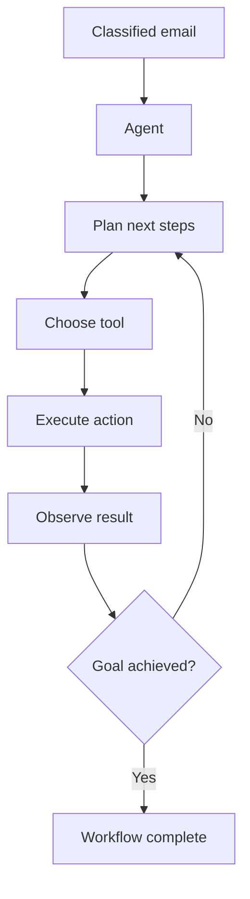
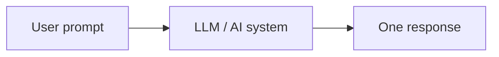
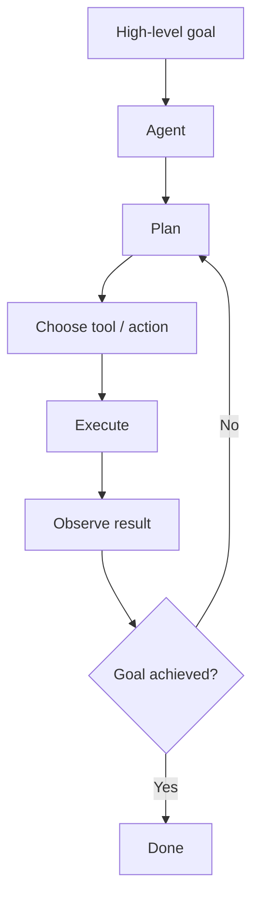
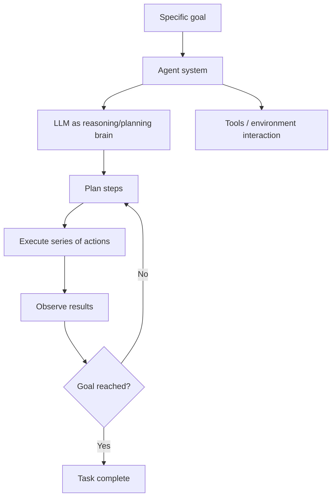
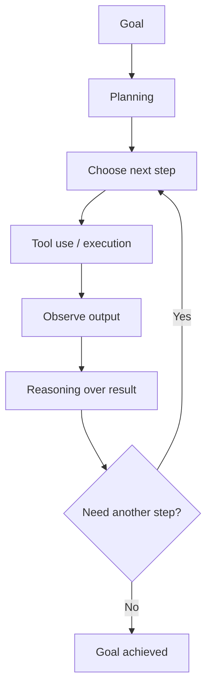
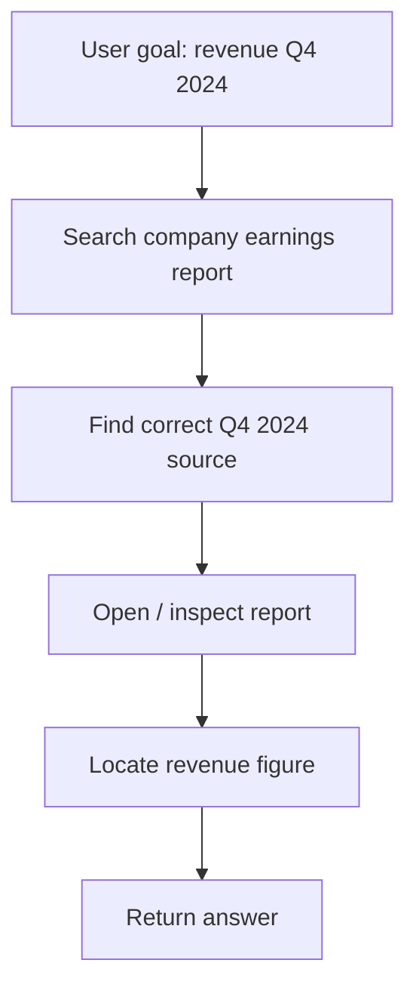
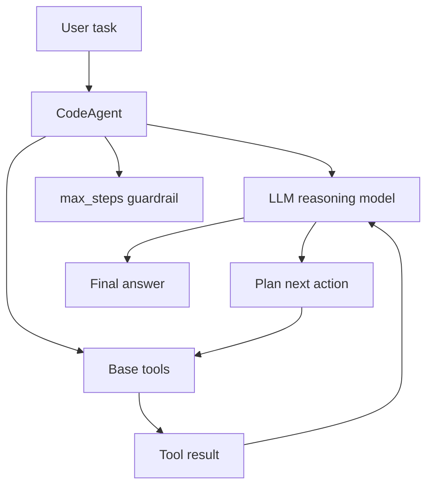
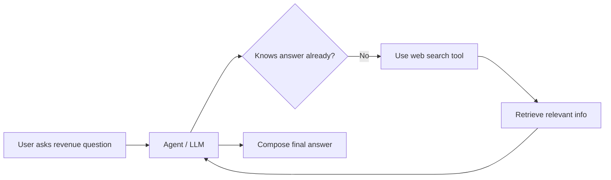
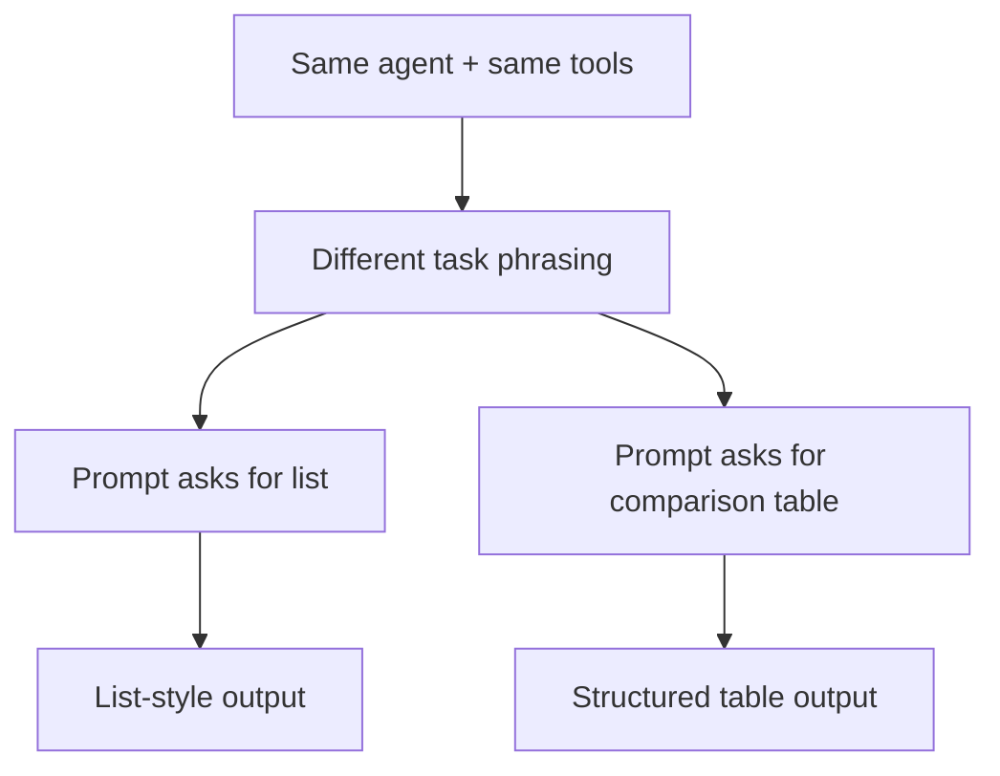

## Part V: Building Agentic Systems

### Problem statement

Part V datang ketika pekerjaan AI tidak lagi cukup hanya menjawab atau memberi label. Masalahnya sekarang adalah bagaimana AI bisa menjalankan rangkaian kerja, memilih tools, dan menyelesaikan goal yang utuh. Ini bukan lagi soal output, tapi tentang sistem yang bisa bertindak.

Bagian ini terasa seperti transisi paling besar di seluruh buku. Sampai Part IV, semua yang dibangun masih berada di pola: manusia kasih tugas, model bantu satu langkah, lalu manusia lanjut lagi. Part V mulai bertanya sesuatu yang jauh lebih berani:

> “The question shifted dramatically from ‘Can the AI understand and label this email?’ to ‘Can the AI act on this email?’”

Itu bukan sekadar pertanyaan baru. Itu perubahan paradigma.

### 1) Dari mesin jawaban ke mesin workflow

Sebelumnya fokusnya adalah:

- classify,
- retrieve,
- generate,
- summarize,
- answer.

Sekarang fokusnya melompat ke:

- plan,
- choose tools,
- execute steps,
- move state forward,
- interact with systems outside itself.

Dan yang paling penting, Part V tidak hanya mengangkat agent sebagai fitur keren. Dia menyajikannya sebagai jawaban atas masalah nyata: inbox sudah rapi, tapi bottleneck pindah downstream.

> “The chaotic inbox had transformed into an organized system.”

> “The avalanche was tamed.”

Kalimat-kalimat ini penting karena mereka mengatakan satu hal sederhana: masalah pertama sudah diselesaikan, tetapi masalah berikutnya muncul di layer selanjutnya. Classification itu sering cuma pintu masuk, bukan penyelesaian end-to-end.

### 2) Bottleneck pindah downstream

Bagian ini memperjelas bahwa ketika satu tahap dioptimalkan, constraint sistem tidak hilang. Ia pindah ke tahap berikutnya.

Sebelumnya bottleneck adalah triage inbox. Setelah fine-tuning, masalahnya adalah follow-up workflow. Email yang sudah terlabel rapi masih membutuhkan rangkaian aksi nyata:

- research perusahaan,
- cari kontak,
- draft outreach,
- update CRM,
- susun jawaban support,
- jadwalkan meeting.

Dengan kata lain, problemnya berubah dari “apa kategori email ini?” menjadi “apa rangkaian aksi yang perlu dilakukan setelah kategori itu diketahui?”

### 3) Ini bukan text-generation sederhana

> “These weren’t simple text-generation tasks either.”

Kalimat ini penting karena Part V sedang membedakan dua kelas kerja:

- kerja generatif sederhana seperti menulis email, merangkum, menjawab satu pertanyaan,
- kerja workflow nyata yang melibatkan banyak langkah, banyak tool, dan keputusan antar langkah.

Agentic system lahir karena satu prompt atau satu panggilan model tidak lagi cukup.

### 4) Definisi kasar agentic workflow

Di sini kita mulai melihat bahwa “pekerjaan AI” berubah dari sekadar memahami ke sekadar bertindak.

Dari kutipan ini, agentic workflow bisa diringkas sebagai sistem yang:

1. memiliki goal,
2. memecah goal jadi beberapa langkah,
3. menggunakan tool berbeda untuk tiap langkah,
4. membuat keputusan di tengah jalan,
5. mengubah status dunia,
6. menyesuaikan langkah berikutnya sesuai hasil.

Kalimat-kalimat yang menegaskan ini termasuk:

- “navigating different software”
- “accessing external websites”
- “performing searches”
- “making small decisions”
- “orchestrating multiple steps”

### 5) Pertanyaan pivot Part V

Pertanyaan sentralnya adalah:

> “Can the AI act on this email?”

Di sini muncul dua mode AI system:

- Mode A — cognitive support: AI membantu memahami informasi.
- Mode B — delegated workflow execution: AI membantu menyelesaikan rangkaian kerja.

Part V jelas masuk ke Mode B.

Kalimat berikut ini sudah mengandung semua komponen utama agent:

> “Can it take the classified lead, figure out all the steps needed to follow up ... identify the right tools ... and then execute that plan autonomously?”

Kalau gue ringkas, bentuk minimumnya jadi seperti ini:

### 6) Kenapa ini disebut “agentic”?

Pembuka ini belum mendefinisikan agen secara formal, tapi elemen-elemennya sudah jelas:

- reason,
- plan,
- use tools,
- interact with digital world,
- pursue a goal across multiple steps.

Itu membuat sesuatu terasa agentic bukan karena ada model, tapi karena ada aksi yang terstruktur dan goal-directed.

### 7) Implikasi risiko tool use

Walaupun belum dibahas detail, bagian ini sudah menyinggung risiko baru. Begitu AI mulai berinteraksi dengan tool eksternal dan sistem lain, failure mode-nya berubah drastis.

Salah output teks mungkin akan membuat jawaban keliru. Salah aksi bisa membuat email salah dikirim, CRM salah diupdate, atau meeting salah dijadwalkan.

Itu artinya agentic system selalu butuh lapisan tambahan seperti:

- guardrails,
- permission boundaries,
- verification,
- observability,
- recovery.

### 8) Struktur logika pembuka Part V

Garis narasinya terasa rapi:

1. inbox chaos berhasil diatasi,
2. email sekarang terlabel,
3. manusia masih terjebak pekerjaan follow-up,
4. pekerjaan follow-up adalah workflow multi-step,
5. masalah berubah dari labeling ke acting,
6. maka dibutuhkan agent.

Kalau digambar secara utuh, ini bukan lompatan random. Ini logika sistem.

### 9) Hubungan Part V dengan semua part sebelumnya

Part V bukan topik baru yang lepas. Dia adalah sintesis:

- Part I: ngerti LLM dan cara memanggilnya,
- Part II: ngatur output dengan prompt,
- Part III: ngasih context lewat retrieval,
- Part IV: adaptasi model untuk task spesifik,
- Part V: orkestrasi aksi dengan agent.

Jadi agent di sini bukan shortcut yang melompati fondasi. Agent adalah komposisi dari fondasi-fondasi sebelumnya.

### 10) Kutipan yang paling load-bearing

Beberapa quote kunci dari opener yang paling ngerangkum:

- “But sorting, while critical, was only the first step.”
- “The bottleneck had simply moved downstream.”
- “These weren’t simple text-generation tasks either.”
- “Can the AI act on this email?”
- “The team needed something that could not only think but also act.”
- “Enter AI agents.”

### 11) Sintesis pembuka Part V

Kalau gue ringkas:

**Pembuka Part V menunjukkan bahwa setelah startup berhasil mengklasifikasikan email dan menertibkan inbox, mereka menemukan bottleneck baru di tahap lanjutan: follow-up kerja nyata. Masalah ini tidak bisa diselesaikan hanya dengan satu label atau satu jawaban. Ia membutuhkan sistem yang bisa memahami tujuan, merencanakan langkah, memilih tool yang tepat, dan mengeksekusi aksi di dunia digital. Dari sinilah agentic systems muncul.**

Kalau dipadatkan:

**Part V dimulai ketika AI berhenti menjadi mesin jawaban dan mulai diposisikan sebagai mesin pelaksana workflow.**

Jadi yang sedang terjadi di pembuka Part V ini bukan sekadar pengembangan topik. Ini adalah perubahan paradigma dari AI sebagai analis ke AI sebagai pelaksana.

## Chapter 12: From Workflows to Autonomous Agents

Kalau pembuka Part V menjelaskan kenapa agent dibutuhkan, Chapter 12 mulai menjelaskan apa sebenarnya agent itu dan bedanya agentic workflow dengan workflow biasa. Topik “agent” sering kabur, dan bab ini berfungsi sebagai taksonomi.

Ada tiga kutipan yang menurut gue jadi tulang punggung bab ini:

> “our interactions have been purely reactive, confined to chat windows or one-off scripts. That changes now.”

> “We need to give these LLMs a level of agency.”

> “An AI agent is a system that uses an LLM as its ‘brain’ to autonomously plan, reason, and execute a series of steps to achieve a specific goal.”

Dari tiga kutipan itu kita bisa langsung melihat arah bab:

- dari reactive ke active,
- dari responding ke agency,
- dari single turn ke multi-step goal pursuit.

### 1) “our interactions have been purely reactive”

Ini kutipan penting karena dia merangkum semua yang sudah kita lakukan sampai sekarang. Sampai Chapter 11, pola dominannya masih reactive: user input → model response → selesai. Itu termasuk prompt engineering, RAG, fine-tuning, classifier, atau LLM yang sudah diadaptasi.

Reactive artinya sistem tidak punya proses hidup sendiri. Dia tidak memecah goal, tidak memilih langkah sendiri, tidak memutuskan tool berikutnya, tidak mengiterasi sampai goal selesai. Dia menunggu instruksi lalu merespons.

Jadi kalimat ini menegaskan bahwa agentic system bukan peningkatan kecil dari chatbot. Dia perubahan mode operasi.

Sekarang bab ini mau pindah ke sesuatu seperti:

### 2) “We need to give these LLMs a level of agency.”

Agency bukan kesadaran. Bukan AI punya kehendak sendiri. Penulis membicarakan derajat otonomi operasional: sistem yang punya ruang memilih langkah, bisa mengejar tujuan, bisa bertindak lewat tools, dan tidak harus menunggu instruksi mikro untuk tiap langkah.

Analoginya: chatbot biasa itu orang yang hanya menjawab saat ditanya. Agent lebih seperti asisten yang diberi tujuan lalu berkata, “oke, gue akan cari tahu langkahnya, jalanin, dan balik kalau sudah beres atau kalau mentok.”

### 3) Definisi agent: ini kalimat paling penting

Definisinya:

> “An AI agent is a system that uses an LLM as its ‘brain’ to autonomously plan, reason, and execute a series of steps to achieve a specific goal.”

Pecahannya:

- “system” = agent bukan cuma model. Ada state, tools, control loop, memory/context, environment interaction, dan stopping condition.
- “LLM as its brain” = LLM pusat reasoning/planning, bukan seluruh agen.
- “autonomously plan, reason, and execute” = agent menyusun langkah, menilai situasi, dan menjalankan aksi.
- “a series of steps” = bukan single-shot completion.
- “to achieve a specific goal” = goal-oriented.

Kalau digambarkan:

Inilah diagram definisi agent yang paling penting buat dibawa ke chapter berikutnya.

★ Insight ─────────────────────────────────────

1. Penekanan pada “system” mengubah agent dari model saja menjadi sistem yang lengkap.
2. LLM sebagai “brain” berarti agent bukan LLM murni; dia adalah LLM plus control loop dan tools.
3. “Autonomously” dalam engineering berarti sistem punya koridor tindakan sendiri, bukan kebebasan tanpa batas.
4. “Series of steps” menandai bahwa agent bekerja lewat trajectory, bukan satu output.
5. Untuk menilai agent, tanyakan: apakah dia mengejar goal lewat beberapa langkah dengan sebagian keputusan diambil sistem itu sendiri?

### 4) Contoh restoran vegan: bedanya jelas

Contoh restoran ini bagus karena dia menampilkan perbedaan antara informasi dan outcome.

- Chat model: “What are the best vegan restaurants in my area?” → jawab list.
- Agent: “Find a highly rated vegan restaurant with a patio that is open this Saturday, and make a reservation for two.”

Chat model memberi informasi. Agent mengejar outcome.

Outcome ini butuh beberapa langkah: cari restoran, filter rating, cek patio, cek open Sabtu, booking. Itu menunjukkan bahwa agentic behavior muncul ketika ada constraint bertingkat, tool dependency, action in the world, dan kemungkinan gagal/ retry.

### 5) Tiga kemampuan inti agent

Bab ini memecah agent ke tiga komponen utama:

- Planning
- Tool use
- Reasoning

Planning = menentukan langkah untuk mencapai goal.
Tool use = menggunakan antarmuka eksternal untuk bertindak.
Reasoning = menafsirkan hasil aksi sebelumnya dan memutuskan langkah berikutnya.

Loop agentic-nya kira-kira seperti:

### 6) “In essence, an AI agent transforms a passive LLM into an active, goal-oriented problem solver...”

Kalimat ini penting karena ia menjembatani semua pembahasan sebelumnya. Passive LLM = tunggu input, output, selesai. Active agent = punya target, melakukan langkah, memanggil tools, menyesuaikan terhadap hasil.

“Problem solver” di sini bukan jaminan sempurna. Maksudnya agent punya mekanisme mencoba menyelesaikan goal lewat beberapa langkah.

### 7) “Why Do We Need Agents?”

Bab ini menjawab dengan klasifikasi workflow yang sehat:

- Traditional workflows,
- AI workflows,
- Agentic workflows.

Ini penting karena agen tidak dilihat sebagai sesuatu yang selalu unggul. Dia dilihat sebagai salah satu kategori arsitektur.

### 8) Traditional workflow

Traditional workflow ditandai oleh:

- sequence tasks predefined,
- rule-based,
- deterministic,
- explicit logic.

Ini bukan sekadar anti-AI. Ini valid untuk pekerjaan predictable dan repetitif.

### 9) AI workflow

AI workflow adalah alur terstruktur yang menerapkan AI tools dalam urutan yang sudah ditentukan. Di sini ada AI, tapi sequence-nya masih fixed.

Banyak sistem yang disebut agent sebenarnya hanya AI workflow. Dan bab ini membantu membedakan itu.

★ Insight ─────────────────────────────────────

1. Keberadaan LLM tidak otomatis membuat sistem agentic.
2. AI workflow tetap lebih prediktabel dan lebih mudah diaudit.
3. Pengenalaan agent sebagai spektrum otonomi membantu pilihan arsitektur.
4. Semakin tinggi otonomi, semakin penting observability dan guardrails.
5. Agentic system adalah pilihan untuk masalah tertentu, bukan jawaban universal.

### 10) Agentic workflow

Agentic workflow memiliki fleksibilitas memilih tool dan langkah, serta nondeterminism. Jalur tidak sepenuhnya fixed karena bergantung pada hasil intermediate, tool output, dan keputusan agent.

Nondeterminism adalah pembeda utama. Agentic workflow lebih adaptif, tapi juga lebih sulit dikontrol.

### 11) Spektrum workflow

Bab ini menyajikan spektrum otonomi:

- Traditional workflow: no AI, fixed rules.
- AI workflow: AI in predetermined steps.
- Agentic workflow: goal-driven, adaptive, nondeterministic.

Dengan spektrum ini, kita bisa bertanya lebih tajam kalau ada yang menyebut “ini agent.”

### 12) Kapan kita butuh agen?

Agent dibutuhkan ketika task kompleks, tidak cukup satu step, butuh tool eksternal, perlu adaptasi ke hasil intermediate, dan manusia tidak ingin mengarahkan micro-step satu per satu.

Bukan semua task butuh agent. Untuk task sederhana dan predictable, traditional atau AI workflow bisa jadi pilihan yang lebih baik.

### 13) Kutipan paling penting dari Chapter 12

- “our interactions have been purely reactive... That changes now.”
- “We need to give these LLMs a level of agency.”
- “An AI agent is a system that uses an LLM as its ‘brain’...”
- “Unlike a traditional chat-based model ... an agent is given a high-level task and then independently figures out how to accomplish it.”
- “Planning ... Tool use ... Reasoning ...”
- “AI workflows are deterministic...”
- “Agentic workflows ... introduce a degree of nondeterminism...”

### 14) Sintesis besar Chapter 12

Kalau gue ringkas:

**Chapter 12 menggeser fokus dari AI yang reaktif ke AI yang goal-driven. Penulis mendefinisikan AI agent sebagai sistem yang memakai LLM sebagai pusat reasoning untuk merencanakan, memilih tool, dan mengeksekusi serangkaian langkah demi mencapai tujuan. Untuk membuat batas konsepnya jelas, bab ini membedakan tiga jenis workflow: traditional workflows yang rule-based, AI workflows yang memakai AI tetapi tetap mengikuti urutan langkah yang telah ditentukan, dan agentic workflows yang memberi sistem fleksibilitas memilih langkah serta tool secara adaptif, sehingga memperkenalkan nondeterminism. Dengan begitu, agent diposisikan bukan sebagai chatbot yang lebih canggih, melainkan sebagai bentuk workflow otonom yang lebih cocok untuk tugas kompleks dan dinamis.**

Kalau dipadatkan jadi satu kalimat:

**Chapter 12 adalah bab yang mengubah agent dari buzzword menjadi kategori arsitektur yang bisa dibedakan dari workflow biasa.**

Jadi yang sedang terjadi di Chapter 12 ini?

**Penulis sedang membersihkan peta wilayah sebelum kita masuk ke implementasi agent. Dia memastikan kita ngerti apa itu agent, kenapa agent dibutuhkan, dan kapan sistem benar-benar layak disebut agentic.**

## Chapter 13: Building an Autonomous Agent

Kalau Chapter 12 itu bab definisi dan boundary—membersihkan arti agent, workflow, dan agentic workflow—maka Chapter 13 ini adalah bab ketika buku bilang: cukup teori, sekarang bikin agent beneran.

Tapi yang menarik, penulis nggak langsung lompat ke agent yang megah dan rumit. Mereka sengaja mulai dari sesuatu yang sangat sederhana:

- satu goal,
- satu agent,
- model reasoning,
- beberapa base tools,
- dan satu tugas yang cukup realistis.

Menurut gue ini keputusan pedagogis yang bagus banget. Kenapa? Karena agent itu topik yang gampang bikin orang mabuk kompleksitas:

- tools banyak,
- planning loop,
- retries,
- context,
- web,
- formatting,
- max steps,
- safety.

Penulis justru menahan semuanya dan memulai dari skeleton paling inti.

Ada beberapa kutipan yang jadi tulang punggung bab ini:

> “This chapter covers how to build them.”

> “We’ll focus on a customizable, code-based approach... ”

> “understanding the underlying mechanics and having the ability to customize your agents is crucial for developers.”

Nah, tiga kutipan ini sudah cukup menjelaskan arah bab:

- kita bukan lagi membahas “apa itu agent,”
- kita sedang membangun agent,
- dan cara yang dipilih bukan black box no-code, tapi pendekatan yang bikin developer ngerti mekaniknya.

### 1) Kenapa penulis tidak mulai dari CrewAI, Browser Use, atau platform lain?

Di awal bab, penulis menyebut tools/platform seperti:

- CrewAI
- Browser Use
- Agent.ai

Tapi lalu mereka bilang fokus buku ini adalah:

> “the foundational principles of building agents”

dan

> “understanding the underlying mechanics and having the ability to customize your agents is crucial for developers.”

Menurut gue ini penting banget. Karena ini memperlihatkan posisi epistemik buku ini:
**framework itu berguna, tapi developer perlu ngerti mekaniknya dulu.**

Ini pola yang konsisten dari awal buku:

- jangan cuma pakai LLM API, pahami mental model LLM
- jangan cuma pakai prompt, pahami struktur prompt
- jangan cuma pakai RAG library, pahami ingestion dan retrieval
- jangan cuma pakai fine-tuning tool, pahami dataset dan adaptation
- sekarang: jangan cuma pakai agent framework, pahami anatomy agent

Jadi bab ini bukan anti-framework.
Tapi buku ingin fondasi pikirnya dibangun dulu sebelum lo bergantung pada abstraction yang lebih tinggi.

### Kenapa ini penting buat developer?

Karena kalau agent gagal:

- salah pilih tool,
- halu saat web search,
- looping terlalu lama,
- stop terlalu cepat,
- output kacau,

lo butuh mental model internalnya untuk debug.
Kalau cuma tahu cara klik framework, lo akan kesulitan.

### 2) Use case yang dipilih: cari revenue Q4 2024 perusahaan

Penulis memilih contoh:

- investor
- ingin tahu pendapatan perusahaan pada Q4 2024
- perlu cari earnings report
- temukan link yang benar
- buka report
- cari section revenue
- jawab angka yang diminta

Menurut gue ini contoh yang sangat bagus. Kenapa?

Karena ini cukup sederhana untuk dipahami, tapi cukup “agentic” untuk menunjukkan kebutuhan multi-step.

#### Kenapa gak bisa diselesaikan dengan prompt biasa?

Karena model dasar:

- gak selalu punya angka terbaru / spesifik,
- gak selalu tahu dokumen mana yang benar,
- perlu akses ke web,
- perlu mencari dan membaca sumber.

Jadi task ini pas sekali untuk menunjukkan:
**agent diperlukan saat jawaban butuh interaksi dengan dunia luar, bukan cuma recall dari model.**

#### Intuisi task-nya

Goal user kelihatannya sederhana:

> “berapa revenue Amazon Q4 2024?”

Tapi rantai kerjanya bisa begini:

1. cari earnings report Amazon
2. pastikan itu benar Q4 2024
3. buka dan baca sumber
4. cari angka revenue
5. kembalikan ke user

Nah, ini perbedaan besar antara:

- pertanyaan yang terlihat sederhana di permukaan
- proses penyelesaiannya yang sebenarnya berlapis

Ini adalah bentuk dasar task agentic yang dipilih penulis.

### 3) “The steps aren’t always the same” — ini inti kenapa agent dibutuhkan

Penulis bilang:

> “In these kinds of tasks, where the steps aren’t always the same, AI agents really shine.”

Nah, menurut gue ini salah satu kalimat paling penting di bab ini.

Karena ini menjelaskan **boundary penggunaan agent** dengan sangat singkat.

Kalau langkah-langkahnya:

- selalu sama,
- jalurnya bisa di-hardcode,
- exception sedikit,
- keputusan nyaris nol,

maka workflow biasa sering cukup.

Tapi kalau:

- sumber berbeda-beda,
- format dokumen beda,
- urutan pencarian bisa berubah,
- strategi cari info harus menyesuaikan,
- langkah optimal tidak selalu identik,

maka agent mulai masuk akal.

#### Ini nyambung langsung ke Chapter 12

Di sana agentic workflow dibedakan oleh:

- goal orientation
- nondeterminism

Dan bab ini memberi contoh konkret nondeterminism itu:

- Amazon, Apple, Google bisa punya format earnings report berbeda
- lokasi angka revenue bisa beda
- hasil search bisa beda
- langkah agent bisa sedikit berubah

Jadi kalimat ini sangat load-bearing:
**agent dibutuhkan saat path ke solusi tidak bisa ditulis secara fixed dengan nyaman.**

### 4) Setup environment: ini kelihatannya remeh, tapi sebenarnya bagian dari filosofi bab

Penulis menjelaskan:

- buat Python environment terpisah
- install `smolagents==1.22.0`
- pakai integrasi LiteLLM
- set `GEMINI_API_KEY`

Secara permukaan, ini cuma setup. Tapi di balik itu ada beberapa ide penting.

#### a) Agent adalah software system sungguhan

Bukan sekadar prompt playground. Jadi dia hidup dalam environment, dependency, API key, versioning.

#### b) Provider model dipisahkan dari framework agent

Mereka pakai `smolagents` + `LiteLLMModel` + Gemini. Artinya:

- framework agent tidak identik dengan satu provider model
- reasoning layer dan model backend bisa dipisah

Ini penting banget secara arsitektural.

#### c) Isolasi environment tetap penting

Ini konsisten dengan software engineering normal:

- dependency conflict itu nyata
- agent stack bisa cepat kompleks
- proyek agent layak diperlakukan seperti proyek software lain

Jadi walaupun setup ini terlihat biasa, ia menegaskan bahwa:
**agent engineering itu masih software engineering.**

### 5) Agent pertama mereka: sangat sederhana, dan itu bagus

Kode yang dipakai inti-inti begini:

- `CodeAgent`
- `LiteLLMModel`
- `tools = []`
- `add_base_tools=True`
- `verbosity_level=1`
- `max_steps=5`

Menurut gue, pilihan desain contoh ini bagus banget karena memperlihatkan anatomy agent dengan sangat jelas.

#### a) `model = LiteLLMModel(...)`

Ini menunjukkan bahwa agent tetap butuh model sebagai reasoning engine.

#### b) `tools = []`

Menarik karena mereka tidak langsung memberi custom tools. Artinya mereka mau menunjukkan bahwa bahkan agent minimal pun bisa jalan dengan base tools saja.

#### c) `add_base_tools=True`

Nah, ini penting. Karena agent pertama ini diberi tool bawaan, termasuk:

- web search (DuckDuckGo)
- Python code interpreter

Dan ini adalah titik ketika agent benar-benar berbeda dari LLM biasa:
**dia tidak hanya punya model, tapi juga kemampuan bertindak lewat tools.**

#### d) `verbosity_level=1`

Ini penting untuk pembelajaran/debugging. Karena agent yang sepenuhnya diam akan terasa magis dan susah dipahami.

#### e) `max_steps=5`

Ini salah satu parameter paling penting secara engineering. Karena dia memperlihatkan bahwa agent loop itu perlu guardrail.

Kalau gue gambar struktur agent minimumnya:

Ini menurut gue diagram inti Chapter 13.

★ Insight ─────────────────────────────────────

1. Agent minimal di bab ini memperlihatkan bahwa agent pada dasarnya adalah loop: model berpikir, tools bertindak, hasil tool balik lagi ke model.
2. `max_steps` itu sangat penting karena menandai bahwa otonomi agent selalu butuh batas. Ini bukan detail kecil, tapi guardrail inti.
3. `add_base_tools=True` menunjukkan bahwa yang membuat agent agentic bukan sekadar prompt panjang, tapi adanya kemampuan observasi/aksi ke luar model.
4. Pendekatan minimal ini bagus karena memisahkan “anatomy agent” dari “kompleksitas tool custom.” Jadi fondasinya kelihatan dulu.
5. Buat developer, ini mengajarkan bahwa sebelum mikirin multi-agent atau framework kompleks, lo harus paham loop paling dasar ini.

### 6) Bagian paling penting: agent bisa jawab karena dia diberi tool, bukan karena model tahu segalanya

Penulis bilang:

> “It’s important to recognize that an LLM, in its foundational state, does not possess real-time knowledge of such specific, external data.”

Ini kalimat yang sangat penting, dan sangat konsisten dengan seluruh buku.

Jadi lagi-lagi, buku ini tidak mengajarkan fantasy bahwa model agentic tiba-tiba tahu segalanya. Yang terjadi adalah:

- model tetap terbatas,
- tapi agent diberi tool untuk mencari informasi yang dia butuhkan.

Lalu penulis menambahkan:

> “The agent requires the capability to search and retrieve the data from the internet.”

dan

> “This allowed the agent to perform a web query to find the requested financial data.”

Nah, ini inti agent di bab ini.

Bukan “agent = model yang lebih pintar.”

Tapi:
**agent = model yang bisa menggunakan tool untuk menutupi keterbatasan knowledge-nya.**

Kalau gue gambar alurnya:

Ini sederhana, tapi sangat penting untuk membangun intuisi:

- agent tidak harus omniscient,
- dia harus cukup pintar untuk tahu kapan harus mencari.

### 7) Eksperimen kecil yang sangat edukatif: hapus `add_base_tools=True`

Menurut gue ini salah satu bagian paling bagus secara pedagogi.

Penulis menyuruh pembaca:

- coba remove `add_base_tools=True`
- jalankan lagi
- lihat perilakunya

Ini bagus banget karena mengajarkan bukan lewat teori, tapi lewat contrast.

#### Apa yang ingin ditunjukkan?

Bahwa keberhasilan agent tadi **bergantung** pada tool availability.

Kalau tool dicabut:

- agent mungkin hanya menebak,
- atau gagal,
- atau memberi jawaban yang tidak grounded.

Ini eksperimen kecil, tapi insight-nya besar:
**agent behavior is constrained by tool affordances.**

Artinya agent tidak melampaui tool yang diberikan.
Dan itu sangat penting untuk desain sistem.

Kalau lo ingin agent bisa:

- cari web,
- kirim email,
- update CRM,
- baca kalender,

maka kemampuan itu harus benar-benar diberikan sebagai tool.
Bukan diasumsikan model akan “mengerti sendiri.”

### 8) “Agents and Prompt Engineering” — ini bagian yang menurut gue sangat penting

Banyak orang salah paham bahwa begitu kita masuk ke agent, prompt engineering tidak terlalu penting lagi.

Penulis secara eksplisit membantah itu:

> “The art and science of prompt engineering cannot be ignored.”

Ini penting banget. Karena agent bukan pengganti prompt.
Agent justru memperbesar kebutuhan prompt yang baik.

Kenapa? Karena sekarang prompt agent memengaruhi:

- bagaimana task dibaca,
- format output,
- cara tool dipakai,
- kapan berhenti,
- bagaimana jawaban akhir disusun.

Lalu penulis memberi contoh yang sangat bagus.

#### Prompt 1

> “Show me the Q4 2024 revenue for Amazon, Google, and Apple”

Outputnya jawaban list biasa.

#### Prompt 2

> “Show me the Q4 2024 revenue for Amazon, Google and Apple and compare them in a table”

Outputnya jadi tabel.

Nah, ini menunjukkan bahwa bahkan dalam sistem agentic:

- prompt tetap membentuk deliverable,
- prompt tetap memengaruhi struktur hasil,
- prompt tetap bagian dari control surface.

Jadi agent tidak menghapus pentingnya prompt.
Dia justru membuat prompt menjadi instruksi **tentang goal dan bentuk deliverable**, bukan hanya isi jawaban.

#### Diagram perbedaan ini

Ini sangat penting, karena membuktikan bahwa:
**tooling dan planning saja tidak cukup; output contract tetap banyak dibentuk oleh prompt.**

### 9) Jadi apa yang sebenarnya diajarkan bab ini?

Kalau gue tarik benang dari awal sampai akhir, Chapter 13 sebenarnya mengajarkan empat ide inti:

#### Pertama

Agent pertama lo bisa sangat sederhana.
Lo gak perlu mulai dari multi-agent, orchestration graph, atau 15 tools custom.

#### Kedua

Agent hidup dari kombinasi:

- model reasoning
- tools
- control loop
- guardrails (`max_steps`)

#### Ketiga

Agent tidak magically tahu data real-time.
Dia berhasil karena diberi kemampuan mencari/bertindak.

#### Keempat

Prompt engineering tetap relevan.
Bahkan agent yang tool-using pun masih sangat dipengaruhi oleh bagaimana tujuan diminta dan bagaimana output diinginkan.

Jadi chapter ini bukan “cara bikin super-agent.”
Ini lebih seperti:
**cara bikin skeleton agent yang benar-benar hidup.**

### 10) Apa yang bab ini belum lakukan, dan kenapa itu penting?

Menurut gue justru penting juga untuk jujur bahwa Chapter 13 ini masih **introductory build chapter**.

Dia belum terlalu masuk ke:

- tool custom design yang banyak
- memory/state kompleks
- multi-agent coordination
- recovery loop lebih dalam
- permission model
- human approval gates
- observability
- eval agents secara serius

Dan itu bagus. Kenapa?
Karena kalau semua itu dimasukkan sekaligus, pembaca akan kehilangan bentuk paling dasarnya.

Jadi bab ini sengaja menjaga scope:
**agent minimal yang bisa dipahami end-to-end.**

Dan itu keputusan yang sangat tepat secara pedagogi.

### 11) Kutipan paling penting dari Chapter 13

Kalau gue pilih beberapa yang paling load-bearing:

> “This chapter covers how to build them.”

Ini jelas: kita masuk mode implementasi.

> “understanding the underlying mechanics ... is crucial for developers.”

Ini menjelaskan kenapa pendekatannya code-based, bukan sekadar pakai platform.

> “In these kinds of tasks, where the steps aren’t always the same, AI agents really shine.”

Ini boundary penggunaan agent yang paling penting.

> “an LLM, in its foundational state, does not possess real-time knowledge... ”

Ini menjaga kita tetap grounded tentang keterbatasan model.

> “This allowed the agent to perform a web query... ”

Ini menjelaskan kenapa tools adalah inti.

> “The art and science of prompt engineering cannot be ignored.”

Ini menyelamatkan kita dari salah kaprah “agent > prompt.”

### 12) Sintesis besar Chapter 13

Kalau gue ringkas dalam satu paragraf:

**Chapter 13 menunjukkan bagaimana membangun agent pertama secara code-based dengan fokus pada fondasi, bukan kemewahan framework. Penulis memakai use case pencarian revenue Q4 2024 untuk memperlihatkan bahwa agent berguna ketika langkah-langkah penyelesaian tidak bisa ditulis secara fixed dan membutuhkan akses ke dunia luar, seperti web search. Dengan menggunakan model reasoning, base tools, dan guardrails seperti max_steps, agent pertama ini memperlihatkan loop dasar agentic behavior: menerima goal, merencanakan langkah, memakai tool, lalu mengembalikan hasil. Bab ini juga menekankan bahwa keberhasilan agent bukan karena model mengetahui segalanya, melainkan karena ia diberi tool yang tepat. Dan meskipun sudah agentic, prompt engineering tetap penting karena cara user menyatakan goal masih sangat memengaruhi bentuk deliverable akhir.**

Kalau dipadatkan jadi satu kalimat:

**Chapter 13 adalah bab yang mengubah definisi agent dari konsep abstrak menjadi loop kerja minimal yang bisa lo bangun, lihat, dan uji.**

Jadi sebenarnya yang sedang terjadi di Chapter 13 ini?

**Penulis sedang menunjukkan bahwa agent pertama bukanlah monster kompleks, melainkan kombinasi sederhana antara model, tools, batas langkah, dan goal yang ditulis dengan baik.**

Dan begitu kombinasi itu jalan, lo mulai bisa melihat kenapa agent berbeda dari chatbot atau workflow AI biasa.

Tapi yang menarik, penulis nggak langsung lompat ke agent yang megah dan rumit. Mereka sengaja mulai dari sesuatu yang sangat sederhana:

- satu goal,
- satu agent,
- model reasoning,
- beberapa base tools,
- dan satu tugas yang cukup realistis.

Itu keputusan pedagogis yang bagus. Agent itu topik yang gampang bikin orang mabuk kompleksitas: tools banyak, planning loop, retries, context, web, formatting, max steps, safety. Penulis menahan semuanya dan memulai dari skeleton paling inti.

Ada tiga kutipan yang jadi tulang punggung bab ini:

> “This chapter covers how to build them.”

> “We’ll focus on a customizable, code-based approach... ”

> “understanding the underlying mechanics and having the ability to customize your agents is crucial for developers.”

Tiga kutipan ini sudah cukup menjelaskan arah bab:

- kita bukan lagi membahas “apa itu agent,”
- kita sedang membangun agent,
- dan cara yang dipilih bukan black box no-code, tapi pendekatan yang bikin developer ngerti mekaniknya.

### 1) Kenapa penulis tidak mulai dari CrewAI, Browser Use, atau platform lain?

Di awal bab, penulis menyebut tools/platform seperti:

- CrewAI
- Browser Use
- Agent.ai

Tapi lalu mereka bilang fokus buku ini adalah:

> “the foundational principles of building agents”

dan

> “understanding the underlying mechanics and having the ability to customize your agents is crucial for developers.”

Ini penting karena memperlihatkan posisi epistemik buku ini: framework itu berguna, tapi developer perlu ngerti mekaniknya dulu.

Ini pola yang konsisten dari awal buku:

- jangan cuma pakai LLM API, pahami mental model LLM
- jangan cuma pakai prompt, pahami struktur prompt
- jangan cuma pakai RAG library, pahami ingestion dan retrieval
- jangan cuma pakai fine-tuning tool, pahami dataset dan adaptation
- sekarang: jangan cuma pakai agent framework, pahami anatomy agent

Jadi bab ini bukan anti-framework. Buku ingin fondasi pikirnya dibangun dulu sebelum lo bergantung pada abstraction yang lebih tinggi.

### 2) Use case yang dipilih: cari revenue Q4 2024 perusahaan

Penulis memilih contoh:

- investor
- ingin tahu pendapatan perusahaan pada Q4 2024
- perlu cari earnings report
- temukan link yang benar
- buka report
- cari section revenue
- jawab angka yang diminta

Ini contoh yang bagus karena cukup sederhana untuk dipahami, tapi cukup agentic untuk menunjukkan kebutuhan multi-step.

Kenapa gak bisa diselesaikan dengan prompt biasa? Karena model dasar:

- gak selalu punya angka terbaru / spesifik,
- gak selalu tahu dokumen mana yang benar,
- perlu akses ke web,
- perlu mencari dan membaca sumber.

Jadi task ini pas sekali untuk menunjukkan: agent diperlukan saat jawaban butuh interaksi dengan dunia luar, bukan cuma recall dari model.

Intuisi task-nya:

> “berapa revenue Amazon Q4 2024?”

Tapi rantai kerjanya bisa begini:

1. cari earnings report Amazon
2. pastikan itu benar Q4 2024
3. buka dan baca sumber
4. cari angka revenue
5. kembalikan ke user

Ini perbedaan besar antara pertanyaan yang terlihat sederhana di permukaan dan proses penyelesaiannya yang sebenarnya berlapis.

### 3) “The steps aren’t always the same” — ini inti kenapa agent dibutuhkan

Penulis bilang:

> “In these kinds of tasks, where the steps aren’t always the same, AI agents really shine.”

Ini kalimat paling penting di bab ini karena dia menjelaskan boundary penggunaan agent dengan sangat singkat.

Kalau langkah-langkahnya selalu sama, jalurnya bisa di-hardcode, exception sedikit, keputusan nyaris nol, maka workflow biasa sering cukup. Tapi kalau sumber berbeda-beda, format dokumen beda, urutan pencarian bisa berubah, strategi cari info harus menyesuaikan, maka agent mulai masuk akal.

Ini nyambung langsung ke Chapter 12. Di sana agentic workflow dibedakan oleh goal orientation dan nondeterminism. Bab ini memberi contoh konkret nondeterminism itu: Amazon, Apple, Google bisa punya format earnings report berbeda, lokasi angka revenue bisa beda, hasil search bisa beda, langkah agent bisa sedikit berubah.

Jadi kalimat ini sangat load-bearing: agent dibutuhkan saat path ke solusi tidak bisa ditulis secara fixed dengan nyaman.

### 4) Setup environment: ini kelihatannya remeh, tapi sebenarnya bagian dari filosofi bab

Penulis menjelaskan:

- buat Python environment terpisah
- install `smolagents==1.22.0`
- pakai integrasi LiteLLM
- set `GEMINI_API_KEY`

Secara permukaan, ini setup. Tapi di balik itu ada beberapa ide penting.

#### a) Agent adalah software system sungguhan

Bukan sekadar prompt playground. Dia hidup dalam environment, dependency, API key, versioning.

#### b) Provider model dipisahkan dari framework agent

Mereka pakai `smolagents` + `LiteLLMModel` + Gemini. Artinya reasoning layer dan model backend bisa dipisah. Ini penting secara arsitektural.

#### c) Isolasi environment tetap penting

Dependency conflict itu nyata. Agent stack bisa cepat kompleks. Proyek agent layak diperlakukan seperti proyek software lain.

Jadi setup ini menegaskan bahwa agent engineering itu masih software engineering.

### 5) Agent pertama mereka: sangat sederhana, dan itu bagus

Kode inti yang dipakai:

- `CodeAgent`
- `LiteLLMModel`
- `tools = []`
- `add_base_tools=True`
- `verbosity_level=1`
- `max_steps=5`

Pilihan ini bagus karena memperlihatkan anatomy agent dengan jelas.

#### a) `model = LiteLLMModel(...)`

Ini menunjukkan agent tetap butuh model sebagai reasoning engine.

#### b) `tools = []`

Menarik karena mereka tidak langsung memberi custom tools. Artinya mereka mau menunjukkan bahwa bahkan agent minimal pun bisa jalan dengan base tools saja.

#### c) `add_base_tools=True`

Ini penting: agent pertama ini diberi tool bawaan, termasuk web search dan Python interpreter. Ini titik ketika agent berbeda dari LLM biasa: dia tidak hanya punya model, tapi juga kemampuan bertindak lewat tools.

#### d) `verbosity_level=1`

Ini penting untuk pembelajaran/debugging. Agent yang sepenuhnya diam akan terasa magis dan susah dipahami.

#### e) `max_steps=5`

Ini parameter penting secara engineering. Dia memperlihatkan bahwa agent loop perlu guardrail. Ini bukan detail kecil, tapi inti.

Kalau digambarkan:

### 6) Bagian paling penting: agent bisa jawab karena dia diberi tool, bukan karena model tahu segalanya

Penulis bilang:

> “It’s important to recognize that an LLM, in its foundational state, does not possess real-time knowledge of such specific, external data.”

Ini kalimat sangat penting. Buku sekali lagi tidak mengajarkan fantasy bahwa model agentic tiba-tiba tahu segalanya. Yang terjadi adalah model tetap terbatas, tetapi agent diberi tool untuk mencari informasi yang dia butuhkan.

Lalu penulis menambahkan:

> “The agent requires the capability to search and retrieve the data from the internet.”

> “This allowed the agent to perform a web query to find the requested financial data.”

Ini inti agent di bab ini. Bukan “agent = model yang lebih pintar.” Tapi: agent = model yang bisa menggunakan tool untuk menutupi keterbatasan knowledge-nya.

Kalau digambarkan:

### 7) Eksperimen kecil: hapus `add_base_tools=True`

Ini salah satu bagian paling bagus secara pedagogi. Penulis menyuruh pembaca mencoba remove `add_base_tools=True`, jalankan lagi, dan lihat perilakunya.

Apa yang ingin ditunjukkan? Bahwa keberhasilan agent tadi bergantung pada tool availability. Kalau tool dicabut, agent mungkin hanya menebak, atau gagal, atau memberi jawaban yang tidak grounded.

Ini eksperimen kecil, tapi insight-nya besar: agent behavior is constrained by tool affordances.

### 8) “Agents and Prompt Engineering”

Banyak orang salah paham bahwa begitu kita masuk ke agent, prompt engineering tidak terlalu penting lagi. Penulis menegaskan:

> “The art and science of prompt engineering cannot be ignored.”

Agent bukan pengganti prompt. Agent justru memperbesar kebutuhan prompt yang baik.

Kenapa? Karena sekarang prompt agent memengaruhi bagaimana task dibaca, format output, cara tool dipakai, kapan berhenti, dan bagaimana jawaban akhir disusun.

Contoh yang bagus:

- Prompt 1: “Show me the Q4 2024 revenue for Amazon, Google, and Apple” → list.
- Prompt 2: “Show me the Q4 2024 revenue for Amazon, Google and Apple and compare them in a table” → tabel.

Ini menunjukkan bahwa bahkan dalam sistem agentic, prompt tetap membentuk deliverable.

### 9) Jadi apa yang sebenarnya diajarkan bab ini?

Chapter 13 mengajarkan empat ide inti:

1. Agent pertama lo bisa sangat sederhana.
2. Agent hidup dari kombinasi model reasoning, tools, control loop, dan guardrails.
3. Agent tidak magically tahu data real-time; dia berhasil karena diberi kemampuan mencari/bertindak.
4. Prompt engineering tetap relevan.

Jadi bab ini bukan “cara bikin super-agent.” Ini lebih seperti: cara bikin skeleton agent yang benar-benar hidup.

### 10) Apa yang bab ini belum lakukan, dan kenapa itu penting?

Chapter 13 masih intro build chapter. Dia belum terlalu masuk ke:

- tool custom design yang banyak
- memory/state kompleks
- multi-agent coordination
- recovery loop lebih dalam
- permission model
- human approval gates
- observability
- eval agents secara serius

Dan itu bagus. Kalau semua itu dimasukkan sekaligus, pembaca akan kehilangan bentuk paling dasarnya.

Jadi bab ini menjaga scope: agent minimal yang bisa dipahami end-to-end.

### 11) Kutipan paling penting dari Chapter 13

- “This chapter covers how to build them.”
- “understanding the underlying mechanics ... is crucial for developers.”
- “In these kinds of tasks, where the steps aren’t always the same, AI agents really shine.”
- “an LLM, in its foundational state, does not possess real-time knowledge...”
- “This allowed the agent to perform a web query...”
- “The art and science of prompt engineering cannot be ignored.”

### 12) Sintesis besar Chapter 13

Kalau gue ringkas:

**Chapter 13 menunjukkan bagaimana membangun agent pertama secara code-based dengan fokus pada fondasi, bukan kemewahan framework. Penulis memakai use case pencarian revenue Q4 2024 untuk memperlihatkan bahwa agent berguna ketika langkah-langkah penyelesaian tidak bisa ditulis secara fixed dan membutuhkan akses ke dunia luar, seperti web search. Dengan menggunakan model reasoning, base tools, dan guardrails seperti max_steps, agent pertama ini memperlihatkan loop dasar agentic behavior: menerima goal, merencanakan langkah, memakai tool, lalu mengembalikan hasil. Bab ini juga menekankan bahwa keberhasilan agent bukan karena model mengetahui segalanya, melainkan karena ia diberi tool yang tepat. Dan meskipun sudah agentic, prompt engineering tetap penting karena cara user menyatakan goal masih sangat memengaruhi bentuk deliverable akhir.**

Kalau dipadatkan jadi satu kalimat:

**Chapter 13 adalah bab yang mengubah definisi agent dari konsep abstrak menjadi loop kerja minimal yang bisa lo bangun, lihat, dan uji.**

Jadi yang sedang terjadi di Chapter 13 ini?

**Penulis sedang menunjukkan bahwa agent pertama bukanlah monster kompleks, melainkan kombinasi sederhana antara model, tools, batas langkah, dan goal yang ditulis dengan baik.**

Dan begitu kombinasi itu jalan, lo mulai bisa melihat kenapa agent berbeda dari chatbot atau workflow AI biasa.

## Chapter 14: Extending Agents with Tools

Kalau Chapter 13 itu membangun agent pertama yang masih relatif “aman” karena hidup dari base tools bawaan, maka Chapter 14 adalah titik ketika buku bilang:

**agent baru benar-benar menarik kalau dia bisa menyentuh dunia yang tidak bisa disentuh LLM secara native.**

Itu inti bab ini.

Ada satu kutipan pembuka yang menurut gue paling berat maknanya:

> “True agency requires the ability to interact with resources an LLM typically cannot access directly, such as a locally hosted database containing private data.”

Kalimat ini memotong satu ilusi besar: orang sering mengira agent itu sudah “agentic” hanya karena bisa browsing web. Padahal browsing web itu baru memperluas chat ke internet publik. Itu belum otomatis berarti agent bisa masuk ke:

- database internal,
- filesystem,
- CRM,
- observability stack,
- sistem pembayaran,
- inventory,
- AWS billing,
- expense manager,
- atau tool privat lain.

Jadi bab ini sebenarnya sedang menggeser kita dari:

**agent as internet-aware assistant**
menjadi
**agent as system-integrated operator**

### 1) “search the internet” itu belum cukup

Penulis membuka dengan posisi yang sangat bagus:

> “We’ve made progress by enabling the AI to search the internet... However, this still keeps the AI tethered to publicly available information... ”

Ini penting banget.

Karena di chapter sebelumnya agent sudah bisa:

- search,
- cari report,
- ambil angka revenue,
- jawab user.

Kelihatannya sudah hebat. Tapi penulis bilang: tunggu dulu, itu masih **public-data agent**.

### 2) Tools = jalan resmi bagi LLM untuk bertindak

Penulis lalu bilang:

> “These frameworks enable developers to construct custom tools that act as secure pathways... ”

Kata yang paling penting di sini adalah **secure pathways**.

Tools bukan cuma fungsi Python yang bisa dipanggil. Tools adalah:

- kontrak kemampuan,
- batas akses,
- bentuk aksi yang diperbolehkan,
- jembatan antara LLM dan sistem luar.

Jadi tool itu bukan sekadar convenience API. Dia adalah **governed interface**.

### 3) Contoh pertama: simpan stock price ke file

Penulis memberi contoh sederhana tapi tepat:

> “Find the latest stock price for Apple, Google and Amazon. Convert that into a table and save it to a file.”

Ini penting karena dia menggabungkan dua hal:

- ambil data publik
- lakukan aksi lokal nonpublik, yaitu simpan ke file

Dan penulis langsung bilang bahwa agent secara inheren gak punya kemampuan menyimpan file.

Itu mengingatkan kita bahwa perbedaan antara:

- **menghasilkan teks yang tampak seperti isi file**
- dan
- **benar-benar menyimpan file**

itu besar sekali.

### 4) `@tool` itu sederhana, tapi konsepnya besar

Contoh `@tool` terlihat sederhana, tapi konsep di baliknya sangat penting.

Dengan `@tool`, fungsi Python biasa berubah menjadi sesuatu yang:

- bisa “dilihat” agent,
- bisa “dipahami” agent,
- bisa “dipanggil” agent,
- dan punya signature yang jelas.

Jadi decorator ini bukan cuma sintaks manis. Dia mengangkat fungsi lokal menjadi **capability surface untuk model**.

### 5) Nama fungsi, type hints, docstring — ini bukan detail kosmetik

Ini salah satu bagian paling penting di bab ini.

Penulis menekankan bahwa:

- nama fungsi harus deskriptif,
- type hints harus lengkap,
- docstring harus jelas.

Di konteks agent, ini bukan hanya dokumen untuk manusia. Ini adalah **instruction manual untuk LLM**.

Tool definition jadi prompt engineering juga. Jika nama atau docstring tool buruk, model bisa salah memilih atau salah menggunakan tool.

### 6) Lalu muncul masalah berikutnya: reusability

Ketika tool custom banyak, masalahnya cepat berubah menjadi:

- governance,
- reuse,
- standardization,
- maintainability.

Di sinilah bab ini memperkenalkan MCP.

### 7) MCP: kenapa ini penting banget?

Penulis bilang:

> “This is precisely the problem that the MCP is designed to solve.”

MCP bukan hanya tentang tool. MCP adalah protokol standar untuk:

- agent/client,
- tool/server,
- resources,
- prompts.

Dia seperti USB-C atau HTTP untuk dunia agent-tool integration.

### 8) MCP itu bukan cuma tools

MCP memungkinkan tiga komponen:

- Tools,
- Resources,
- Prompts.

Ini penting karena artinya MCP bukan hanya remote function calling, tapi juga:

- expose data,
- expose context,
- expose workflow templates.

### 9) Client-server model MCP: ini cara mikir arsitektur

MCP berjalan dengan model client-server:

- host application,
- MCP client,
- MCP server.

Ini menunjukkan bahwa agent bukan monolit. Ada layer yang jelas, dan debugging bisa dilakukan per layer.

### 10) Special Calculator: kenapa contoh ini sengaja konyol?

Contoh kalkulator aneh ini cerdas. Jika tool memberikan hasil yang salah secara matematis, lalu agent tetap benar, berarti agent benar-benar memanggil tool. Itu membuat mekanisme lebih transparan.

### 11) Nama server dan instruction server juga penting

Server name dan instructions tidak hanya buat developer. Mereka juga menjadi “onboarding prompt” untuk agent.

Ini menegaskan lagi bahwa deskripsi interface adalah bagian dari intelligence surface.

### 12) `@mcp.tool` + type hints = schema generation

Type hints di sini bukan cuma untuk IDE. Mereka jadi dasar JSON schema yang dipakai client/LLM untuk memahami parameter tool.

Ini membuat tool contract menjadi bagian dari runtime.

### 13) Postman testing: pola engineering yang sehat

Sebelum integrasi ke Claude Desktop, MCP server dites dulu dengan Postman.

Ini menunjukkan praktik yang matang:

1. build deterministic layer,
2. uji kontrak,
3. baru integrasi ke nondeterministic layer.

### 14) Claude Desktop integration: demo bahwa tool benar-benar hidup

Ini bukan soal Claude. Ini soal membuktikan bahwa kemampuan tool yang lo bangun bisa muncul di AI client sebenarnya.

Ketika AI client bisa menemukan tool, memanggil server, dan memakai hasilnya, maka MCP berhasil.

### 15) stdio vs HTTP: perbedaan deployment topology

Dengan transport stdio, MCP cocok untuk lokal dan development.
Dengan HTTP, MCP bisa jadi shared capability server untuk banyak client.

Itu penting, karena sekarang MCP bisa dipikirkan sebagai infrastruktur, bukan sekadar script lokal.

### 16) Complex schemas dengan Pydantic: dari demo ke dunia nyata

Penulis menunjukkan bahwa tool nyata sering butuh input/output terstruktur. Pydantic dipakai untuk:

- validasi input,
- generate schema,
- mempertegas contract.

Ini mendorong tool dari proof-of-concept ke real integration.

### 17) Jadi sebenarnya bab ini sedang membangun apa?

Chapter 14 sedang membangun tiga level kedewasaan tooling:

1. local tool
2. reusable protocol
3. production-ish integration

Bukan cuma “nambah tool,” tapi “ubah kemampuan software biasa menjadi capability agentic yang bisa dipakai lintas client.”

### 18) Kutipan paling penting dari Chapter 14

- “True agency requires the ability to interact with resources an LLM typically cannot access directly... ”
- “custom tools ... act as secure pathways... ”
- “The @tool decorator ... turn one of your functions into a tool that the agent’s LLM can understand and use.”
- “The docstring ... [is] the primary instruction manual for the agent’s LLM...”
- “This is precisely the problem that the MCP is designed to solve.”
- “MCP proposes a standard set of rules and a common language... ”
- “Users can interact with complex systems without needing to fully understand their underlying mechanisms.”

### 19) Sintesis besar Chapter 14

Kalau gue ringkas dalam satu paragraf:

**Chapter 14 menunjukkan bahwa agent baru benar-benar memiliki agency ketika ia dapat menggunakan tool untuk mengakses data privat dan melakukan aksi nyata di luar kemampuan native LLM. Bab ini mulai dari level paling dasar—membungkus fungsi Python biasa menjadi tool dengan decorator, type hints, dan docstring—lalu naik ke persoalan yang lebih besar: bagaimana tool-tool itu bisa reusable dan standar lintas agent. Di titik itu, MCP diperkenalkan sebagai protokol bersama yang memungkinkan AI clients dan tool servers berkomunikasi dengan bahasa yang sama. Dengan membangun MCP server sederhana, mengujinya lewat Postman, lalu menghubungkannya ke Claude Desktop, bab ini menunjukkan bagaimana kemampuan software biasa bisa diubah menjadi kapabilitas yang benar-benar hidup di dalam AI client.**

Kalau dipadatkan jadi satu kalimat:

**Chapter 14 adalah bab yang mengubah agent dari pengguna web menjadi operator sistem.**

Jadi sebenarnya yang sedang terjadi di Chapter 14 ini?

**Penulis sedang membuka pintu antara AI dan dunia software nyata.**
Bukan dengan memberi akses liar ke semuanya, tapi dengan membangun antarmuka yang tegas, reusable, dan bisa diaudit: tools dan MCP.
