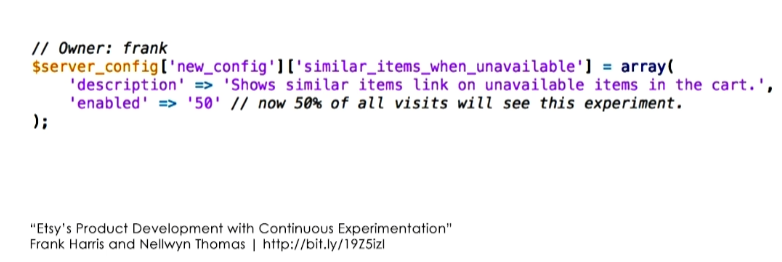
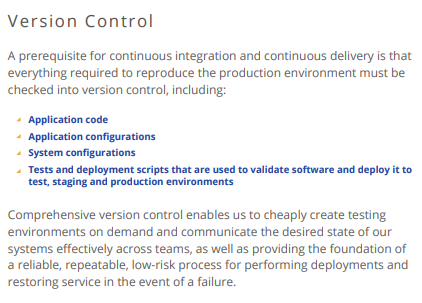
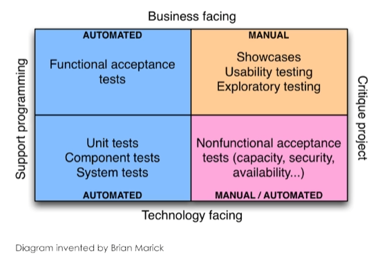

- Apa yang dimaksud dengan continous delivery?

Menurut jez humble continous delivery adalah kemampuan dimana ketika kita melakukan perubahan entah itu perubahan configurasi, bug fixes, experiment atau penambahan fitur kedalam production atau ketangan user dapat dilakukan dengan aman dan cepat.

- Kenapa continous delivery penting?
  - Membuat rilis painless dan meminimalkan resiko
  - mengurangi waktu delivery ke user, menjadi lebih cepat
  - menaikan software quality dan stability
  - mengurangi biaya dari software development
  - meningkatkan kepuasan customer dan employee
  - menghindari big release, release harus kecil
  - intinya akan meningkatkan developer menjadi senang karena bisa rilis dengan perubahan kecil
  - bisa mendapatkan feedback dengan cepat

- Key Principles
  - menbuat kualitas menjadi lebih baik
  - work in  perubahan kecil
  - komputer melakukan repetitif task, manusia menyelesaikan masalah
  - terus melakukan improvement, menjadi lebih baik dan baik lagi
  - semua orang bertanggung jawab

- Increase Performance
  - lead time for changes, from commit to deploy.
    - berapa lama waktu untuk mendeploy perubahan?
    - apakah ini berulang, dilakukan dengan cara yang sama?
    - seberapa cepat lo bisa merestore service?
    - seberapa cepat lo bisa memperbaiki critical bugs ke user?
    - seberapa cepat lo bisa memvalidasi apakah fitur bernilai dimata user?
  - relase frequency, menjadi lebih sering
    - semakin kecil perubahan lo, maka akan semakin cepat releasenya
  - Time eto restore service

- bagaimana sih caranya lo bisa tau kalau fitur lo ini bermanfaat buat user?
  - jika ditanya hal seperti ini, pada umumnya adalah dengan membuat user story, praktek ini ramai diperbincangan di komunitas product and development sebagai metode agile. ini adalah cara yang bagus diawal, tapi ada masalah disini?
    - orang yang terlibat direquirement awal kadang tidak paham atau mencari cara yang sederhana untuk mendefinisikan apa yang dibutuhkan, apa yang diinginkan.
    - masalahnya dimana? masalahnya terletak pada
      - user tidak tau apa yang mereka inginkan
      - mereka tau apa yang lo gak inginkan
      - requirement yang menurut lo bagus, belum tentu user mau
    - kalau boleh jujur, sebenarnya kita gak punya requirement yang kita punya cuma tebakan. seperti didalam bukunya Jeff Gothelf "Lean UX" punya template yang disebut Hypothesis-Driven Delivery
  - Hypothesis-Driven Delivery

      ```text
      We belive that
          [building this feature]
          [for these people]
      Will achieve [this outcome]

      We will know we are successful when we see
      [this signal from the market]
      ```

  - dari hipotesis diatas, maka perlu dilakukan experiment. maka dari itu, kalau lo bisa membuat experiment kecil dimana lo bisa dengan mudah turn on atau off fitur itu akan membantu lo menvalidasi hipotesis itu. Istilah ini disebut dengan feature flag
  
  gambar diatas diambil dari presentasi engineer dari etsy dimana mereka menunjukan bagaimana mereka membuat konfigurasi atas fitur yang mau diexperimentkan. fitur tersebut akan dinyalakan ke 50% user yang mengunjungi situsnya.

  Lalu disisi backend akan ada metrics untuk melihat berapa banyak user yang melihat fitur itu, apakah fitur itu membuat user melanjutkan transaksi atau malah pergi. seperi pada gambar dibawah.

  

  Lalu dari data data tersebut, kita bisa menentukan apakah fitur ini dapat dirilis 100% atau tidak. Menurut Ronny Kohavi dia berkerja di microsoft yang membangun microsoft experimentation platform. data yang dia punya memperlihatkan. bisa baca di white papper ini [http://stanford.io/130uW6X](http://stanford.io/130uW6X)

  ```text
  Evaluating well-designed and executed experiments 
  and executed experiments that were designed to improve a key metric, 
  only about 1/3 were successful at improving key metric
  ```

  weh, kok bisa, ngeri juga kalau kita udah develop terlalu lama tapi hasilnya mengecewakan atau tidak digunakan dan dampaknya juga lebih dari itu

  1. menyianyiakan kesempatan, karena tidak membuat sesuatu yang valuable
  2. lo harus mempertahankan fitu itu ada diproduction selamanya, jadi ada biaya yang terkait dengan itu karena memang seberapa sering lo menghapus fitur?
  3. fitu fitur itu menambah kompleksitas pada sistem, memperlambat kecepatan penambahan fitur baru.

  jadi pemborosan yang terbesar adalah pengembangan software yang dibangun tapi tidak tepat sasaran dan tidak bisa digunakan user. Ini lah alasan kena web service sangat sangat butuh continous delivery dan continous deployment.

- Jenis jenis continous
  - Continous Integration (integrate early & often)
  - Continous Deployment (deploy as the final stage of CI)
    - setiap kali lo build harus melewati automated test dan validasi
    - melakukan quick scan
    - lalu push menjadi live
  - Continous Delivery (software is always deployable)
    - memastikan jika software kita itu siap untuk di deploy, meskipun lo ga mau deploy saat ini
    - mengubah economics software delivery agar lo bisa berkerja dalam batch kecil
      - jadi lo bisa melakukan perubahan secara incremental kecil dari pada harus big bang
      - Untuk melakukan itu
        - lo harus membuat beberapa feedback loops berbeda dengan melakukan automated test
        - lalu mendapatkan result dari exploratory testing
        - terakhir, feedback loops dari customer ke bisnis jadi kita bisa membuat dengan kualitas yang lebih baik
      - Menaikan throughput dan stability
      - Mengurangi resiko dan ongoing cost of delivery
      - Membuat kita untuk belajar dan beradaptasi dengan cepat

- Bahan bahan
  - Configuration nmanagement
  - Continous Intergation
  - Automated Testing

- High Correlation with IT Performance
  - Kode kita, app config dan system config ada didalam version control system
      
  - Kita bisa mendapat failure alert dari logging dan monitoring system
  - Developers merge kode mereka ke trunk setiap hari
  - Developers memecah fitur besar kedalam bagian kecil dan incremental changes
  - Ketika development dan operation saling berinteraksi, maka hasilnya win/win
- [source](https://media.webteam.puppet.com/uploads/2019/11/2014-state-of-devops-report.pdf)

- Hal yang salah kaprah
  - Testing hanya dilakukan ketika setelah development selesai. Seharusnya testing kita lakukan kapan pun. Cara termurah untuk memperbaiki bugs adalah dengan cara jangan masuk ke version control, maka dari itu kita harus menjalankan automated test diawal.
  - Hanya tester yang bertanggun jawab atas kualitas. Seharusnya semua orang bertanggung jawab atas kualitas. 

- [continous integration on a dollar a day](https://www.jamesshore.com/v2/blog/2006/continuous-integration-on-a-dollar-a-day)
  - develop
  - build dan test dilocal
  - pull kerjaan orang lain dari trunk
  - build dan test lagi dilocal
  - sebelum push, cek apakah ada orang yang sedang deploy ke trunk juga
    - karena offline, yang sedang push harus ambil penanda
  - jika ada, maka tunggu, lalu pull kembali, jika error ajak orang yang push terkahir untuk fix barengan
  - jika tidak ada error, ambil penanda, lalu push ke trunk dan 
  - push ke trunk
  - tunggu sampai build test berasil lalu kembalikan penanda
  - jika ada error fix dulu dan jangan kembalikan penanda

- Jenis jenis testing
      

  - Automated - Bawah (Programming test)
    - Unit Test
    - Component Test
    - Sustem Test
  - Automated - Atas (Bussiness Facing - running script user scenario)
    - Functional Acceptance Test
  - Manual - Atas (Bussiness Facing - Memerlukan manusia yang test)
    - Showcases
    - Usability testing
    - Exploratory testing
  - Manual Bawah - Bawah
    - Nonfunctional Acceptance test
      - capacity
      - security
      - availability

NOTE:
    - [chapter terhakhir sudah ditonton tapi belum dicatet](https://learning.oreilly.com/videos/continuous-delivery/9780134389363/9780134389363-CONT_01_04/)

- Pertanyaan
  - Bagaimana implementasi continous delivery dengan proper
