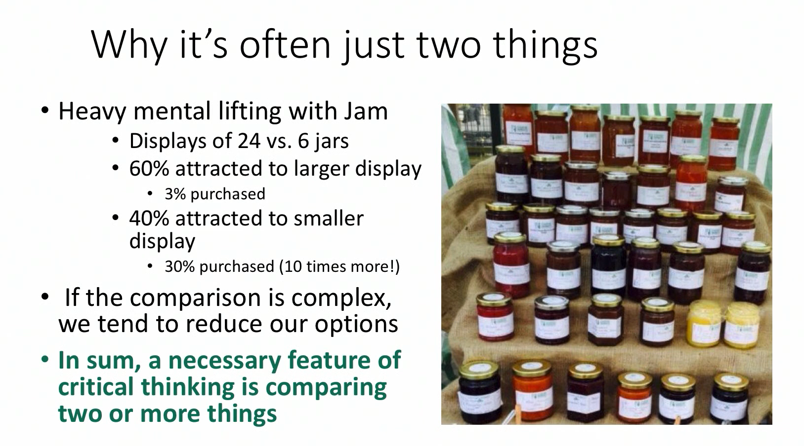
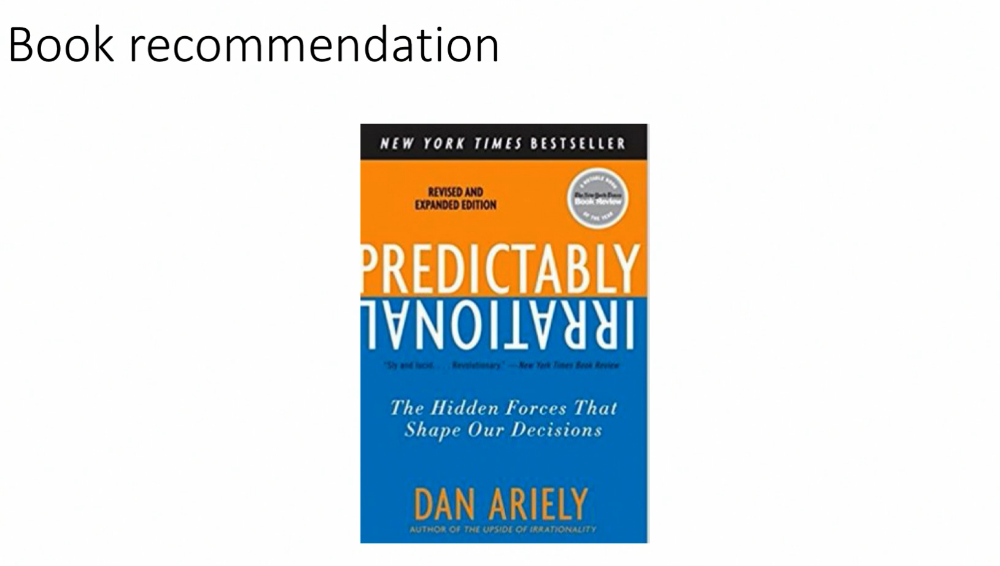

## What Is Critical Thinking,  Actually?

Link: <https://learning.oreilly.com/videos/critical-thinking-at/9781492028383/9781492028383-video318508/>

### Inti

tentang bagaimana pikiran kita cenderung lebih memilih hal-hal yang sederhana dan mudah diproses, dan bagaimana hal ini dapat memengaruhi keputusan kita dalam berbagai hal, termasuk dalam membeli barang atau dalam berpikir kritis. Penelitian juga menunjukkan bahwa membandingkan dua atau lebih hal adalah fitur yang diperlukan dalam berpikir kritis, tetapi pikiran kita cenderung untuk memilih opsi yang lebih sederhana dan terbatas. Pembicara merekomendasikan buku "Predictably Irrational" oleh Dan Ariely yang membahas cara-cara aneh yang kita gunakan dalam pengambilan keputusan dan bagaimana kita dapat menggunakan pengetahuan tentang cara kerja otak kita untuk membuat keputusan yang lebih baik.

### Transkrip

50 tahun yang lalu, Hakim Mahkamah Agung, Potter Stewart, terkenal mengatakan tentang pornografi, "Saya tidak bisa mendefinisikannya, tapi saya tahu ketika saya melihatnya." Nah, apakah kita berada dalam situasi yang sama dengan pemikiran kritis? Jika saya melihat atau memahami sebuah gagasan dari seseorang dan saya sangat menyukainya, saya bisa berkata, "Wow, ya, itu pemikiran kritis." Di sisi lain, jika ada gagasan yang saya tidak peduli, yang dipegang oleh seseorang, apakah baik-baik saja bagi saya untuk berkata, "Saya tidak suka itu. Itu tidak bisa dianggap pemikiran kritis." Saya tidak berpikir begitu.

Itu bukan cara yang baik untuk memikirkan tentang pemikiran kritis karena itu hanya membawa kita pada bias kita sendiri. Dan kita tidak benar-benar belajar dengan cara itu. Jadi, ada kualitas struktural dalam pemikiran kritis. Dan saya ingin menggambarkannya sekarang. Sangat mudah seperti membandingkan dua objek atau dua gagasan. Jadi, saya berpikir tentang ponsel ini. Satu yang lebih baik daripada yang lain? Saya membandingkan keduanya.

Saya menimbang opsi dari keduanya. Ini sesederhana itu, tetapi semenonjol itu karena dalam pertumbuhan pengetahuan dan sepanjang sejarah, kita memiliki segala jenis perbandingan. Jadi, apakah teori bahwa sel melakukan bunuh diri lebih baik daripada teori bahwa mereka hanya mati secara alami? Haruskah saya memilih Anna atau Mary? Apakah saya suka restoran A, B, atau C? Apakah teori string lebih mungkin daripada gravitasi loop kuantum? Sekarang lihat, saya tidak tahu apa-apa tentang gravitasi loop kuantum, tetapi saya bisa melihat bahwa orang-orang melakukan perbandingan semacam ini. Jadi, perbandingan adalah inti dari apa yang disebut pemikiran kritis.

Jadi membandingkan, membandingkan apa saja - oke, apa saja? Bagaimana dengan selai? Sekarang jika saya dalam mode otomatis, alias kebiasaan, maka saya hanya akan memilih selai boysenberry ini. Ini akan seperti, "Oh, itu yang saya dapatkan di pasar. Saya mengambilnya dari rak." Tetapi jika saya berpikir tentang - saya ingin selai baru dalam hidup saya. Maka saya akan melakukan beberapa pemikiran kritis. Dan saya akan membandingkan. Jadi begitulah cara kerjanya. Tetapi saya membawa selai kepada Anda karena ada kualitas yang sangat menarik tentang apa yang sering kita lakukan ketika kita berpikir secara kritis.

Seringkali, hanya dua hal yang kita bandingkan. Dan saya ingin memberikan Anda perasaan cepat tentang cara pikiran ingin mengecilkan alternatif. Ada sebuah studi selai yang sangat terkenal yang dilakukan, tetapi direplikasi di banyak area lain. Jadi juga terkait dengan hal lain, tentu saja, dalam hidup.

Tetapi para peneliti ini melakukan penelitian dalam dua pengaturan yang berbeda. Pertama, pada suatu hari di pasar, mereka menampilkan 24 botol selai. Dan mereka meminta orang untuk mencoba, orang bisa mencicipi. Kemudian orang dapat membeli atau tidak membeli, dan sebagainya. Dalam kasus itu, 60% orang sebenarnya tertarik pada tampilan yang besar ini, tetapi hanya 3% yang membeli selai. Pada hari lain, para peneliti hanya menampilkan enam botol selai, lagi-lagi, mencicipi, tetapi 10 kali lebih banyak orang membeli selai. Dan mereka telah mereplikasi hal ini banyak kali. Ini sangat menarik. Saya pikir alasannya adalah bahwa pikiran kita hanya ingin menjaga segala sesuatu semudah mungkin. Kami agak kebanjiran jika ada lebih dari itu. Jadi jika perbandingan dengan berpikir kritis itu kompleks, kami cenderung mengurangi pilihan kami, bahkan dengan selai. Jadi, fitur yang diperlukan dari berpikir kritis adalah membandingkan dua atau mungkin lebih hal.

Jadi, saya ingin merekomendasikan buku ini oleh Dan Ariely yang berjudul Predictably Irrational. Dan di buku ini, dia banyak membahas beberapa cara aneh kita memutuskan. Aneh bahwa banyak orang tidak memutuskan dalam selai. Ada juga yang disebut anchoring. Jadi dalam studi ini, jika orang hanya diingatkan pada dua digit terakhir nomor keamanan sosial mereka, orang yang memiliki nomor keamanan sosial yang lebih tinggi - jika mereka hanya diingatkan pada itu - akhirnya mengatakan bahwa vas atau beberapa hal acak lainnya lebih berharga daripada orang yang memiliki nomor keamanan sosial yang lebih rendah.

Saya maksud, kita gila, tetapi kita gila dengan cara yang bisa diprediksi. Dan kita dapat menggunakan apa yang kita ketahui tentang berpikir kritis - menghubungkannya dengan ilmu otak - untuk membantu kita membuat keputusan yang lebih baik. Pikirkan sebentar. Apakah Anda membandingkan beberapa hal baru-baru ini di tempat kerja? Kami akan melihat alasan untuk segmen berikutnya.
