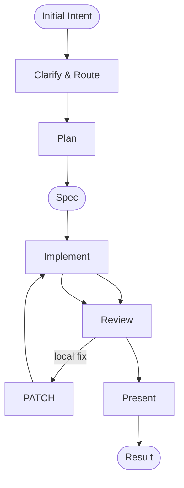
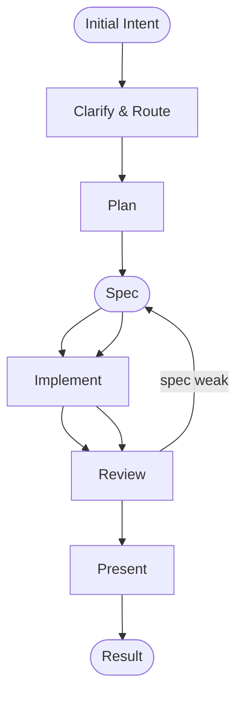
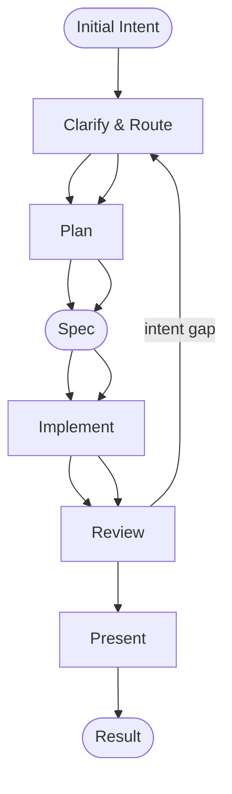

## Pertanyaan yang dibuka

1. Bagaimana Quick Dev memutuskan kapan masalah reset-password cukup di-PATCH, kapan harus kembali ke spec, dan kapan harus kembali ke intent?
2. Mengapa fitur reset password via email cenderung masuk jalur penuh, bukan one-shot?
3. Bagaimana review triage menjaga fokus agar workflow tidak berubah menjadi cleanup auth umum?

## Klaim utama

Fitur reset password via email adalah contoh bagus untuk Quick Dev karena risiko keamanan dan ambiguitasnya tinggi.

Quick Dev tidak sekadar mempercepat kode. Ia memisahkan tiga jenis kesalahan:

* PATCH = implementasi lokal perlu diperbaiki,
* BAD SPEC = boundary eksekusi perlu diperbaiki,
* INTENT GAP = pemahaman awal terhadap maksud user perlu dikoreksi.

## Skenario

Initial Intent: "Tambahin forgot password ya. User harus bisa reset password lewat email."

Ini masih terlalu longgar karena banyak aspek yang belum terjawab: user enumeration, token expiry, one-time link, rate limit, audit log, session invalidation, dan apakah akun SSO boleh ikut.

### Clarify & Route

Hasil interview memadatkan intent menjadi goal yang jelas:

* email reset link, bukan OTP
* token berlaku 15 menit
* link one-time use
* tidak pernah bocorkan apakah email terdaftar
* rate limit endpoint forgot-password
* kirim email async via job queue
* catat setiap reset action di audit log
* invalidasi semua session aktif lain setelah reset sukses
* tambahkan UI "Forgot password?" tanpa memodifikasi flow login lain

Karena task ini menyentuh auth flow, email, queue, dan security behavior, Quick Dev memilih jalur penuh, bukan one-shot. Ini terjadi setelah analysis phase, ketika intent cukup dipadatkan sehingga routing bisa diputuskan.

## Plan & Spec

Plan menyusun langkah kerja:

1. tambah endpoint `POST /auth/forgot-password`
2. generate token hash + expiry
3. kirim email via queue jika user ditemukan
4. tambah endpoint `POST /auth/reset-password`
5. validasi token dan set password baru
6. invalidasi session aktif lain
7. catat audit log
8. tambahkan UI sederhana dan tes edge case

Spec lalu membeku sebagai boundary:

* respons request reset harus netral
* token satu kali pakai, berlaku 15 menit
* email non-terdaftar tidak mengungkapkan keberadaan akun
* semua reset tercatat di audit log
* session lain diinvalidasi setelah reset
* hanya flow forgot-password yang berubah, login normal tidak berubah

## Flow sukses dengan PATCH

Model implementasikan sesuai spec. Review menemukan dua masalah lokal:

* pesan error token expired/invalid berbeda, membuka sinyal teknis
* rate limit hanya diterapkan pada reset-password, bukan forgot-password

Diagnosis review: masalah masih dalam layer implementasi.

**PATCH** dipilih.

Setelah PATCH, implementasi diperbaiki dan review ulang. Hasilnya masuk Present dan manusia menerima.

## Flow BAD SPEC

Bayangkan spec disetujui tanpa menyebut session invalidation secara eksplisit.

Implementasi yang dihasilkan akan bekerja untuk reset password, tetapi tidak mengakhiri session lain.

Review menemukan bahwa behavior penting hilang dari boundary.

Diagnosis review: bukan lagi bug lokal, melainkan spec lemah.

**BAD SPEC** dipilih.

Spec direvisi untuk memasukkan "invalidasi semua session aktif lain setelah successful reset." Setelah itu implementasi dijalankan ulang.

## Flow INTENT GAP

Situasi lain: interview awal luput mengungkap bahwa akun enterprise SSO tidak boleh memakai flow forgot-password lokal.

Spec dibangun atas asumsi semua akun lokal dapat reset password.

Review akhir manusia menilai hasil implementasi dan berkata:
"Akun SSO tidak boleh masuk flow ini."

Ini bukan bug lokal, dan bukan sekadar boundary yang lemah. Ini menunjuk ke pemahaman awal yang salah.

**INTENT GAP** dipilih.

Intent dianalisis ulang, constraint SSO ditambahkan, lalu plan/spec dibuat ulang.

## Mengapa ini penting

Fitur reset-password adalah test case yang baik karena risiko kecilnya tersembunyi dan failure mode-nya berbeda:

* PATCH bersih saat batasan sudah benar dan hanya detail kode yang perlu dibetulkan.
* BAD SPEC muncul saat boundary formal tidak memuat kebutuhan keamanan atau behavior penting.
* INTENT GAP muncul saat domain constraints yang mahal tidak digali sejak awal.

Dengan membedakan ketiganya, Quick Dev menjaga human attention tetap fokus pada titik leverage besar.

## Hubungan ke Quick Dev

* [[zettel.20260421174123]] — inti desain Quick Dev, termasuk intent compression dan review triage
* [[zettel.20260421174751]] — node-by-node diagnosis layer dan alur koreksi
